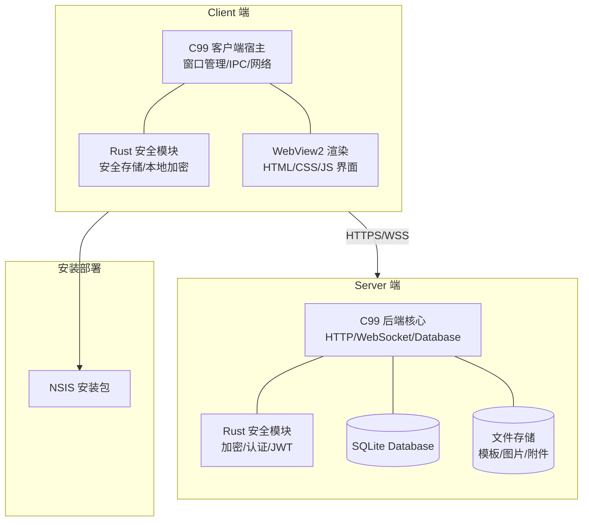
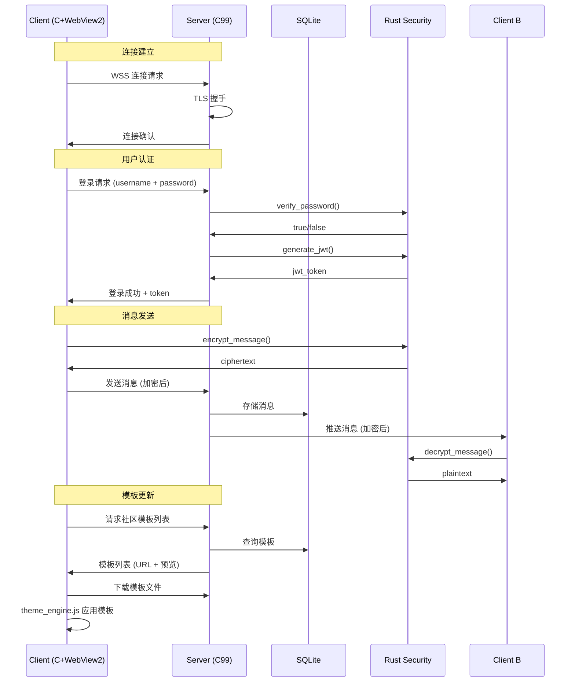
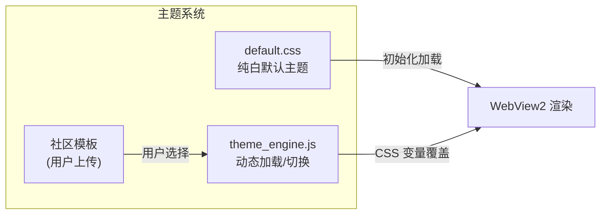
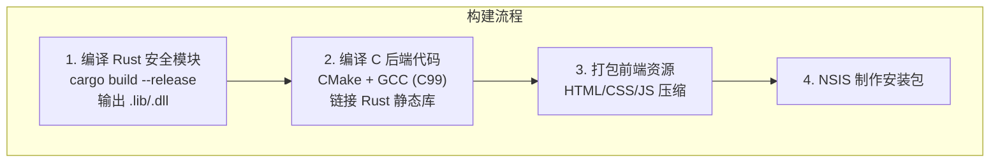

# Chrono-shift 架构设计文档

## 项目概述

一款面向二次元用户的社交即时通讯软件，类似 QQ 风格，支持用户更换社区模板背景。服务端负责用户数据、消息和模板资源的存储与管理。

---

## 技术栈总览

| 层级 | 技术选型 | 说明 |
|------|---------|------|
| **安全模块** | Rust (stable-x86_64-pc-windows-gnu) | 加密、认证、安全存储 |
| **后端核心** | C99 (GCC 15.2.0 MinGW) | HTTP/WebSocket 服务、数据库操作、文件管理 |
| **前端界面** | HTML5 + CSS3 + JavaScript (ES6+) | WebView2 渲染的桌面 GUI |
| **客户端宿主** | C99 + WebView2 | 窗口管理、IPC 通信、系统集成 |
| **构建系统** | CMake + Cargo + Makefile | 多语言混合编译 |
| **安装包** | NSIS v3.12 | Windows 安装程序 |
| **数据库** | SQLite3 (C library) | 轻量级嵌入式数据库 |
| **目标平台** | Windows 10 / Windows 11 | 仅 64 位 |

---

## 整体架构



---

## 目录结构

```
Chrono-shift/
│
├── server/                          # 服务端
│   ├── CMakeLists.txt               # CMake 构建配置
│   ├── build.rs                     # Rust 编译集成脚本
│   │
│   ├── include/                     # C 头文件
│   │   ├── server.h                 # 服务器主接口
│   │   ├── http_server.h            # HTTP 服务器
│   │   ├── websocket.h              # WebSocket 处理
│   │   ├── database.h               # 数据库操作
│   │   ├── user_handler.h           # 用户管理
│   │   ├── message_handler.h        # 消息处理
│   │   ├── community_handler.h      # 社区/模板管理
│   │   ├── file_handler.h           # 文件存储
│   │   └── protocol.h               # 通信协议定义
│   │
│   ├── src/                         # C 源码 (C99)
│   │   ├── main.c                   # 入口
│   │   ├── http_server.c            # HTTP 服务实现
│   │   ├── websocket.c              # WebSocket 实现
│   │   ├── database.c               # SQLite 操作
│   │   ├── user_handler.c           # 用户注册/登录/管理
│   │   ├── message_handler.c        # 消息收发/存储
│   │   ├── community_handler.c      # 社区模板管理
│   │   ├── file_handler.c           # 文件上传/下载
│   │   ├── protocol.c               # 协议编解码
│   │   ├── json_parser.c            # JSON 解析器
│   │   └── utils.c                  # 工具函数
│   │
│   ├── security/                    # Rust 安全模块
│   │   ├── Cargo.toml
│   │   └── src/
│   │       ├── lib.rs               # FFI 导出入口
│   │       ├── crypto.rs            # AES/RSA 加密
│   │       ├── auth.rs              # JWT 令牌管理
│   │       ├── password.rs          # 密码哈希(Argon2)
│   │       └── key_mgmt.rs          # 密钥管理
│   │
│   └── data/                        # 运行时数据目录
│       ├── db/                      # 数据库文件
│       └── storage/                 # 用户上传文件
│
├── client/                          # 客户端
│   ├── CMakeLists.txt               # CMake 构建配置
│   ├── build.rs                     # Rust 编译集成脚本
│   │
│   ├── include/                     # C 头文件
│   │   ├── client.h                 # 客户端主接口
│   │   ├── webview_manager.h        # WebView2 管理
│   │   ├── ipc_bridge.h             # C-JS IPC 桥接
│   │   ├── network.h                # 网络通信
│   │   ├── local_storage.h          # 本地存储
│   │   └── updater.h                # 自动更新
│   │
│   ├── src/                         # C 源码 (C99)
│   │   ├── main.c                   # WinMain 入口
│   │   ├── webview_manager.c        # WebView2 初始化/管理
│   │   ├── ipc_bridge.c             # IPC 消息路由
│   │   ├── network.c                # HTTP/WebSocket 客户端
│   │   ├── local_storage.c          # 本地文件/配置管理
│   │   └── updater.c                # 版本检查/更新
│   │
│   ├── security/                    # Rust 安全模块
│   │   ├── Cargo.toml
│   │   └── src/
│   │       ├── lib.rs               # FFI 导出入口
│   │       ├── secure_storage.rs    # 本地安全存储 (DPAPI)
│   │       ├── crypto.rs            # 端到端加密
│   │       └── session.rs           # 会话管理
│   │
│   └── ui/                          # 前端界面 (HTML/CSS/JS)
│       ├── index.html               # 主入口
│       ├── pages/                   # 页面
│       │   ├── login.html
│       │   ├── register.html
│       │   ├── main.html            # 主界面
│       │   ├── chat.html            # 聊天窗口
│       │   ├── contacts.html        # 联系人
│       │   ├── community.html       # 社区/模板商城
│       │   └── settings.html        # 设置
│       │
│       ├── css/                     # 样式
│       │   ├── global.css           # 全局样式
│       │   ├── variables.css        # CSS 变量(主题系统)
│       │   ├── login.css
│       │   ├── main.css             # 主界面布局
│       │   ├── chat.css
│       │   ├── community.css
│       │   └── themes/              # 社区模板主题
│       │       ├── default.css      # 纯白默认主题
│       │       └── ...
│       │
│       ├── js/                      # JavaScript
│       │   ├── app.js               # 应用入口/路由
│       │   ├── api.js               # 网络请求封装
│       │   ├── ipc.js               # C-JS IPC 通信
│       │   ├── auth.js              # 认证管理
│       │   ├── chat.js              # 聊天逻辑
│       │   ├── contacts.js          # 联系人管理
│       │   ├── community.js         # 社区/模板逻辑
│       │   ├── theme_engine.js      # 主题引擎(模板切换)
│       │   └── utils.js             # 工具函数
│       │
│       └── assets/                  # 静态资源
│           ├── images/
│           ├── icons/
│           └── fonts/
│
├── installer/                       # NSIS 安装脚本
│   ├── server_installer.nsi         # 服务端安装包
│   └── client_installer.nsi         # 客户端安装包
│
├── docs/                            # 文档
│   ├── API.md                       # API 接口文档
│   ├── PROTOCOL.md                  # 通信协议文档
│   └── BUILD.md                     # 构建指南
│
├── CMakeLists.txt                   # 根 CMake 配置
├── Makefile                         # 顶级 Makefile
└── README.md
```

---

## 通信协议设计



---

## 核心模块详细设计

### 1. C99 后端核心 (Server & Client)

**服务端 (Server):**
- 基于 epoll/IOCP 的事件驱动架构（Windows IOCP）
- 自定义 HTTP/1.1 解析器
- WebSocket (RFC 6455) 实现
- SQLite3 嵌入式数据库
- 文件上传/下载管理
- JSON 编解码（手写 C99 兼容解析器）

**客户端宿主 (Client):**
- Win32 API 窗口管理
- WebView2 控件集成（需 WebView2 Runtime）
- C-JS 双向 IPC 通道
- 本地文件/配置管理
- 断线重连机制

### 2. Rust 安全模块

通过 `extern "C"` FFI 导出为 C 可调用的函数：

```c
// 示例 FFI 接口
// 服务端安全模块
int rust_server_init(const char* config_path);
char* rust_hash_password(const char* password);
int rust_verify_password(const char* password, const char* hash);
char* rust_generate_jwt(const char* user_id);
int rust_verify_jwt(const char* token, char** out_user_id);
char* rust_encrypt_message(const char* plaintext, const char* key);
char* rust_decrypt_message(const char* ciphertext, const char* key);

// 客户端安全模块
int rust_client_init(const char* app_data_path);
int rust_store_secure(const char* key, const char* value);
char* rust_load_secure(const char* key);
char* rust_generate_keypair();
char* rust_encrypt_e2e(const char* plaintext, const char* pubkey);
```

### 3. 前端界面 (HTML/CSS/JS)

**主题系统架构:**


**核心页面:**
1. 登录/注册页
2. 主界面（联系人列表 + 聊天窗口）
3. 社区模板商城
4. 个人设置

### 4. 数据库设计 (Server SQLite)

```
users:           id, username, password_hash, nickname, avatar, created_at
messages:        id, from_user, to_user, content_encrypted, timestamp, read_status
friends:         user_id, friend_id, status, created_at
communities:     id, name, description, creator_id, created_at
templates:       id, name, author_id, css_path, preview_url, downloads
user_templates:  user_id, template_id, applied_at
```

---

## 构建流程



---

## 开发阶段规划

### Phase 1: 项目骨架搭建
- 创建完整目录结构
- Rust 安全模块基础框架（FFI 导出）
- C99 后端基础框架（入口、日志、配置）
- 前端基础 HTML 结构

### Phase 2: 核心通信层
- HTTP/WebSocket 服务器实现
- 客户端网络层
- 通信协议定义与实现
- 基础 API 接口

### Phase 3: 用户系统
- 用户注册/登录
- JWT 认证流程
- 个人信息管理
- 好友系统

### Phase 4: 消息系统
- 一对一即时通讯
- 消息加密/解密
- 消息存储与历史
- 在线状态管理

### Phase 5: 主题/模板系统
- 纯白默认主题
- CSS 变量主题引擎
- 社区模板上传/下载
- 模板实时切换

### Phase 6: 前端界面完善
- 所有页面 UI 实现
- 交互逻辑
- 响应式布局
- 动画效果

### Phase 7: 安全加固
- 端到端加密
- 安全存储
- XSS/CSRF 防护
- 输入验证

### Phase 8: 安装包与发布
- NSIS 安装脚本
- 自动更新机制
- 发布文档

---

## 关键技术决策说明

1. **WebView2 选择**：Windows 10/11 内置 WebView2 Runtime，无需额外分发浏览器引擎，相比 CEF 减小安装包体积 100MB+

2. **Rust 安全模块 FFI**：通过 `extern "C"` 导出函数，编译为静态库 `.a` 链接到 C 程序中，避免运行时依赖分发

3. **纯 C99 HTTP 服务器**：不依赖第三方 HTTP 库，自行实现轻量级 HTTP/1.1 + WebSocket，减少外部依赖

4. **CSS 变量主题系统**：使用 CSS 自定义属性实现动态换肤，无需重新加载页面，切换即时生效

5. **SQLite 选择**：零配置、单文件、跨平台，适合中小规模社交应用
