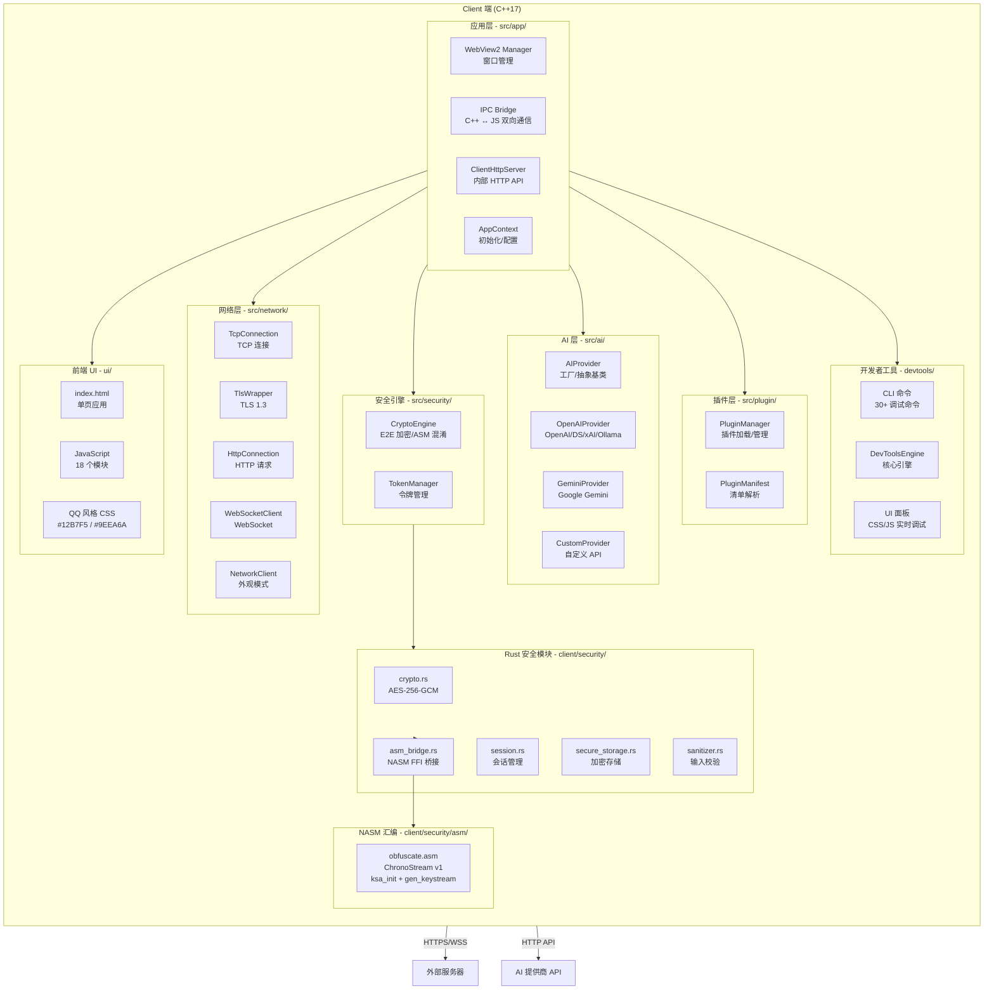
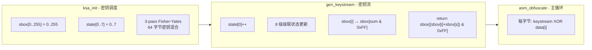
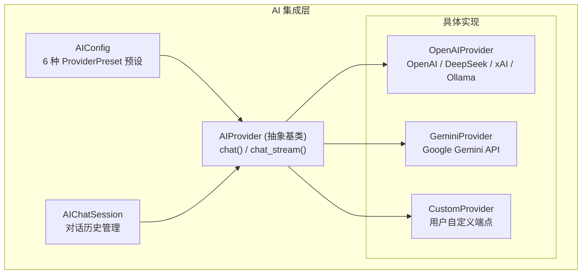
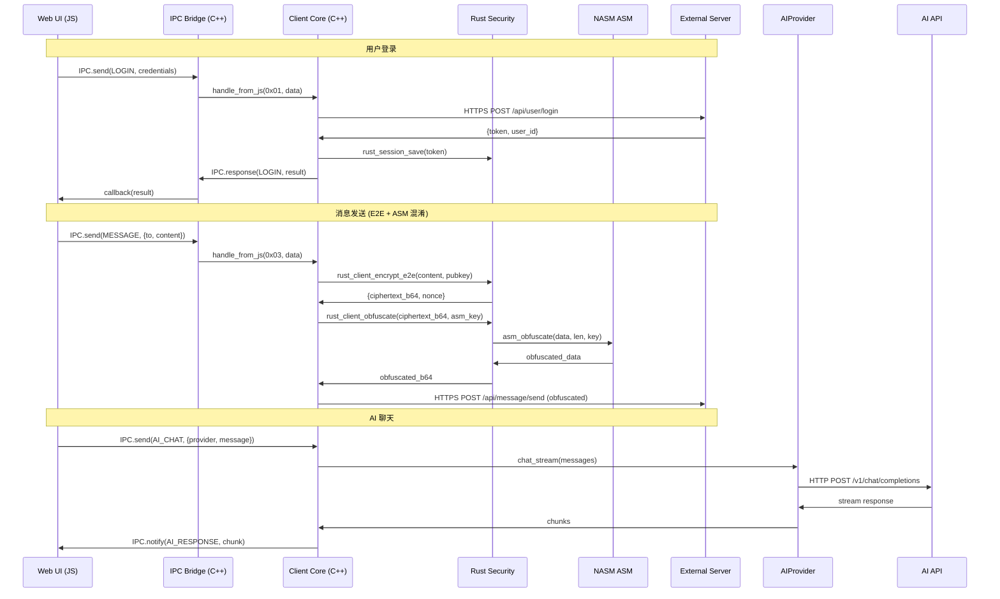

# Chrono-shift 架构设计文档

> **版本**: v2.0.0 | **更新**: 2026-05-03

## 项目概述

一款跨平台 QQ 风格即时通讯桌面客户端。**纯客户端架构**（服务端已移除），所有通信通过客户端内置的 HTTP 服务器和网络层完成。内置 E2E 加密、ASM 私有混淆、AI 聊天、插件系统和开发者工具。

---

## 技术栈总览

| 层级 | 技术选型 | 说明 |
|------|---------|------|
| **客户端外壳** | C++17 (GCC/MinGW) | WebView2 集成、IPC 桥接、HTTP 服务器、网络通信 |
| **安全模块** | Rust (stable `x86_64-pc-windows-gnu`) | AES-256-GCM E2E 加密、安全存储、会话管理 |
| **私有加密** | NASM x64 (Win64 COFF) | ChronoStream v1 对称流密码（3-pass Fisher-Yates KSA） |
| **前端界面** | HTML5 + CSS3 + JavaScript (ES6+) | WebView2 渲染的 QQ 风格桌面 GUI |
| **CLI 工具** | C99 (WinSock2) | DevTools CLI 调试、压力测试 |
| **构建系统** | CMake + Cargo + Makefile + NSIS | 多语言混合编译 |
| **安装包** | NSIS v3.12 | Windows 安装程序 |
| **目标平台** | Windows 10/11 / Linux (WebKitGTK) | 64 位 |

---

## 整体架构



---

## 目录结构

```
Chrono-shift/
│
├── client/                              # 桌面客户端
│   ├── CMakeLists.txt                   # CMake 构建配置
│   │
│   ├── include/                         # C 头文件 (遗留)
│   │   ├── client.h
│   │   ├── ipc_bridge.h
│   │   ├── network.h
│   │   ├── webview_manager.h
│   │   ├── local_storage.h
│   │   ├── updater.h
│   │   ├── tls_client.h
│   │   ├── platform_compat.h
│   │   ├── json_parser.h
│   │   └── protocol.h
│   │
│   ├── src/                             # C++17 源码
│   │   ├── app/                         # 应用外壳
│   │   │   ├── Main.cpp                 # 入口点
│   │   │   ├── AppContext.cpp/.h        # 应用上下文
│   │   │   ├── IpcBridge.cpp/.h         # IPC 桥接
│   │   │   ├── ClientHttpServer.cpp/.h  # 内部 HTTP API
│   │   │   ├── WebViewManager.cpp/.h    # WebView2 管理
│   │   │   ├── TlsServerContext.cpp/.h  # TLS 服务端上下文
│   │   │   └── Updater.cpp/.h           # 自动更新
│   │   │
│   │   ├── network/                     # 网络通信
│   │   │   ├── NetworkClient.cpp/.h     # 网络客户端
│   │   │   ├── TcpConnection.cpp/.h     # TCP 连接
│   │   │   ├── HttpConnection.cpp/.h    # HTTP 请求
│   │   │   ├── WebSocketClient.cpp/.h   # WebSocket 客户端
│   │   │   ├── TlsWrapper.cpp/.h        # TLS 包装
│   │   │   ├── Sha1.cpp/.h              # SHA-1 (WS 握手)
│   │   │   └── tls_client.c             # TLS C 接口
│   │   │
│   │   ├── security/                    # 安全引擎
│   │   │   ├── CryptoEngine.cpp/.h      # 加密引擎
│   │   │   └── TokenManager.cpp/.h      # 令牌管理
│   │   │
│   │   ├── storage/                     # 本地存储
│   │   │   ├── LocalStorage.cpp/.h      # 本地持久化
│   │   │   └── SessionManager.cpp/.h    # 会话管理
│   │   │
│   │   ├── util/                        # 工具
│   │   │   ├── Logger.cpp/.h            # 日志
│   │   │   └── Utils.cpp/.h             # 通用工具
│   │   │
│   │   ├── ai/                          # AI 集成层
│   │   │   ├── AIConfig.h/cpp           # AI 配置 + ProviderPreset
│   │   │   ├── AIProvider.h/cpp         # 抽象基类 + 工厂
│   │   │   ├── OpenAIProvider.h/cpp     # OpenAI 兼容协议
│   │   │   ├── GeminiProvider.h/cpp     # Google Gemini
│   │   │   ├── CustomProvider.h/cpp     # 自定义 API
│   │   │   └── AIChatSession.h/cpp      # AI 会话管理
│   │   │
│   │   └── plugin/                      # 插件系统
│   │       ├── PluginManager.cpp/.h     # 插件加载/管理
│   │       ├── PluginManifest.cpp/.h    # 清单解析
│   │       ├── PluginInterface.h         # 插件接口
│   │       └── types.h                  # 类型定义
│   │
│   ├── security/                        # Rust 安全模块
│   │   ├── Cargo.toml                   # Rust 配置 (staticlib + cdylib)
│   │   ├── build.rs                     # NASM 编译脚本
│   │   ├── asm/                         # NASM 汇编
│   │   │   ├── obfuscate.asm            # ChronoStream v1
│   │   │   └── obfuscate.lst            # 列表文件
│   │   ├── include/
│   │   │   └── chrono_client_security.h # C FFI 头文件
│   │   └── src/
│   │       ├── lib.rs                   # FFI 导出入口
│   │       ├── crypto.rs                # AES-256-GCM + ASM 混淆
│   │       ├── asm_bridge.rs            # NASM FFI 桥接
│   │       ├── session.rs               # 会话管理
│   │       ├── secure_storage.rs        # 安全存储
│   │       └── sanitizer.rs             # 输入校验
│   │
│   ├── devtools/                        # 开发者工具
│   │   ├── cli/                         # CLI 命令
│   │   │   ├── main.c                   # 主入口
│   │   │   ├── devtools_cli.h           # 公共头文件
│   │   │   ├── net_http.c               # HTTP 客户端
│   │   │   ├── Makefile                 # 构建配置
│   │   │   └── commands/                # 30+ 命令文件
│   │   │       ├── init_commands.c      # 命令注册
│   │   │       ├── cmd_health.c         # 健康检查
│   │   │       ├── cmd_endpoint.c       # API 端点测试
│   │   │       ├── cmd_token.c          # JWT 解码
│   │   │       ├── cmd_ipc.c            # IPC 消息
│   │   │       ├── cmd_user.c           # 用户管理
│   │   │       ├── cmd_ws.c             # WebSocket 调试
│   │   │       ├── cmd_msg.c            # 消息操作
│   │   │       ├── cmd_friend.c         # 好友管理
│   │   │       ├── cmd_db.c             # 数据库浏览
│   │   │       ├── cmd_session.c        # 会话管理
│   │   │       ├── cmd_config.c         # 配置管理
│   │   │       ├── cmd_storage.c        # 安全存储
│   │   │       ├── cmd_crypto.c         # 加密测试
│   │   │       ├── cmd_network.c        # 网络诊断
│   │   │       ├── cmd_connect.c        # 连接
│   │   │       ├── cmd_disconnect.c     # 断开
│   │   │       ├── cmd_tls.c            # TLS 信息
│   │   │       ├── cmd_gen_cert.c       # 证书生成
│   │   │       ├── cmd_json.c           # JSON 工具
│   │   │       ├── cmd_trace.c          # 请求追踪
│   │   │       ├── cmd_obfuscate.c      # ASM 混淆工具
│   │   │       ├── cmd_ping.c           # 延迟测试
│   │   │       ├── cmd_watch.c          # 实时监控
│   │   │       └── cmd_rate_test.c      # 速率测试
│   │   ├── core/                        # 核心组件 (C++)
│   │   │   ├── DevToolsEngine.cpp/.h    # 引擎
│   │   │   ├── DevToolsHttpApi.cpp/.h   # HTTP API
│   │   │   └── DevToolsIpcHandler.cpp/.h# IPC 处理
│   │   └── ui/                          # UI 面板
│   │       ├── js/devtools.js           # 调试面板 JS
│   │       └── css/devtools.css         # 调试面板样式
│   │
│   ├── tools/                           # 遗留 CLI 工具
│   │   ├── debug_cli.c                  # 调试接口
│   │   ├── stress_test.c                # 压力测试
│   │   └── Makefile
│   │
│   ├── ui/                              # 前端界面
│   │   ├── index.html                   # 单页应用入口
│   │   ├── oauth_callback.html          # OAuth 回调页面
│   │   ├── css/
│   │   │   ├── variables.css            # CSS 变量
│   │   │   ├── global.css               # 全局样式
│   │   │   ├── login.css                # 登录页
│   │   │   ├── main.css                 # 主布局
│   │   │   ├── chat.css                 # 聊天样式
│   │   │   ├── community.css            # 社区样式
│   │   │   ├── qq_group.css             # QQ 群组
│   │   │   ├── ai.css                   # AI 聊天
│   │   │   └── themes/default.css       # 默认主题
│   │   ├── js/
│   │   │   ├── app.js                   # 应用入口/路由
│   │   │   ├── api.js                   # API 请求封装
│   │   │   ├── ipc.js                   # IPC 通信
│   │   │   ├── auth.js                  # 认证管理
│   │   │   ├── oauth.js                 # OAuth 登录
│   │   │   ├── chat.js                  # 聊天逻辑
│   │   │   ├── contacts.js              # 联系人
│   │   │   ├── community.js             # 社区/模板
│   │   │   ├── ai_chat.js               # AI 聊天
│   │   │   ├── ai_smart_reply.js        # AI 智能回复
│   │   │   ├── qq_friends.js            # QQ 好友
│   │   │   ├── qq_group.js              # QQ 群组
│   │   │   ├── qq_file.js               # QQ 文件
│   │   │   ├── qq_status.js             # QQ 状态
│   │   │   ├── qq_emoji.js              # QQ 表情
│   │   │   ├── theme_engine.js          # 主题引擎
│   │   │   ├── plugin_api.js            # 插件 API
│   │   │   └── utils.js                 # 工具函数
│   │   └── assets/images/
│   │       └── default_avatar.png
│   │
│   └── plugins/                         # 插件示例
│       ├── plugin_catalog.json          # 插件目录
│       └── example_plugin/              # 示例插件
│           ├── manifest.json
│           └── plugin.js
│
├── tests/                               # 测试脚本
│   ├── asm_obfuscation_test.sh          # ASM 混淆测试
│   ├── security_pen_test.sh             # 安全渗透
│   ├── api_verification_test.sh         # API 验证
│   └── loopback_test.sh                 # 端到端测试
│
├── installer/
│   └── client_installer.nsi             # 客户端 NSIS 安装脚本
│
├── docs/                                # 文档
│   ├── BUILD.md                         # 构建指南
│   ├── ASM_OBFUSCATION.md               # ChronoStream v1 算法
│   ├── PROJECT_OVERVIEW.md              # 综合项目说明
│   ├── AI_INTEGRATION.md                # AI 集成说明
│   ├── HTTPS_MIGRATION.md               # HTTPS 迁移记录
│   ├── API.md                           # API 接口文档 (遗留)
│   └── PROTOCOL.md                      # 通信协议 (遗留)
│
├── plans/                               # 规划文档
│   ├── ARCHITECTURE.md                  # 本文档
│   ├── phase_handover.md                # 项目交接
│   └── phase_*.md                       # 各 Phase 计划
│
├── reports/                             # 测试报告
│   ├── SUMMARY.md                       # 综合测试报告
│   └── asm_obfuscation_results.md       # ASM 测试报告
│
├── CMakeLists.txt                       # 根 CMake 配置
├── Makefile                             # 根 Makefile
├── cleanup.bat / cleanup.sh             # 清理脚本
├── gen_cert.bat / gen_cert.sh           # 证书生成
└── README.md                            # 入口文档
```

---

## 核心模块详细设计

### 1. 网络层 (Network Layer)

```
TCPConnection (Socket 封装)
    ↓
TlsWrapper (OpenSSL TLS 1.3)
    ↓
HttpConnection (HTTP/1.1 请求)
WebSocketClient (RFC 6455)
    ↓
NetworkClient (外观模式 - 统一管理)
```

**关键特性:**
- 自动重连 + 指数退避
- 连接池管理
- 同步/异步双模式
- 跨平台 (WinSock2 + POSIX)

### 2. Rust 安全模块

通过 `extern "C"` FFI 导出，编译为 `chrono_client_security.a` 静态库：

```c
// 客户端安全模块 FFI 接口
int rust_client_init(const char* app_data_path);
char* rust_client_generate_keypair();
char* rust_client_encrypt_e2e(const char* plaintext_b64, const char* pubkey_b64);
char* rust_client_decrypt_e2e(const char* ciphertext_b64, const char* privkey_b64);
char* rust_client_obfuscate(const char* plaintext_b64, const char* key_hex);
char* rust_client_deobfuscate(const char* ciphertext_b64, const char* key_hex);
void rust_client_free_string(char* s);
```

### 3. NASM 汇编模块 (ChronoStream v1)



- **算法**: 自研对称流密码
- **密钥**: 512 位 (64 字节)
- **实现**: NASM x64 (Win64 COFF)
- **函数**: `asm_obfuscate(data, len, key)` / `asm_deobfuscate(data, len, key)`
- **集成**: Rust `build.rs` → NASM 编译 → Rust FFI → C++ CryptoEngine

### 4. AI 提供商架构



| 提供商 | 实现类 | API 端点 | 认证方式 |
|--------|--------|---------|---------|
| OpenAI | [`OpenAIProvider`](client/src/ai/OpenAIProvider.cpp) | `api.openai.com` | API Key |
| DeepSeek | 复用 `OpenAIProvider` | `api.deepseek.com` | API Key |
| xAI | 复用 `OpenAIProvider` | `api.x.ai` | API Key |
| Ollama | 复用 `OpenAIProvider` | `localhost:11434` | 无 |
| Gemini | [`GeminiProvider`](client/src/ai/GeminiProvider.cpp) | `generativelanguage.googleapis.com` | API Key |
| Custom | [`CustomProvider`](client/src/ai/CustomProvider.cpp) | 用户指定 | 自定义 |

### 5. 插件系统

| 组件 | 文件 | 说明 |
|------|------|------|
| 插件管理器 | [`PluginManager.cpp`](client/src/plugin/PluginManager.cpp) | 加载/卸载/枚举插件 |
| 插件清单 | [`PluginManifest.cpp`](client/src/plugin/PluginManifest.cpp) | `manifest.json` 解析 |
| 插件接口 | [`PluginInterface.h`](client/src/plugin/PluginInterface.h) | 标准插件 API 定义 |
| 示例插件 | [`example_plugin/`](client/plugins/example_plugin/) | 最小插件示例 |
| 插件目录 | [`plugin_catalog.json`](client/plugins/plugin_catalog.json) | 可用插件索引 |

### 6. 开发者工具 (DevTools)

**CLI 命令分类:**

| 分类 | 命令 | 数量 |
|------|------|------|
| 基础功能 | `health`, `endpoint`, `token`, `ipc`, `user` | 5 |
| 客户端本地 | `session`, `config`, `storage`, `crypto`, `network` | 5 |
| 网络调试 | `ws` (connect/send/recv/close/status/monitor) | 1 |
| 数据库操作 | `msg`, `friend`, `db` | 3 |
| 连接管理 | `connect`, `disconnect` | 2 |
| 安全与诊断 | `tls-info`, `gen-cert`, `json-parse`, `json-pretty`, `trace`, `obfuscate` | 6 |
| 性能测试 | `ping`, `watch`, `rate-test` | 3 |
| **合计** | | **25+** |

---

## 通信协议设计



---

## 已完成的开发阶段

| Phase | 名称 | 关键交付 | 状态 |
|-------|------|---------|------|
| 1 | 项目骨架 | 目录结构、Rust FFI、C 基础框架、HTML 结构 | ✅ |
| 2 | 核心通信层 | HTTP/WebSocket 服务器、客户端网络层、协议定义 | ✅ |
| 3 | 用户系统 | 注册/登录、JWT 认证、个人信息、好友系统 | ✅ |
| 4 | 消息系统 | 一对一通讯、消息存储、在线状态 | ✅ |
| 5 | 主题/模板系统 | 纯白默认主题、CSS 变量引擎、模板 CRUD | ✅ |
| 6 | UI QQ 风格重构 | QQ 风格 CSS (#12B7F5/#9EEA6A)、CLI 调试增强 | ✅ |
| 7 | 安全加固 | CSRF/SSRF 防护、文件类型校验、路径遍历防护 | ✅ |
| 8 | 安装包与发布 | NSIS 安装脚本、HTTPS 迁移、文档完善 | ✅ |
| 9 | C++ 重构 + OAuth | 客户端 C→C++ 迁移、OAuth 登录、邮箱验证 | ✅ |
| 9-1b | 客户端 C++ 重构 | C 到 C++ 迁移、模块化重构 | ✅ |
| 9-2 | OAuth 登录 | QQ/微信/OAuth/邮箱注册登录 | ✅ |
| 10 | Rust+ASM 混淆 | ChronoStream v1 私有加密、NASM 汇编核心 | ✅ |
| 11 | AI 多提供商 | 6 家 AI 提供商集成 | ✅ |
| 12 | 综合扩展规划 | 插件系统、QQ 社交功能、DevTools（规划） | 📋 |
| D | 开发者工具 | DevTools CLI 30+ 命令 + UI 面板 | ✅ |
| — | 服务端移除 | `server/` 目录移除，纯客户端架构 | ✅ |
| — | HTTPS 迁移 | 自签名证书、TLS 1.3 强制 | ✅ |

---

## 关键技术决策说明

1. **纯客户端架构**: 原先的 `server/` 目录已在 v0.3.0 移除，项目聚焦桌面客户端，通过外部 API 通信。

2. **C++17 重构**: 客户端从 C99 迁移到 C++17，利用 RAII、智能指针、`std::string`、STL 容器等特性提升代码安全性和可维护性。

3. **Rust 安全模块 FFI**: 通过 `extern "C"` 导出函数，编译为静态库 `.a` 链接到 C++ 程序，避免运行时依赖分发。使用 `panic::catch_unwind` 确保 FFI 边界安全。

4. **NASM 汇编集成**: ChronoStream v1 私有加密算法使用 NASM 编写，通过 Rust `build.rs` 编译为 COFF 目标文件，再链接到 Rust 静态库中。实现 3-pass Fisher-Yates KSA + 8 级级联状态更新。

5. **WebView2 选择**: Windows 10/11 内置 WebView2 Runtime，无需额外分发浏览器引擎，相比 CEF 减小安装包体积 100MB+。

6. **QQ 风格 UI**: 纯白背景 (#FFFFFF)、蓝色主色调 (#12B7F5)、绿色自聊气泡 (#9EEA6A)、280px 固定侧边栏、底部导航指示条、不对称气泡圆角。

7. **AI 多提供商设计**: 抽象基类 `AIProvider` 定义统一接口，OpenAI 兼容协议复用同一实现，Gemini 和 Custom 独立实现，工厂方法根据枚举创建实例。

8. **DevTools CLI 架构**: 命令使用注册模式 - 每个命令文件独立实现 `init_cmd_*()` 函数，`init_commands()` 统一注册，支持交互模式和单命令模式。

---

## 已知架构局限

| 局限 | 说明 | 影响 |
|------|------|------|
| CSP 宽松 | `unsafe-inline` + `unsafe-eval` | XSS 攻击面大 (S1) |
| Token 存储 | localStorage 明文存储 | 易被 XSS 窃取 (S2) |
| IPC 路由 | 按注册顺序匹配而非按类型 | 多处理器时可能错误分发 (S6) |
| WebView2 stub | `navigate`/`evaluate_script` 空实现 | 需真实 WebView2 运行时 (S9) |
| LocalStorage stub | `save_config`/`load_config` 空实现 | 配置持久化缺失 (S8) |

详细信息请参见 [`phase_handover.md`](phase_handover.md) 的"已知问题清单"章节。
