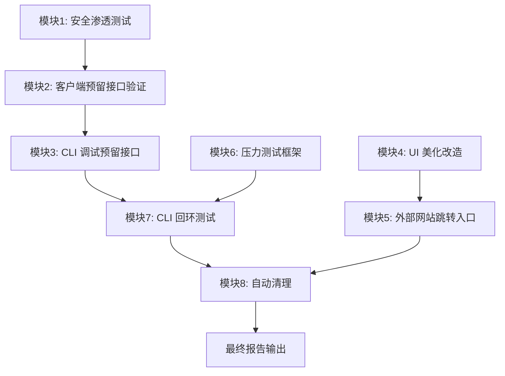

# 墨竹 (Chrono-shift) 综合测试与 UI 改造计划

## 概述

本计划涵盖安全渗透测试、客户端预留接口验证、CLI 调试、UI 美化改造、外部网站跳转入口、压力测试框架、CLI 回环测试以及自动清理共 8 大模块。

---

## 模块 1：安全渗透测试

### 目标
对墨竹服务器进行全面的安全渗透测试，验证各 API 端点的安全性。

### 实施步骤

#### 1.1 创建安全测试脚本 `tests/security_pen_test.sh`
- **SQL 注入测试**：向 `/api/user/login`、`/api/user/profile` 等端点发送含 `' OR 1=1--`、`'; DROP TABLE--` 等 payload 的请求
- **XSS 测试**：向用户名字段、消息内容字段发送 `<script>alert(1)</script>`、`` 等 payload
- **路径遍历测试**：向文件相关端点发送 `../../../etc/passwd`、`..\..\windows\system32\drivers\etc\hosts` 等
- **JWT 伪造测试**：发送空 token、过期 token、篡改 token、算法混淆 token（alg:none）
- **权限越界测试**：未认证访问需认证的端点（`/api/message/send`、`/api/user/friends` 等）
- **大 payload 测试**：发送超大数据包测试缓冲区溢出防护

#### 1.2 执行脚本
```bash
# 使用 debug_cli 发送测试请求
./server/build/debug_cli endpoint /api/user/login POST '{"username":"admin'"'"' OR 1=1--","password":"test"}'
./server/build/debug_cli endpoint /api/user/profile POST '{"username":"<script>alert(1)</script>"}'
./server/build/debug_cli endpoint /api/templates/download '?id=../../../etc/passwd' GET
```

#### 1.3 输出
- `reports/security_pen_test_results.md` — 每个测试用例的结果记录
- 格式：测试名称 | payload | 预期行为 | 实际行为 | 状态(PASS/FAIL)

---

## 模块 2：客户端预留接口验证

### 目标
验证所有 9 个 IPC 消息类型和 11 个 HTTP API 端点的可用性。

### 2.1 IPC 消息类型验证

| 类型 | 名称 | 验证方式 |
|------|------|----------|
| 0x01 | IPC_LOGIN | 通过 IPC 发送登录请求，验证 C 端正确处理 |
| 0x02 | IPC_LOGOUT | 发送登出消息，验证会话清理 |
| 0x10 | IPC_SEND_MESSAGE | 发送消息，验证存储和转发 |
| 0x11 | IPC_GET_MESSAGES | 获取消息历史，验证分页 |
| 0x20 | IPC_GET_CONTACTS | 获取联系人列表 |
| 0x30 | IPC_GET_TEMPLATES | 获取社区模板列表 |
| 0x31 | IPC_APPLY_TEMPLATE | 应用模板主题 |
| 0x40 | IPC_FILE_UPLOAD | 上传文件 |
| 0xFF | IPC_SYSTEM_NOTIFY | 系统通知 |

### 2.2 HTTP API 端点验证

通过 `debug_cli endpoint` 命令逐一测试：

```bash
# 用户系统
debug endpoint /api/user/register POST '{"username":"test","password":"123456","nickname":"测试"}'
debug endpoint /api/user/login POST '{"username":"test","password":"123456"}'
debug endpoint /api/user/profile GET
debug endpoint /api/user/update PUT '{"nickname":"新名字"}'
debug endpoint /api/user/search '?q=test' GET
debug endpoint /api/user/friends GET
debug endpoint /api/user/friends/add POST '{"friend_id":2}'

# 消息系统
debug endpoint /api/message/send POST '{"to_user_id":2,"content":"hello"}'
debug endpoint '/api/message/list?user_id=2&offset=0&limit=50' GET

# 模板系统
debug endpoint '/api/templates?offset=0&limit=20' GET
debug endpoint /api/templates/apply POST '{"template_id":1}'
```

### 2.3 输出
- `reports/api_verification_results.md` — 每个端点的响应状态码和响应体记录

---

## 模块 3：CLI 调试预留接口

### 目标
扩展 `debug_cli.c` 增加 IPC 消息调试能力，并完善 `ipc_bridge.c` 的 C 端实现。

### 3.1 扩展 debug_cli.c
增加新命令：

```c
// IPC 消息测试
ipc send <type_hex> <json_data>    // 发送 IPC 消息
ipc types                          // 列出所有 IPC 消息类型及其含义

// 完整回环测试
loopback                           // 执行完整的 注册→登录→发消息→获取消息→登出 流程
```

### 3.2 完善 ipc_bridge.c
- 实现 `ipc_send_to_js` 函数（目前是 stub，返回 0 但不实际发送）
- 为每个 IPC 消息类型添加专用的 handler 回调
- 添加基本的消息序列化和反序列化

### 3.3 CLI 端到端调试流程

```
debug> health
[*] 服务器运行正常

debug> ipc send 01 {"username":"admin","password":"admin123"}
[*] IPC 消息已发送: type=0x01, data={"username":"admin","password":"admin123"}

debug> ipc types
0x01 - LOGIN
0x02 - LOGOUT
0x10 - SEND_MESSAGE
0x11 - GET_MESSAGES
0x20 - GET_CONTACTS
0x30 - GET_TEMPLATES
0x31 - APPLY_TEMPLATE
0x40 - FILE_UPLOAD
0xFF - SYSTEM_NOTIFY
```

---

## 模块 4：UI 美化改造（现代简约风格）

### 目标
将当前纯白默认主题改造为现代简约风格，提升视觉体验。

### 4.1 CSS 变量系统重构（`variables.css` + `themes/default.css`）

**颜色系统改造：**

```
旧: 淡紫色系 (#7C5CFC) + 纯白背景
新: 柔和渐变 + 毛玻璃效果 + 深色/浅色双模式
```

| 变量 | 旧值 | 新值（现代简约） |
|------|------|----------------|
| `--color-primary` | `#7C5CFC` | `#6366F1` (靛蓝) |
| `--color-primary-hover` | `#6B4DE6` | `#4F46E5` |
| `--color-primary-light` | `#E8E0FF` | `#EEF2FF` |
| `--color-primary-bg` | `#F5F0FF` | `#F8FAFF` |
| `--color-bg-primary` | `#FFFFFF` | `#FAFAFA` |
| `--color-bg-secondary` | `#F9FAFB` | `#F1F5F9` |
| `--color-bg-tertiary` | `#F3F4F6` | `#E2E8F0` |
| `--color-text-primary` | `#1A1A2E` | `#0F172A` |
| `--color-text-secondary` | `#6B7280` | `#475569` |
| `--color-text-tertiary` | `#9CA3AF` | `#94A3B8` |
| `--color-border` | `#E5E7EB` | `#E2E8F0` |
| `--color-shadow` | `rgba(124,92,252,0.1)` | `rgba(99,102,241,0.12)` |

**新增毛玻璃效果变量：**
```css
--glass-bg: rgba(255, 255, 255, 0.7);
--glass-border: rgba(255, 255, 255, 0.3);
--glass-shadow: 0 8px 32px rgba(0, 0, 0, 0.06);
backdrop-filter: blur(12px);
```

### 4.2 登录页面重设计（`login.css`）

**改造前：** 简单渐变背景 + 白色卡片
**改造后：**
- 全屏渐变背景（靛蓝 → 紫 → 淡粉）
- 毛玻璃效果登录卡片
- 背景装饰元素（浮动圆点/波浪）
- Logo 区域添加图标
- 输入框圆角加大，内阴影焦点效果
- 按钮渐变背景 + 悬浮上浮效果

```css
#page-auth {
    background: linear-gradient(135deg, #6366F1 0%, #8B5CF6 50%, #F472B6 100%);
}

.auth-box {
    background: var(--glass-bg);
    backdrop-filter: blur(12px);
    border: 1px solid var(--glass-border);
    box-shadow: var(--glass-shadow);
}
```

### 4.3 侧边栏重设计（`main.css`）

**改造前：** 纯色背景 + 简单分割线
**改造后：**
- 侧边栏背景渐变
- 联系人有毛玻璃 hover 效果
- 选中项左侧彩色指示条
- 头像添加在线状态指示点
- 搜索框圆角 + 左侧搜索图标

### 4.4 聊天界面重设计（`chat.css`）

**改造前：** 标准气泡 + 输入框
**改造后：**
- 聊天气泡圆角不对称（自己：右上方更圆，对方：左上方更圆）
- 气泡尾部三角形
- 时间戳淡入显示
- 输入框区域毛玻璃
- 消息间间距调整
- 未读消息指示点

### 4.5 联系人/社区页面重设计

**联系人卡片：**
- 卡片悬浮阴影
- 头像圆形渐变色边框
- 在线状态脉冲动画

**社区模板：**
- 模板卡片增加悬停放大效果
- 预览图圆角优化
- 下载次数增加计数动画

### 4.6 微交互动画

```css
/* 按钮点击波纹效果 */
.btn::after {
    content: '';
    position: absolute;
    border-radius: 50%;
    background: rgba(255,255,255,0.3);
    transform: scale(0);
    animation: ripple 0.6s linear;
}

/* 页面切换淡入 */
@keyframes fadeInUp {
    from { opacity: 0; transform: translateY(10px); }
    to { opacity: 1; transform: translateY(0); }
}

/* 消息出现动画 */
@keyframes messageIn {
    from { opacity: 0; transform: translateY(5px) scale(0.98); }
    to { opacity: 1; transform: translateY(0) scale(1); }
}
```

### 4.7 文件修改清单

| 文件 | 修改内容 |
|------|----------|
| `client/ui/css/variables.css` | 重写颜色变量系统，添加毛玻璃/动画变量 |
| `client/ui/css/themes/default.css` | 适配新变量系统 |
| `client/ui/css/global.css` | 添加基础动画效果，改进按钮/输入框样式 |
| `client/ui/css/login.css` | 完全重写 - 毛玻璃登录卡片 + 渐变背景 |
| `client/ui/css/main.css` | 侧边栏重设计，外部链接区域样式 |
| `client/ui/css/chat.css` | 聊天气泡/输入框重设计 |
| `client/ui/css/community.css` | 模板卡片美化 |
| `client/ui/index.html` | 添加登录页面装饰元素，侧边栏外部链接区域 |
| `client/ui/js/app.js` | 添加外部链接点击处理 |

---

## 模块 5：外部网站跳转入口

### 目标
在侧边栏底部导航上方添加外部网站入口区域，包含 Bilibili、AcFun、CP 漫展官网。

### 5.1 HTML 结构修改（`index.html`）

在 `sidebar-footer` 上方添加外部链接区域：

```html
<!-- 外部链接区域 -->
<div class="sidebar-external-links">
    <div class="external-links-title">🌐 外部站点</div>
    <div class="external-links-list">
        <a class="external-link" onclick="openExternalUrl('https://www.bilibili.com')" title="Bilibili">
            <span class="ext-link-icon">📺</span>
            <span class="ext-link-name">Bilibili</span>
        </a>
        <a class="external-link" onclick="openExternalUrl('https://www.acfun.cn')" title="AcFun">
            <span class="ext-link-icon">📺</span>
            <span class="ext-link-name">AcFun</span>
        </a>
        <a class="external-link" onclick="openExternalUrl('https://www.comicup.cn')" title="CP漫展">
            <span class="ext-link-icon">🎪</span>
            <span class="ext-link-name">CP漫展</span>
        </a>
    </div>
</div>
```

### 5.2 IPC 扩展

**`ipc_bridge.h`** 新增消息类型：
```c
IPC_OPEN_URL  = 0x50   // 打开外部 URL
```

**`ipc.js`** 新增处理函数：
```javascript
function openExternalUrl(url) {
    IPC.send(IPC.MessageType.OPEN_URL, { url: url });
}
```

### 5.3 CSS 样式

```css
.sidebar-external-links {
    border-top: 1px solid var(--color-border-light);
    padding: var(--spacing-md) var(--spacing-lg);
}

.external-links-title {
    font-size: var(--font-size-xs);
    color: var(--color-text-tertiary);
    margin-bottom: var(--spacing-sm);
    text-transform: uppercase;
    letter-spacing: 0.5px;
}

.external-link {
    display: flex;
    align-items: center;
    gap: var(--spacing-sm);
    padding: var(--spacing-sm) var(--spacing-md);
    border-radius: var(--border-radius-sm);
    cursor: pointer;
    transition: all var(--transition-fast);
    color: var(--color-text-secondary);
    text-decoration: none;
}

.external-link:hover {
    background: var(--color-bg-hover);
    color: var(--color-primary);
}
```

### 5.4 文件修改清单

| 文件 | 修改内容 |
|------|----------|
| `client/include/ipc_bridge.h` | 添加 `IPC_OPEN_URL = 0x50` |
| `client/ui/js/ipc.js` | 添加 `OPEN_URL` 消息类型 + `openExternalUrl()` 函数 |
| `client/ui/js/app.js` | 注册 `openExternalUrl` 全局函数 |
| `client/ui/index.html` | 添加侧边栏外部链接区域 |
| `client/ui/css/main.css` | 添加外部链接区域样式 |

---

## 模块 6：压力测试框架

### 目标
创建可复用的压力测试框架，评估服务器在高负载下的抗冲击能力。

### 6.1 创建压力测试工具 `tools/stress_test.c`

**功能：**
- 多线程 HTTP 请求发送（可配置线程数和总请求数）
- 支持 GET/POST 请求
- 支持自定义请求体
- 统计 QPS、平均/最大/最小响应时间、错误率
- 支持渐进式负载（逐步增加并发数）
- 支持持续模式（固定 QPS 持续 N 秒）

**命令行参数：**
```
Usage: stress_test [options]
  -h, --host <host>         Server host (default: 127.0.0.1)
  -p, --port <port>         Server port (default: 8080)
  -t, --threads <num>       Number of threads (default: 4)
  -n, --requests <num>      Total requests (default: 1000)
  -r, --rate <qps>          Target QPS (0 = unlimited)
  -d, --duration <sec>      Test duration in seconds
  -e, --endpoint <path>     API endpoint (default: /api/health)
  -m, --method <method>     HTTP method (default: GET)
  -b, --body <json>         Request body
  --token <token>           Bearer token for auth
  -v, --verbose             Verbose output
```

**输出示例：**
```
┌─────────────────────────────────────────────────────────┐
│            Chrono-shift 压力测试报告                      │
├─────────────────────────────────────────────────────────┤
│ 目标端点:    GET /api/health                             │
│ 总请求数:    5000                                        │
│ 并发线程:    8                                           │
├─────────────────────────────────────────────────────────┤
│ 成功:        4982 (99.64%)                               │
│ 失败:        18   (0.36%)                                │
│ 超时:        0    (0.00%)                                │
├─────────────────────────────────────────────────────────┤
│ 总耗时:      3.24s                                       │
│ 平均 QPS:    1543.21                                     │
│ 峰值 QPS:    2100.50                                     │
├─────────────────────────────────────────────────────────┤
│ 响应时间:                                               │
│   最小:      0.32ms                                      │
│   平均:      5.18ms                                      │
│   中位数:    4.50ms                                      │
│   P95:       12.30ms                                     │
│   P99:       25.60ms                                     │
│   最大:      180.20ms                                    │
└─────────────────────────────────────────────────────────┘
```

### 6.2 压力测试场景

| 场景 | 端点 | 方法 | 说明 |
|------|------|------|------|
| 基础健康检查 | `/api/health` | GET | 最低负载基准测试 |
| 用户注册 | `/api/user/register` | POST | 写密集型负载 |
| 用户登录 | `/api/user/login` | POST | 认证密集型负载 |
| 消息发送 | `/api/message/send` | POST | 混合读写负载 |
| 用户搜索 | `/api/user/search?q=a` | GET | 读密集型负载 |
| 混合场景 | 以上所有 | 混合 | 真实场景模拟 |

### 6.3 抗冲击能力评估指标

| 指标 | 目标值 | 临界值 |
|------|--------|--------|
| QPS | ≥ 1000 | ≥ 500 |
| P99 响应时间 | ≤ 50ms | ≤ 200ms |
| 错误率 | ≤ 0.1% | ≤ 1% |
| CPU 使用率 | ≤ 70% | ≤ 90% |
| 内存使用 | ≤ 200MB | ≤ 500MB |

### 6.4 CMake 集成

`server/CMakeLists.txt` 添加 stress_test 目标：
```cmake
add_executable(stress_test tools/stress_test.c)
target_include_directories(stress_test PRIVATE include)
if(WIN32)
    target_link_libraries(stress_test PRIVATE ws2_32)
endif()
```

---

## 模块 7：CLI 回环测试

### 目标
使用 debug_cli 工具执行完整的端到端回环测试，验证服务器各功能的连通性。

### 7.1 测试流程

```bash
# Step 1: 健康检查
debug_cli health

# Step 2: 注册用户
debug_cli endpoint /api/user/register POST {"username":"loopback_test","password":"Test123456","nickname":"回环测试"}

# Step 3: 登录获取 token
debug_cli endpoint /api/user/login POST {"username":"loopback_test","password":"Test123456"}

# Step 4: 获取用户信息
debug_cli endpoint /api/user/profile GET

# Step 5: 搜索用户
debug_cli endpoint '/api/user/search?q=loopback' GET

# Step 6: 解码 JWT 验证
debug_cli token <jwt_from_step3>

# Step 7: 验证健康状态再次检查
debug_cli health

# Step 8: 清理测试用户
debug_cli user delete <user_id>
```

### 7.2 自动回环脚本 `tests/loopback_test.sh`

自动执行上述流程，记录每一步的响应状态码和响应体，生成报告。

---

## 模块 8：自动清理

### 目标
创建清理脚本，清除测试临时数据和编译中间文件。

### 8.1 创建 `cleanup.bat`（Windows）

```batch
@echo off
echo [*] Chrono-shift 清理脚本
echo.

echo [1/4] 清理编译中间文件...
if exist server\build rmdir /s /q server\build
if exist client\build rmdir /s /q client\build
echo     [OK]

echo [2/4] 清理测试临时数据...
if exist server\data\test_* del /q server\data\test_*
if exist server\data\loopback_test* del /q server\data\loopback_test*
echo     [OK]

echo [3/4] 清理测试报告...
if exist reports\*.md del /q reports\*.md
echo     [OK]

echo [4/4] 清理日志...
if exist *.log del /q *.log
echo     [OK]

echo.
echo [*] 清理完成
```

### 8.2 创建 `cleanup.sh`（Linux/macOS）

```bash
#!/bin/bash
echo "[*] Chrono-shift 清理脚本"

echo "[1/4] 清理编译中间文件..."
rm -rf server/build client/build
echo "    [OK]"

echo "[2/4] 清理测试临时数据..."
find server/data -name 'test_*' -delete 2>/dev/null
find server/data -name 'loopback_test*' -delete 2>/dev/null
echo "    [OK]"

echo "[3/4] 清理测试报告..."
rm -rf reports/*.md 2>/dev/null
echo "    [OK]"

echo "[4/4] 清理日志..."
rm -f *.log 2>/dev/null
echo "    [OK]"

echo "[*] 清理完成"
```

---

## 执行顺序与依赖关系



---

## 文件修改完整清单

### 修改文件
| 序号 | 文件 | 模块 |
|------|------|------|
| 1 | `server/tools/debug_cli.c` | 模块3 - 扩展 IPC 命令 |
| 2 | `client/include/ipc_bridge.h` | 模块3,5 - 添加 IPC_OPEN_URL |
| 3 | `client/src/ipc_bridge.c` | 模块3 - 完善实现 |
| 4 | `client/ui/js/ipc.js` | 模块3,5 - 添加 OPEN_URL 类型和函数 |
| 5 | `client/ui/js/app.js` | 模块5 - 注册 openExternalUrl |
| 6 | `client/ui/css/variables.css` | 模块4 - 重写颜色系统 |
| 7 | `client/ui/css/themes/default.css` | 模块4 - 适配新变量 |
| 8 | `client/ui/css/global.css` | 模块4 - 改进基础样式 |
| 9 | `client/ui/css/login.css` | 模块4 - 完全重写 |
| 10 | `client/ui/css/main.css` | 模块4,5 - 侧边栏+外部链接样式 |
| 11 | `client/ui/css/chat.css` | 模块4 - 聊天气泡重设计 |
| 12 | `client/ui/css/community.css` | 模块4 - 模板卡片美化 |
| 13 | `client/ui/index.html` | 模块4,5 - 装饰元素+外部链接 |
| 14 | `server/CMakeLists.txt` | 模块6 - 添加 stress_test 目标 |

### 新增文件
| 序号 | 文件 | 模块 |
|------|------|------|
| 1 | `server/tools/stress_test.c` | 模块6 - 压力测试工具 |
| 2 | `tests/security_pen_test.sh` | 模块1 - 安全渗透测试 |
| 3 | `tests/loopback_test.sh` | 模块7 - 回环测试 |
| 4 | `cleanup.bat` | 模块8 - Windows 清理 |
| 5 | `cleanup.sh` | 模块8 - Linux 清理 |
| 6 | `reports/` | 全模块 - 测试结果目录 |

---

## 风险评估

| 风险 | 影响 | 缓解措施 |
|------|------|----------|
| 安全测试可能破坏现有数据库 | 高 | 使用独立测试数据库，不操作生产数据 |
| UI 改造成本超预期 | 中 | 聚焦 CSS 变量改造，不重写 HTML 结构 |
| 压力测试导致服务器崩溃 | 中 | 渐进式增加负载，监控系统资源 |
| Windows 兼容性问题 | 低 | 所有 C 代码使用跨平台兼容层 |
