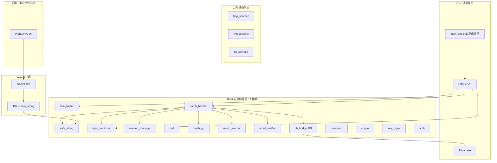

# Phase 11: 激进三语言安全架构 — Rust 安全加固 + C 网络栈 + C++ 轻量编排

> **核心决策**: Rust + C 为后端主力框架，C++ 降级为轻量路由编排层
> **安全焦点**: Java UTF-16 高位截断漏洞 → Rust safe_string 兜底 + 全量安全逻辑 Rust 化
> **设计原则**: Defense in depth — 所有安全敏感逻辑必须经过 Rust 内存安全验证

---

## 一、最终语言分布

| 层 | 语言 | 职责 | 文件数 |
|----|------|------|--------|
| **安全加固层** | **Rust** | 全部安全逻辑：速率限制、输入消毒、会话管理、CSRF、OAuth QQ/微信、SMTP 邮件、OAuth 编排、字符串校验、密码学、JWT | ~14 .rs |
| **网络栈巩固** | **C** | HTTP 服务器、WebSocket、TLS 服务器、HTTP 解析 | ~10 .c/.h |
| **编排层** | **C++** | main_cpp.cpp 路由注册、HttpServer、Database | ~5 .cpp/.h |
| **客户端** | **Java** | TrafficFilter JNI → Rust safe_string | ~5 .java |
| **前端** | HTML/CSS/JS | WebView2 渲染 (保持不变) | ~15 |

## 二、Rust 安全模块完整清单

```
server/security/src/
├── lib.rs              # FFI 导出入口
├── safe_string.rs      # ✅ 已实现 (36 单元测试)
├── password.rs         # ✅ 已有 (Argon2 密码哈希)
├── auth.rs             # ✅ 已有
├── crypto.rs           # ✅ 已有 (AES-GCM)
├── key_mgmt.rs         # ✅ 已有 (密钥管理)
├── rate_limiter.rs     # 🔜 Phase 1 — 滑动窗口速率限制
├── input_sanitizer.rs  # 🔜 Phase 1 — 6 个消毒方法
├── session_manager.rs  # 🔜 Phase 1 — 会话 CRUD
├── csrf.rs             # 🔜 Phase 1 — CSRF 令牌
├── oauth_qq.rs         # 🔜 Phase 2 — QQ OAuth2.0
├── oauth_wechat.rs     # 🔜 Phase 2 — 微信 OAuth2.0
├── email_verifier.rs   # 🔜 Phase 2 — SMTP 邮件发送
├── oauth_handler.rs    # 🔜 Phase 3 — OAuth 业务编排
└── db_bridge.rs        # 🔜 Phase 3 — Database FFI 桥
```

## 三、实施路线 (6 Phases)

### Phase 1: Rust 安全基础模块
**新增文件**: `rate_limiter.rs`, `input_sanitizer.rs`, `session_manager.rs`, `csrf.rs`
**修改文件**: `lib.rs`, `Cargo.toml`, `RustBridge.h`, `RustBridge.cpp`
**代码量**: ~450 行 Rust + ~50 行 C++ FFI

### Phase 2: Rust OAuth 客户端 + SMTP
**新增文件**: `oauth_qq.rs`, `oauth_wechat.rs`, `email_verifier.rs`
**修改文件**: `lib.rs`, `RustBridge.h`, `RustBridge.cpp`
**代码量**: ~600 行 Rust + ~60 行 C++ FFI

### Phase 3: Rust OAuthHandler + Database FFI
**新增文件**: `oauth_handler.rs`, `db_bridge.rs`
**修改文件**: `lib.rs`, `RustBridge.h`, `RustBridge.cpp`, `Database.h/.cpp`
**代码量**: ~800 行 Rust + ~150 行 C++ FFI

### Phase 4: C++ 精简
**删除文件**: `SecurityManager.h/.cpp`, `OAuthClient.h/.cpp`, `EmailVerifier.h/.cpp`, `OAuthHandler.h/.cpp`
**修改文件**: `main_cpp.cpp` 路由注册
**代码量**: -2000 行 C++

### Phase 5: C 网络栈巩固 + 胶水层
**保留 C 文件**: `http_server.c`, `http_conn.c`, `http_core.c`, `http_parse.c`, `websocket.c`, `tls_server.c`
**修改文件**: `main_cpp.cpp` 中间件链接入 Rust safe_string

### Phase 6: Java JNI + 编译验证
**新增**: Java 项目 TrafficFilter + JNI 桥
**测试**: `cargo test`, CMake 编译, 全量集成测试

## 四、架构图



## 五、环境需求

| 工具 | 版本 | 路径 |
|------|------|------|
| JDK | 26.0.1 | 系统默认 |
| Rust | stable-x86_64-pc-windows-gnu | rustup |
| G++ | 15.2.0 MinGW | C:\mingw64\bin |
| MSYS2 | make + OpenSSL | D:\mys32\usr\bin |
| CMake | 已安装 | 系统路径 |
