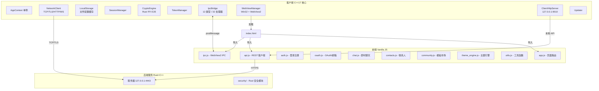
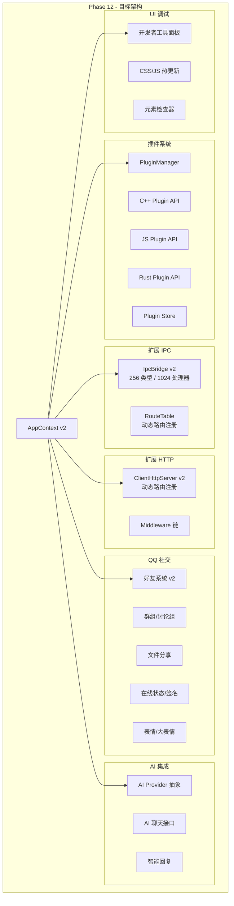
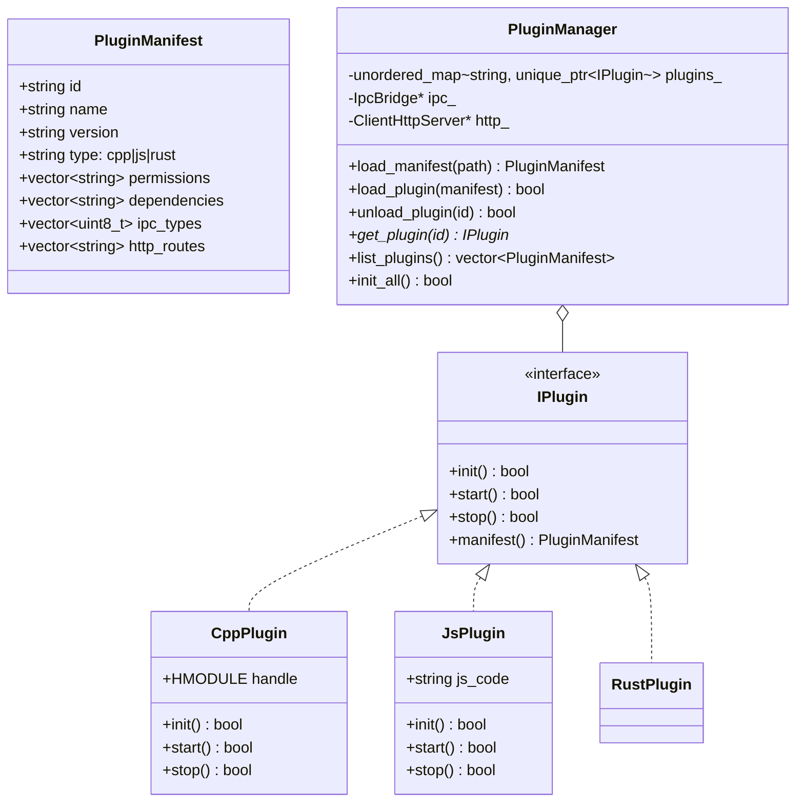
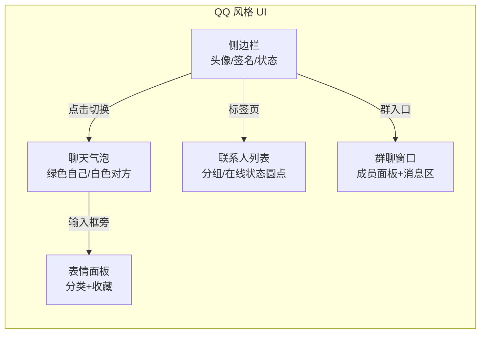
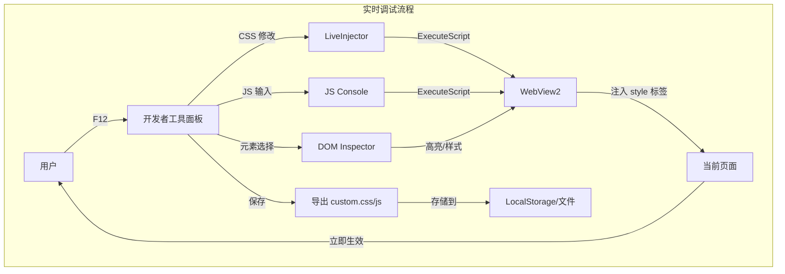
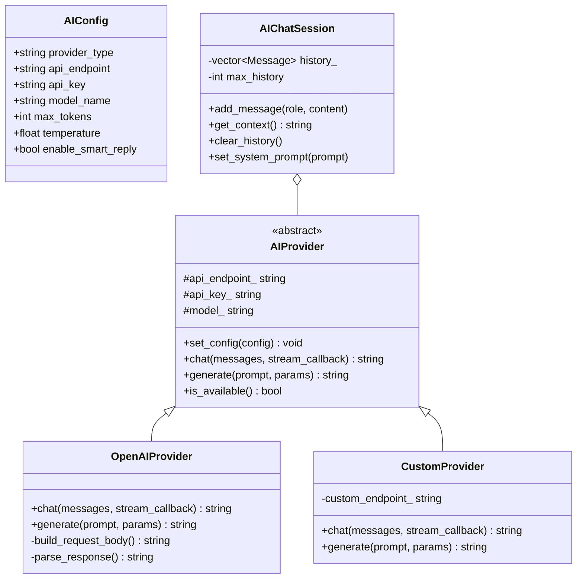

# Chrono-shift 综合扩展计划

> 基于当前代码库的全面分析，制定六大领域的扩展方案

---

## 一、当前架构总览



### 已发现的漏洞与问题

| # | 严重程度 | 问题描述 | 所在文件 |
|---|---------|---------|---------|
| S1 | **严重** | CSP `unsafe-inline` + `unsafe-eval` 开启，XSS 攻击面大 | [`index.html`](../client/ui/index.html:20) |
| S2 | **严重** | Token 存入 `localStorage`，任何 XSS 即可窃取 | [`auth.js`](../client/ui/js/auth.js:28) |
| S3 | **中等** | `send_error_json` 未转义 `message` 参数 → JSON 注入 | [`ClientHttpServer.cpp`](../client/src/app/ClientHttpServer.cpp:254) |
| S4 | **中等** | `contacts.js` 中 `avatar_url` 直接插入 `innerHTML` 未转义 | [`contacts.js`](../client/ui/js/contacts.js:39) |
| S5 | **中等** | `contacts.js` 中 `last_message` 直接插入 `innerHTML` 未转义 | [`contacts.js`](../client/ui/js/contacts.js:43) |
| S6 | **中等** | IPC 路由错误：`handle_from_js` 总是调用第一个注册的处理器，不按类型匹配 | [`IpcBridge.cpp`](../client/src/app/IpcBridge.cpp:70) |
| S7 | **中等** | `community.js` 模板预览直接 fetch 外部 URL → SSRF 风险 | [`community.js`](../client/ui/js/community.js:66) |
| S8 | **低** | `LocalStorage` 的 `save_config`/`load_config`/`save_file`/`load_file` 均为空实现 | [`LocalStorage.cpp`](../client/src/storage/LocalStorage.cpp) |
| S9 | **低** | WebView2 的 `execute_script`/`load_html`/`navigate` 均为空桩 | [`WebViewManager.cpp`](../client/src/app/WebViewManager.cpp) |
| S10 | **低** | IPC `send_to_js` 为空实现 | [`IpcBridge.cpp`](../client/src/app/IpcBridge.cpp:48) |
| S11 | **信息** | `oauth.js` 中 `Auth.sendEmailCode` 递归调用自身（死循环 bug） | [`oauth.js`](../client/ui/js/oauth.js:115) |

---

## 二、整体架构演进



---

## 三、分阶段详细计划

---

### 阶段 A：安全审计与修复（前提条件）

**目标**：修复所有已发现漏洞，为后续扩展打好安全基础

| ID | 任务 | 文件 | 说明 |
|----|------|------|------|
| A1 | 收紧 CSP 策略 | [`index.html`](../client/ui/index.html:20) | 移除 `unsafe-inline`/`unsafe-eval`，改用 nonce 或 hash |
| A2 | Token 改用 httpOnly cookie 或 WebView2 非持久存储 | [`auth.js`](../client/ui/js/auth.js:28) | 防止 XSS 窃取 token |
| A3 | 修复 `send_error_json` JSON 注入 | [`ClientHttpServer.cpp`](../client/src/app/ClientHttpServer.cpp:254) | 对 message 做 JSON 转义 |
| A4 | 修复 `contacts.js` 未转义的 `innerHTML` | [`contacts.js`](../client/ui/js/contacts.js:39-43) | 使用 `textContent` 或 `escapeHtml` |
| A5 | 修复 IPC 路由按类型精确匹配 | [`IpcBridge.cpp`](../client/src/app/IpcBridge.cpp:70) | 用 `unordered_map` 按类型查找 |
| A6 | 修复 `community.js` SSRF 风险 | [`community.js`](../client/ui/js/community.js:66) | 限制模板 ID 为数字，不做未验证的外部请求 |
| A7 | 修复 `oauth.js` 递归调用 bug | [`oauth.js`](../client/ui/js/oauth.js:115) | `Auth.sendEmailCode` 不应自调用 |
| A8 | 给 LocalStorage 函数增加实际实现 | [`LocalStorage.cpp`](../client/src/storage/LocalStorage.cpp) | 实现 JSON 文件读写 |

---

### 阶段 B：插件系统（核心扩展基础）

**目标**：设计三层次插件架构（C++ / JS / Rust），为所有后续扩展提供基础

#### B1. PluginManager 核心

```
client/src/plugin/
├── PluginManager.h        # 插件管理器核心
├── PluginManager.cpp
├── PluginInterface.h      # 插件基类接口
├── PluginManifest.h       # 插件清单（名称/版本/权限/依赖）
├── PluginRegistry.h       # 注册中心
└── types.h                # 公共类型定义
```



#### B2. IPC Bridge 扩展

| ID | 修改 | 当前值 | 目标值 |
|----|------|--------|--------|
| B2-1 | `IpcMessageType` enum 扩展 | 12 类型 | 256 类型 (0x01-0xFF) |
| B2-2 | `kMaxHandlers` 上限 | 32 | 1024 |
| B2-3 | 内部数据结构 | `vector<pair>` | `unordered_map<uint8_t, vector<handler>>` |
| B2-4 | 新增消息类型范围 | - | `kPluginBase=0x70` (~0x9F 插件用), `kExtensionBase=0xA0` (~0xEF 扩展用), `kAIBase=0xF0` (~0xFE AI 用) |

新消息类型分配：

```
0x01-0x6F : 系统核心消息（现有 0x01-0x61）
0x70-0x9F : 插件消息（48 个槽位）
0xA0-0xEF : 扩展消息（80 个槽位）
0xF0-0xFE : AI 系统消息（15 个槽位）
0xFF      : 系统通知
```

#### B3. HTTP 路由注册系统

| ID | 修改 | 当前 | 目标 |
|----|------|------|------|
| B3-1 | `ClientHttpServer` 路由 | 硬编码 2 条 | 动态 `unordered_map<string, handler>` |
| B3-2 | 方法支持 | 仅 GET | GET/POST/PUT/DELETE |
| B3-3 | 中间件链 | 无 | 认证/日志/限流中间件 |
| B3-4 | 路由注册 API | - | `register_route(method, path, handler, middleware?)` |

#### B4. 插件文件规范

```
client/plugins/
├── plugin_catalog.json        # 全局插件目录
├── example_plugin/
│   ├── manifest.json           # 插件清单
│   ├── plugin.cpp              # C++ 插件源码
│   ├── plugin.js               # JS 插件源码
│   ├── assets/
│   └── README.md
└── ...
```

#### B5. 前端插件接口

```
client/ui/js/plugin_api.js     # 前端插件 API 基类
client/ui/css/plugin_base.css   # 插件样式基础
```

- `PluginAPI.register()` - 注册 JS 插件
- `PluginAPI.on(type, handler)` - 订阅 IPC 消息
- `PluginAPI.http(method, path, data)` - 调用本地 HTTP API
- `PluginAPI.storage(key, value?)` - 插件专属存储
- `PluginAPI.ui.createPanel(config)` - 在侧边栏创建面板

---

### 阶段 C：QQ 风格社交功能

**目标**：实现 QQ 核心社交功能，包括好友系统增强、群组、文件分享、状态签名

#### C1. 好友系统增强

```
client/ui/js/qq_friends.js     # QQ 风格好友管理
```

| 功能 | 描述 | 涉及文件 |
|------|------|---------|
| 好友分组/标签 | 可分组的联系人列表 | [`contacts.js`](../client/ui/js/contacts.js) 重构 |
| 好友备注 | 可为好友设置备注名 | 新增 `API.updateFriendNote()` |
| 好友验证 | 添加好友需要验证消息 | 新增后端 API |
| 黑名单功能 | 屏蔽用户 | 新增后端 API |
| 最近联系人 | 显示最近聊天的联系人排序 | [`chat.js`](../client/ui/js/chat.js) 扩展 |

#### C2. 群组/讨论组

```
client/ui/js/qq_group.js       # QQ 群组管理
client/ui/css/qq_group.css     # 群组样式
```

| 功能 | 描述 |
|------|------|
| 创建群组 | 创建新群（指定名称/简介/头像） |
| 加入/退出群 | 群邀请/申请/退出 |
| 群聊 | 群内实时聊天（通过 WebSocket） |
| 群成员管理 | 群主/管理员/普通成员权限 |
| 群公告 | 群置顶消息/公告 |
| 讨论组 | 临时多人会话（不同于永久群组） |

#### C3. 文件分享

```
client/ui/js/qq_file.js        # 文件分享管理
```

| 功能 | 描述 |
|------|------|
| 文件发送 | 支持拖拽/选择文件发送 |
| 图片预览 | 图片消息缩略图+点击放大 |
| 文件传输进度 | 上传/下载进度条 |
| 文件管理 | 已收文件列表/搜索 |
| 离线文件 | 好友离线时留言文件 |

#### C4. 在线状态与签名

```
client/ui/js/qq_status.js      # 状态/签名管理
```

| 功能 | 描述 |
|------|------|
| 在线状态 | 在线/离线/忙碌/隐身（4 种状态） |
| 个性签名 | 用户签名（修改后广播给好友） |
| 自定义头像 | 支持上传自定义头像 |
| 个人名片 | 展示昵称/签名/等级/会员标识 |

#### C5. 表情系统

```
client/ui/js/qq_emoji.js       # QQ 表情
```

| 功能 | 描述 |
|------|------|
| 基础表情 | 经典 QQ 表情集（贴图模式） |
| 大表情 | GIF/动画表情 |
| 自定义表情 | 用户上传收藏表情 |

#### C6. UI 改进



相关 CSS 文件修改：

| 文件 | 修改内容 |
|------|---------|
| [`variables.css`](../client/ui/css/variables.css) | 增加 QQ 风格变量（绿色气泡 `#1AAD19`、在线绿点） |
| [`chat.css`](../client/ui/css/chat.css) | 聊天气泡风格改为 QQ 风格（圆角、绿色/白色） |
| [`contacts.css`](../client/ui/css/community.css) | 联系人分组、在线状态点 |

---

### 阶段 D：CSS/JS/HTML 实时调试

**目标**：内置开发者工具面板，允许用户实时修改 UI 并立即看到效果

#### D1. 后端注入引擎

```
client/src/devtools/
├── DevToolsManager.h        # 开发者工具管理器
├── DevToolsManager.cpp
├── LiveInjector.h           # CSS/JS/HTML 注入引擎
├── LiveInjector.cpp
└── InspectorBridge.h        # DOM 检查器桥接
```

| 组件 | 功能 |
|------|------|
| `DevToolsManager` | 管理开发者工具生命周期，绑定 F12 快捷键 |
| `LiveInjector` | 通过 WebView2 `ExecuteScript` 注入 CSS/JS/HTML 到页面 |
| `InspectorBridge` | IPC 通道，将前端检查器事件传到 C++ 层 |

#### D2. 前端开发者工具面板

```
client/ui/devtools/
├── devtools.html            # 开发者工具主面板（iframe）
├── devtools.css             # 开发者工具样式
├── devtools.js              # 开发者工具主逻辑
├── css_editor.js            # CSS 实时编辑器
├── js_console.js            # JS 控制台
├── html_inspector.js        # HTML 元素检查器
└── theme_playground.js      # 主题沙盒
```

| 面板 | 功能 |
|------|------|
| **CSS 编辑器** | 实时 CSS 编辑面板，修改即时生效，支持自动补全 |
| **JS 控制台** | 类 Chrome DevTools 控制台，可执行任意 JS |
| **HTML 检查器** | 点击页面元素显示 DOM 结构和样式 |
| **主题沙盒** | 可视化修改 CSS 变量（颜色/字体/间距），实时预览 |
| **样式录制** | 记录用户的所有 CSS 修改，可导出为 `custom.css` |



#### D3. 用户自定义文件系统

```
client/data/user_custom/
├── custom.css               # 用户自定义 CSS
├── custom.js                # 用户自定义 JS
├── custom.html              # 用户自定义 HTML 片段
└── themes/
    └── my_theme.css         # 用户创建的主题
```

- 启动时自动加载 `custom.css` 和 `custom.js`
- 实时调试修改后可保存到这些文件
- 支持 `Ctrl+S` 触发文件保存

#### D4. 安全限制

| 措施 | 说明 |
|------|------|
| 沙盒化执行 | 用户 JS 运行在隔离的 iframe 中 |
| API 白名单 | 自定义 JS 只能调用白名单内的 API |
| 持久化审查 | 用户自定义内容仅影响本地，不影响其他用户 |
| 重置功能 | 一键清除所有自定义修改 |

---

### 阶段 E：扩展接口预留

**目标**：在核心系统中预留大量扩展点，确保未来可扩展性

#### E1. IPC 消息槽预留

在 [`IpcBridge.h`](../client/src/app/IpcBridge.h) 中预留：

```
// 系统保留区 0x01-0x6F
// 插件使用区 0x70-0x9F (48 slots)
// 扩展使用区 0xA0-0xEF (80 slots)
// AI 使用区   0xF0-0xFE (15 slots)
```

新增 enum 范围：

```cpp
enum class IpcMessageType : uint8_t {
    // ... 现有类型 ...
    
    // 插件预留 (0x70-0x9F)
    kPluginBase      = 0x70,
    kPluginMax       = 0x9F,
    
    // 扩展预留 (0xA0-0xEF)
    kExtensionBase   = 0xA0,
    kExtensionMax    = 0xEF,
    
    // AI 预留 (0xF0-0xFE)
    kAIBase          = 0xF0,
    kAIChat          = 0xF0,
    kAISmartReply    = 0xF1,
    kAITranslate     = 0xF2,
    kAISummarize     = 0xF3,
    kAIImageGen      = 0xF4,
    kAITTS           = 0xF5,
    kAIMax           = 0xFE,
};
```

#### E2. HTTP 路由预留

在 [`ClientHttpServer.h`](../client/src/app/ClientHttpServer.h) 中新增：

```cpp
// 路由映射表
using RouteHandler = std::function<void(SOCKET, const HttpRequest&)>;
std::unordered_map<std::string, RouteHandler> routes_;

// 预留路由前缀
static constexpr const char* kRoutePluginPrefix   = "/api/plugins/";
static constexpr const char* kRouteExtensionPrefix = "/api/ext/";
static constexpr const char* kRouteAIPrefix        = "/api/ai/";
static constexpr const char* kRouteDevtoolsPrefix  = "/api/devtools/";
```

预注册路由列表：

| 路由 | 用途 |
|------|------|
| `/api/plugins/*` | 插件 HTTP API（阶段 B） |
| `/api/ext/*` | 扩展接口（未来） |
| `/api/ai/*` | AI 接口（阶段 F） |
| `/api/devtools/*` | 开发者工具接口（阶段 D） |
| `/api/qq/*` | QQ 社交功能（阶段 C） |

#### E3. 存储系统预留

在 [`LocalStorage.h`](../client/src/storage/LocalStorage.h) 中新增存储区域：

```cpp
// 预留存储路径
std::string plugins_path_;    // ./data/plugins/
std::string ext_path_;        // ./data/extensions/
std::string ai_path_;         // ./data/ai/
std::string devtools_path_;   // ./data/devtools/
std::string user_custom_path_; // ./data/user_custom/
```

#### E4. AppContext 扩展点

在 [`AppContext.h`](../client/src/app/AppContext.h) 中新增模块：

```cpp
// 新模块预留
std::unique_ptr<PluginManager>      plugin_mgr_;    // 阶段 B
std::unique_ptr<DevToolsManager>    devtools_;      // 阶段 D
std::unique_ptr<AIProvider>         ai_provider_;   // 阶段 F
```

#### E5. 前端全局 API 扩展

在 [`ipc.js`](../client/ui/js/ipc.js) 中新增命名空间：

```javascript
// 全局扩展接口
window.ChronoExtensions = {
    plugins: {},      // 插件注册表
    devtools: {},     // 开发者工具 API
    ai: {},           // AI 接口
    qq: {},           // QQ 社交增强
    hooks: [],        // 生命周期钩子
    storage: {}       // 扩展专属存储
};
```

---

### 阶段 F：AI 集成接口

**目标**：抽象 AI Provider 接口，支持用户配置自己的 AI API

#### F1. C++ AI Provider 抽象层

```
client/src/ai/
├── AIProvider.h           # AI 提供者抽象基类
├── AIProvider.cpp
├── OpenAIProvider.h       # OpenAI API 兼容实现
├── OpenAIProvider.cpp
├── CustomProvider.h       # 自定义 API 实现
├── CustomProvider.cpp
├── AIChatSession.h        # AI 聊天会话管理
├── AIChatSession.cpp
└── AIConfig.h             # AI 配置结构
```



#### F2. AI 功能集成

| 功能 | 描述 | 涉及文件 |
|------|------|---------|
| AI 聊天 | 在聊天界面中与 AI 对话 | [`chat.js`](../client/ui/js/chat.js) 扩展 |
| 智能回复 | 选中消息后 AI 生成回复建议 | 新增 `AISmartReply` IPC |
| 消息摘要 | 群聊/长对话自动摘要 | 新增 IPC + Provider |
| 翻译助手 | 实时翻译消息 | 新增 IPC + Provider |
| 内容审核 | 消息发送前 AI 安全检查 | 后端集成 |

#### F3. AI 配置界面

在 [`index.html`](../client/ui/index.html) 的 `view-settings` 面板中新增：

```
├── AI 配置区域
│   ├── AI 提供商选择（下拉：OpenAI / Custom）
│   ├── API 端点输入
│   ├── API Key 输入（密码框）
│   ├── 模型名称输入
│   ├── 参数调节（温度/最大Token）
│   └── 测试连接按钮
```

#### F4. 前端 AI UI

```
client/ui/js/ai_chat.js       # AI 聊天界面
client/ui/js/ai_smart_reply.js # 智能回复
client/ui/css/ai.css           # AI 相关样式
```

AI 聊天气泡样式：

```html
<div class="message message-ai">
    <div class="message-avatar">🤖</div>
    <div class="message-bubble message-ai-bubble">
        <p>这是 AI 的回复</p>
        <div class="message-actions">
            <button onclick="AIChat.regenerate()">重新生成</button>
            <button onclick="AIChat.copy()">复制</button>
        </div>
    </div>
</div>
```

---

## 四、整体实施路线图

```mermaid
gantt
    title Chrono-shift 综合扩展计划
    dateFormat  YYYY-MM-DD
    axisFormat  %m/%d
    
    section 阶段A - 安全修复
    收紧 CSP 策略                    :A1, 1d
    Token 安全存储                    :A2, 1d
    JSON 注入修复                     :A3, 0.5d
    innerHTML 转义修复                :A4, 0.5d
    IPC 路由修复                      :A5, 1d
    SSRF 修复                        :A6, 0.5d
    递归调用 bug 修复                :A7, 0.5d
    LocalStorage 实现                :A8, 2d
    
    section 阶段B - 插件系统
    PluginManager 核心                :B1, 3d
    IPC Bridge 扩展                   :B2, 2d
    HTTP 路由注册系统                 :B3, 2d
    插件文件规范与示例                :B4, 1d
    前端插件 API                      :B5, 2d
    
    section 阶段C - QQ 社交功能
    好友系统增强                      :C1, 2d
    群组/讨论组                       :C2, 3d
    文件分享                          :C3, 2d
    在线状态与签名                    :C4, 1d
    表情系统                          :C5, 1d
    UI 风格调整                       :C6, 2d
    
    section 阶段D - UI 调试
    后端 LiveInjector                 :D1, 2d
    前端 DevTools 面板                :D2, 3d
    自定义文件系统                    :D3, 1d
    安全限制                          :D4, 1d
    
    section 阶段E - 扩展预留
    IPC 消息槽                        :E1, 0.5d
    HTTP 路由预留                    :E2, 0.5d
    存储系统预留                      :E3, 0.5d
    AppContext 扩展点                 :E4, 0.5d
    前端 API 扩展                     :E5, 1d
    
    section 阶段F - AI 集成
    AI Provider 抽象层                :F1, 3d
    AI 功能集成                       :F2, 2d
    AI 配置界面                       :F3, 1d
    AI 聊天 UI                        :F4, 2d
```

---

## 五、关键文件变更清单

### 新增文件

```
client/src/plugin/PluginManager.h
client/src/plugin/PluginManager.cpp
client/src/plugin/PluginInterface.h
client/src/plugin/PluginManifest.h
client/src/plugin/PluginRegistry.h
client/src/devtools/DevToolsManager.h
client/src/devtools/DevToolsManager.cpp
client/src/devtools/LiveInjector.h
client/src/devtools/LiveInjector.cpp
client/src/devtools/InspectorBridge.h
client/src/ai/AIProvider.h
client/src/ai/AIProvider.cpp
client/src/ai/OpenAIProvider.h
client/src/ai/OpenAIProvider.cpp
client/src/ai/CustomProvider.h
client/src/ai/CustomProvider.cpp
client/src/ai/AIChatSession.h
client/src/ai/AIChatSession.cpp
client/src/ai/AIConfig.h
client/ui/devtools/devtools.html
client/ui/devtools/devtools.css
client/ui/devtools/devtools.js
client/ui/devtools/css_editor.js
client/ui/devtools/js_console.js
client/ui/devtools/html_inspector.js
client/ui/devtools/theme_playground.js
client/ui/js/plugin_api.js
client/ui/js/qq_friends.js
client/ui/js/qq_group.js
client/ui/js/qq_file.js
client/ui/js/qq_status.js
client/ui/js/qq_emoji.js
client/ui/js/ai_chat.js
client/ui/js/ai_smart_reply.js
client/ui/css/qq_group.css
client/ui/css/ai.css
client/ui/css/devtools.css
```

### 修改文件

| 文件 | 修改内容 |
|------|---------|
| [`IpcBridge.h`](../client/src/app/IpcBridge.h) | 扩展消息类型到 256 个，增加范围定义 |
| [`IpcBridge.cpp`](../client/src/app/IpcBridge.cpp) | 修复路由为精确匹配，扩展处理器上限 |
| [`ClientHttpServer.h`](../client/src/app/ClientHttpServer.h) | 增加动态路由注册、中间件链 |
| [`ClientHttpServer.cpp`](../client/src/app/ClientHttpServer.cpp) | 实现路由表、JSON 注入修复 |
| [`AppContext.h`](../client/src/app/AppContext.h) | 新增 PluginManager/DevTools/AIProvider 模块 |
| [`AppContext.cpp`](../client/src/app/AppContext.cpp) | 初始化新模块 |
| [`WebViewManager.cpp`](../client/src/app/WebViewManager.cpp) | 实现 `ExecuteScript` 等 WebView2 操作 |
| [`LocalStorage.h`](../client/src/app/../storage/LocalStorage.h) | 增加插件/扩展/AI 存储路径 |
| [`LocalStorage.cpp`](../client/src/app/../storage/LocalStorage.cpp) | 实现配置/文件读写 |
| [`index.html`](../client/ui/index.html) | 收紧 CSP，增加 DevTools/AI/QQ 面板 |
| [`ipc.js`](../client/ui/ipc.js) | 增加扩展消息类型、全局扩展 API 命名空间 |
| [`api.js`](../client/ui/api.js) | 增加 QQ/AI/插件相关 API 端点 |
| [`chat.js`](../client/ui/chat.js) | 增加 AI 聊天集成、表情功能 |
| [`contacts.js`](../client/ui/contacts.js) | XSS 修复、分组功能 |
| [`oauth.js`](../client/ui/oauth.js) | 修复递归 bug |
| [`variables.css`](../client/ui/css/variables.css) | 增加 QQ 绿/在线状态/表情变量 |
| [`chat.css`](../client/ui/css/chat.css) | QQ 风格聊天气泡 |

---

## 六、依赖关系

```
阶段A (安全修复)
  ├── 无前置依赖
  ├── 必须先于所有阶段完成
  └── 所有后续阶段依赖 A5 (IPC 路由修复)

阶段B (插件系统)
  ├── 依赖: A5 (IPC 路由修复), A8 (LocalStorage 实现)
  ├── AppContext 新增 PluginManager
  ├── IPC Bridge 扩展
  └── 是 C/D/E/F 的基础平台

阶段C (QQ 社交)
  ├── 依赖: B2 (IPC 扩展), B3 (HTTP 路由)
  ├── 需要 IPC 新消息类型 0x70-0x7F
  └── 需要 HTTP 路由 /api/qq/*

阶段D (UI 调试)
  ├── 依赖: A5, A1 (CSP 收紧), B2, B3
  ├── 需要 WebView2 ExecuteScript 实现
  └── 需要安全的 JS 注入通道

阶段E (扩展预留)
  ├── 依赖: B (插件系统整体)
  ├── 贯穿整个代码库的预留点
  └── 可与 C/D/F 并行进行

阶段F (AI 集成)
  ├── 依赖: B2 (IPC 扩展), B3 (HTTP 路由)
  ├── 需要 HTTP 路由 /api/ai/*
  ├── 需要 IPC 消息类型 0xF0-0xFE
  └── 需要 NetworkClient 做 HTTP 请求到外部 AI API
```

---

## 七、技术决策说明

### 为什么用 WebView2 ExecuteScript 注入而不是修改源文件？
- 实时性：修改立即生效，无需重启
- 安全性：不影响源文件，重置方便
- 隔离性：用户修改与产品代码分离

### 为什么用抽象 Provider 模式而不是直接硬编码 AI API？
- 用户可选择自己喜欢的 AI 服务
- 未来可轻松添加新 Provider
- 统一接口降低耦合

### 为什么插件系统分三层 (C++/JS/Rust)？
- C++ 层：高性能/系统级操作（网络/文件/加密）
- JS 层：UI 操作/前端扩展（快速开发）
- Rust 层：安全敏感操作（加密验证）

### 为什么保留 0x70-0xFF 作为扩展空间？
- 当前仅用 0x01-0x61，剩余 90% 空间给未来
- 分区管理（插件/扩展/AI）避免冲突
- 支持最多 143 种新消息类型

---

## 八、实施顺序建议

**最短可行路径** (快速交付)：

```
阶段A → 阶段E(轻量) → 阶段F → 阶段C → 阶段D → 阶段B(完整) → 阶段E(完整)
```

**完整实施路径** (一次性交付)：

```
阶段A → 阶段B → 阶段E → 阶段C + 阶段F(并行) → 阶段D
```

---

*计划版本: v1.0*
*制定日期: 2026-05-02*
