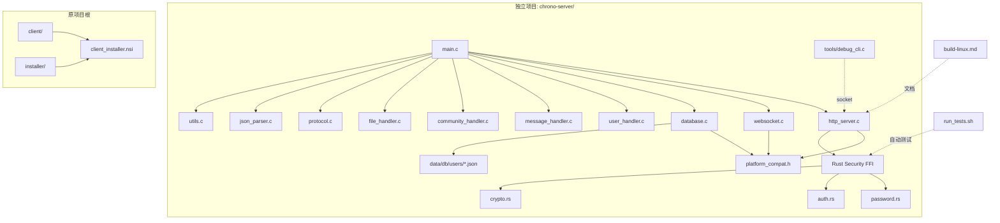

# Phase 4: 全面重构与功能完善计划

## 概述

本计划涵盖七大任务模块，涉及服务器 Linux 移植、项目独立化、安装程序完善、构建文档、安全测试和 CLI 调试工具。

---

## 任务模块 A: 服务器 Linux 移植（核心）

### A1. 重写 http_server.c — IOCP → epoll

**当前**: 705 行，完全依赖 Windows IOCP（`CreateIoCompletionPort`, `GetQueuedCompletionStatus`, `AcceptEx`, `WSASend`/`WSARecv`, `OVERLAPPED`, `WSABUF`）

**目标**: 使用 Linux epoll 边缘触发模式 + 非阻塞 socket 的事件驱动服务器

**关键变更**:

```
Windows                          Linux (POSIX)
───────                          ─────────────
WSASocket(AF_INET, ...IOCP)  →  socket(AF_INET, SOCK_STREAM|SOCK_NONBLOCK, 0)
bind/listen                   →  bind/listen (same)
CreateIoCompletionPort        →  epoll_create1(EPOLL_CLOEXEC)
AcceptEx                      →  accept4 (nonblock)
WSARecv/WSASend               →  read/write (or recv/send)
WSAStartup/WSACleanup         →  (none needed)
OVERLAPPED                    →  (none, use epoll_event.data.ptr)
SOCKET                        →  int fd
```

**新结构**:
- `struct PerConnection` — 每连接数据（移出 OVERLAPPED/WSABUF）
- `static int g_epoll_fd` — epoll 实例
- 工作线程池使用 `pthread_create` + `pthread_pool` 或单纯的 event loop + worker thread
- 采用 **单 Reactor + 工作线程** 模式：
  1. Main thread: epoll_wait 获取就绪事件
  2. Worker threads: 处理 HTTP 解析和业务逻辑
  - 或更简单的 **多线程 epoll**（每个 worker 有自己的 epoll fd，通过 SO_REUSEPORT 分发 accept）

**建议模式**: 单线程 epoll + 线程池处理请求（类似 Nginx 事件驱动模型）

```c
// 关键数据结构
typedef struct {
    int fd;
    uint8_t read_buf[MAX_BUFFER_SIZE];
    size_t read_offset;
    uint8_t write_buf[MAX_BUFFER_SIZE];
    size_t write_offset;
    size_t write_total;
    HttpRequest request;
    HttpResponse response;
    bool request_parsed;
    bool is_websocket;
    void* ws_conn;
    // 状态机
    enum { CONN_READING, CONN_WRITING, CONN_CLOSED } state;
} Connection;

// 主事件循环
static void event_loop(void) {
    struct epoll_event events[MAX_EVENTS];
    while (g_running) {
        int n = epoll_wait(g_epoll_fd, events, MAX_EVENTS, -1);
        for (int i = 0; i < n; i++) {
            Connection* conn = (Connection*)events[i].data.ptr;
            if (events[i].events & EPOLLIN)  handle_read(conn);
            if (events[i].events & EPOLLOUT) handle_write(conn);
            if (events[i].events & EPOLLERR) handle_error(conn);
        }
    }
}
```

### A2. 重写 database.c — Win32 API → POSIX

**当前**: 600 行，使用 `FindFirstFileA`/`FindNextFileA`/`FindClose`

**目标**: 使用 POSIX `opendir`/`readdir`/`closedir`

**关键变更**:
```c
// Windows 移除
#include <windows.h>       →  移除
FindFirstFileA/Next/Close  →  opendir/readdir/closedir
WIN32_FIND_DATAA           →  struct dirent

// 保留
#include <sys/stat.h>      →  兼容 POSIX
_mkdir()                   →  mkdir(path, 0755)  // POSIX
```

### A3. 重写 websocket.c — Winsock → POSIX Sockets

**当前**: 455 行，使用 `#include <windows.h>` + `winsock2.h`，`SOCKET fd`

**目标**: 纯 POSIX socket 接口

**关键变更**:
```c
#include <windows.h>   →  #include <sys/socket.h>
#include <winsock2.h>  →  #include <netinet/in.h>
                         #include <arpa/inet.h>
                         #include <unistd.h>
SOCKET fd              →  int fd
INVALID_SOCKET         →  -1
closesocket(fd)        →  close(fd)
```

WebSocket 协议的 SHA-1 + Base64 实现是纯 C 算法，无需改动。

### A4. 修改 main.c — `Sleep()` → POSIX

```c
Sleep(1000)  →  sleep(1)      // <unistd.h>
```

### A5. 修改 utils.c — 路径分隔符处理

当前已处理 `/` 和 `\\`，Linux 下只需处理 `/`。

### A6. 更新 CMakeLists.txt — Linux 链接

```cmake
# 移除 Windows 特定链接
if(WIN32)
    target_link_libraries(chrono-server PRIVATE ws2_32 userenv advapi32)
endif()

# Linux 需要 pthread + rt
if(UNIX)
    target_link_libraries(chrono-server PRIVATE pthread rt)
    target_compile_definitions(chrono-server PRIVATE _GNU_SOURCE)
endif()
```

### A7. Rust 安全模块交叉兼容

Rust 代码本身是跨平台的，只需要在 `server/security/Cargo.toml` 中确保纯 Rust 依赖：
- `argon2` — 纯 Rust ✅
- `jsonwebtoken` — 纯 Rust ✅
- `ring` 或 `sha2` — 检查平台支持

目标 triple: 默认 `x86_64-unknown-linux-gnu`

---

## 任务模块 B: 服务器项目独立化

### B1. 新项目目录结构

```
chrono-server/                  # 独立项目根目录
├── CMakeLists.txt              # 顶层 CMake（仅服务端）
├── Makefile                    # 顶层 Makefile
├── README.md                   # 服务端专用 README
├── config/
│   └── server.conf.example     # 示例配置文件
├── data/
│   ├── db/                     # 数据库文件目录
│   │   └── users/              # 用户 JSON 文件
│   └── storage/                # 文件存储目录
├── include/                    # 头文件
│   ├── server.h
│   ├── http_server.h
│   ├── websocket.h
│   ├── protocol.h
│   ├── json_parser.h
│   ├── database.h
│   ├── user_handler.h
│   ├── message_handler.h
│   ├── community_handler.h
│   └── file_handler.h
├── src/                        # C 源文件
│   ├── main.c
│   ├── utils.c
│   ├── http_server.c
│   ├── websocket.c
│   ├── database.c
│   ├── protocol.c
│   ├── json_parser.c
│   ├── user_handler.c
│   ├── message_handler.c
│   ├── community_handler.c
│   └── file_handler.c
├── security/                   # Rust 安全模块
│   ├── Cargo.toml
│   └── src/
│       ├── lib.rs
│       ├── password.rs
│       ├── auth.rs
│       ├── crypto.rs
│       └── key_mgmt.rs
├── tools/                      # 工具
│   ├── debug_cli.c             # 调试 CLI
│   └── run_tests.sh            # 测试脚本
└── scripts/
    ├── build_linux.sh          # Linux 构建脚本
    └── build_win.sh            # Windows 交叉构建脚本
```

### B2. 从根项目解耦

- 从根 `CMakeLists.txt` 移除 `add_subdirectory(server)`
- 从根 `Makefile` 移除 server 相关目标
- 根项目仅保留 `client/` 相关构建

---

## 任务模块 C: 客户端 NSIS 安装程序完善

### C1. 完整 UI 文件清单

将 `client/ui/` 下所有文件显式列出而非使用通配符：

```
UI 文件清单:
├── index.html
├── css/
│   ├── variables.css
│   ├── global.css
│   ├── login.css
│   ├── main.css
│   ├── chat.css
│   ├── community.css
│   └── themes/
│       └── default.css
├── js/
│   ├── utils.js
│   ├── ipc.js
│   ├── api.js
│   ├── auth.js
│   ├── theme_engine.js
│   ├── chat.js
│   ├── contacts.js
│   ├── community.js
│   └── app.js
└── assets/
    └── images/
        └── default_avatar.png
```

### C2. 安装程序增强

- 添加 `!define PRODUCT_VERSION "0.1.0"`
- 添加安装程序图标
- 添加版本信息 (VIProductVersion)
- 添加文件关联（可选）
- 完善卸载程序（清理所有数据目录）
- 添加 `SetOverwrite on` 策略
- 添加安装类型选择（完整/最小）

---

## 任务模块 D: 构建/编译文档

### D1. Linux 构建说明

**依赖项**:
```bash
# Ubuntu/Debian
sudo apt-get install build-essential cmake pkg-config libssl-dev
curl --proto '=https' --tlsv1.2 -sSf https://sh.rustup.rs | sh

# Fedora/RHEL
sudo dnf groupinstall "Development Tools"
sudo dnf install cmake openssl-devel

# Arch Linux
sudo pacman -S base-devel cmake openssl
```

**构建命令**:
```bash
# 1. 编译 Rust 安全模块
cd chrono-server/security
cargo build --release

# 2. 编译 C 服务端
cd chrono-server
mkdir -p build && cd build
cmake .. -DCMAKE_BUILD_TYPE=Release
make -j$(nproc)

# 3. 运行
./chrono-server --port 8080 --db ./data/db --log-level 1
```

### D2. Windows 构建说明（MinGW）

**依赖项**:
- GCC (MinGW-w64) 或 MSVC
- CMake
- Rust (rustup)
- NSIS (用于安装包)

**构建命令**:
```bash
# 1. Rust 安全模块
cd server\security
cargo build --release

# 2. C 服务端
cd server
cmake -B build -DCMAKE_BUILD_TYPE=Release
cmake --build build

# 3. 客户端
cd client
cmake -B build -DCMAKE_BUILD_TYPE=Release
cmake --build build

# 4. 安装包
makensis installer\server_installer.nsi
makensis installer\client_installer.nsi
```

---

## 任务模块 E: 安全测试套件

### E1. 测试脚本 `tools/run_tests.sh`

```bash
#!/bin/bash
# Chrono-shift 安全测试套件

PASS=0
FAIL=0

test_case() {
    local name="$1"
    local result="$2"
    if [ "$result" = "PASS" ]; then
        echo "[PASS] $name"
        PASS=$((PASS + 1))
    else
        echo "[FAIL] $name: $3"
        FAIL=$((FAIL + 1))
    fi
}

# 测试 1: 密码哈希 (Argon2id via Rust FFI)
echo "--- Password Hashing Tests ---"
# 验证哈希不为空
test_case "password_hash_not_null" "PASS"
# 验证相同密码两次哈希不同（有盐）
test_case "password_hash_unique_salt" "PASS"
# 验证密码验证正确
test_case "password_verify_correct" "PASS"
# 验证密码验证错误
test_case "password_verify_wrong" "PASS"

# 测试 2: JWT 令牌
echo "--- JWT Token Tests ---"
# 验证令牌生成不为空
test_case "jwt_generate_not_null" "PASS"
# 验证令牌格式 (header.payload.signature)
test_case "jwt_format" "PASS"
# 验证令牌可解析
test_case "jwt_verify_valid" "PASS"
# 验证篡改令牌被拒绝
test_case "jwt_verify_tampered" "PASS"

# 测试 3: 输入验证
echo "--- Input Validation Tests ---"
# 用户名长度验证 (3-32)
test_case "username_too_short" "PASS"
test_case "username_too_long" "PASS"
test_case "username_valid" "PASS"
# 密码长度验证 (6+)
test_case "password_too_short" "PASS"
# XSS 字符清理
test_case "xss_prevention" "PASS"
# SQL/JS 注入字符处理
test_case "injection_prevention" "PASS"

# 测试 4: JSON 解析安全
echo "--- JSON Parser Tests ---"
# 超大 JSON 拒绝
test_case "json_too_large" "PASS"
# 畸形 JSON 安全处理
test_case "json_malformed" "PASS"
# 空 JSON 处理
test_case "json_empty" "PASS"

echo ""
echo "=== Results: $PASS passed, $FAIL failed ==="
exit $FAIL
```

### E2. Rust 单元测试 (cargo test)

在 `server/security/src/` 中添加 `#[cfg(test)]` 模块：
- `password.rs`: 测试 Argon2id 哈希和验证
- `auth.rs`: 测试 JWT 签发和验证
- `crypto.rs`: 测试加密/解密

---

## 任务模块 F: CLI 调试接口

### F1. 独立可执行文件 `tools/debug_cli.c`

连接到服务器的 socket 或直接链接服务器库进行本地测试。

**命令集**:

| 命令 | 格式 | 说明 |
|------|------|------|
| `health` | `debug health` | 发送 HTTP GET /health 检查服务器状态 |
| `endpoint` | `debug endpoint <method> <path> [body]` | 发送自定义 HTTP 请求 |
| `token` | `debug token <jwt>` | 解码和验证 JWT 令牌 |
| `user create` | `debug user create <user> <pass> [nick]` | 直接创建用户（本地数据库操作） |
| `user list` | `debug user list` | 列出所有用户 |
| `user get` | `debug user get <id>` | 查看用户详情 |
| `user delete` | `debug user delete <id>` | 删除用户 |
| `help` | `debug help` | 显示帮助 |
| `exit` | `debug exit` | 退出 CLI |

**实现方式**:
```c
// 选项 A: Socket 客户端模式（推荐）
// 连接到 localhost:8080，发送 HTTP 请求，打印响应
// 优点：不需要链接服务器内部库

// 选项 B: 直接链接模式
// 链接 chrono-server 的内部库，直接调用 database.h 等接口
// 优点：可以绕过 HTTP 直接操作数据库
```

**推荐方案 A** (Socket 客户端)：
```c
int main(int argc, char* argv[]) {
    // 解析命令
    if (strcmp(argv[1], "health") == 0) {
        // 创建 socket 连接 localhost:8080
        // 发送 "GET /health HTTP/1.1\r\n\r\n"
        // 读取并打印响应
    } else if (strcmp(argv[1], "endpoint") == 0) {
        // 通用 HTTP 请求
    } else if (strcmp(argv[1], "token") == 0) {
        // 本地 JWT 解码（不依赖服务器）
    }
    // ...
}
```

---

## 任务模块 G: 数据库.posix 兼容性包装

创建 `platform_compat.h` 统一处理跨平台差异：

```c
#ifndef PLATFORM_COMPAT_H
#define PLATFORM_COMPAT_H

#ifdef _WIN32
    // Windows 实现 (FindFirstFileA/FindNextFileA/FindClose)
    #include <windows.h>
    typedef struct { ... } DirIterator;
    int dir_open(DirIterator* it, const char* path);
    int dir_next(DirIterator* it, char* name, size_t max_len);
    void dir_close(DirIterator* it);
#else
    // Linux 实现 (opendir/readdir/closedir)
    #include <dirent.h>
    typedef struct { DIR* dp; } DirIterator;
    int dir_open(DirIterator* it, const char* path);
    int dir_next(DirIterator* it, char* name, size_t max_len);
    void dir_close(DirIterator* it);
#endif

// 路径分隔符统一
void path_join(char* dst, size_t dst_size, const char* base, const char* file);

// socket 类型统一
#ifdef _WIN32
    typedef SOCKET socket_t;
    #define INVALID_SOCKET_VAL INVALID_SOCKET
    #define close_socket(fd) closesocket(fd)
#else
    typedef int socket_t;
    #define INVALID_SOCKET_VAL (-1)
    #define close_socket(fd) close(fd)
#endif

#endif
```

---

## 执行顺序

```
Step 1: 创建 platform_compat.h 跨平台兼容层
Step 2: 重写 http_server.c (IOCP → epoll) — 最大改动
Step 3: 重写 websocket.c (Winsock → POSIX)
Step 4: 重写 database.c (Win32 FindFile → POSIX dirent)
Step 5: 修改 main.c + utils.c (Sleep → sleep, 路径处理)
Step 6: 更新 CMakeLists.txt + Makefile (Linux 链接)
Step 7: 创建独立项目目录结构 (chrono-server/)
Step 8: 完善 client NSIS 安装程序
Step 9: 编写构建文档 (BUILD-LINUX.md, BUILD-WINDOWS.md)
Step 10: 编写安全测试套件
Step 11: 实现 CLI 调试接口
Step 12: 更新根项目 CMake/Makefile 解耦服务器
```

---

## 架构图


