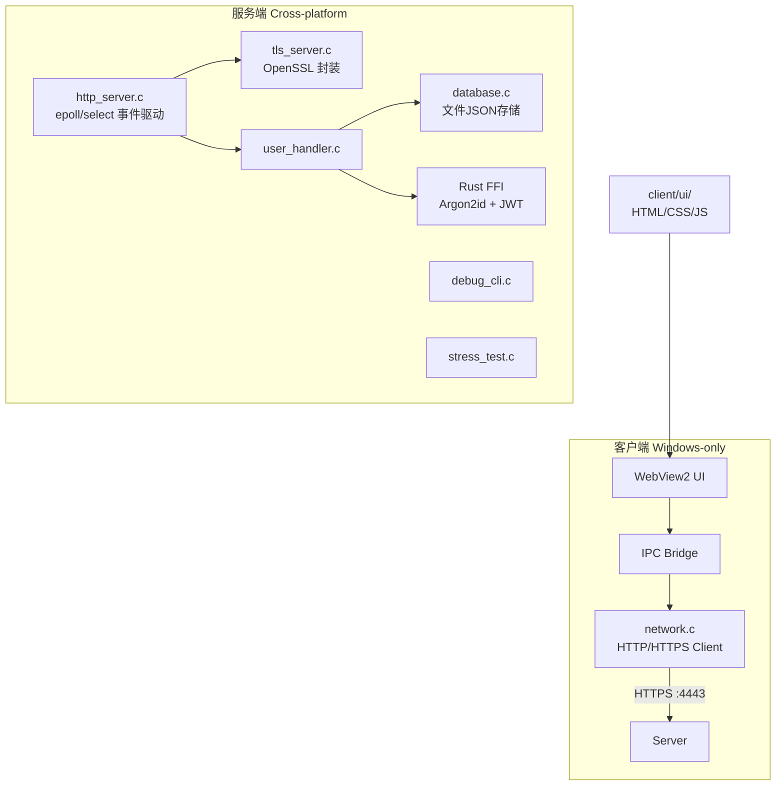
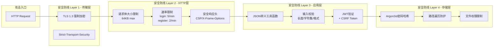
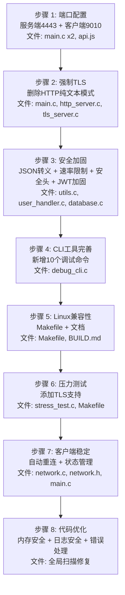

# Phase 5: 全面安全加固与优化计划

## 架构总览（当前状态）



## 发现的关键漏洞

| 漏洞类型 | 位置 | 严重性 | 描述 |
|---------|------|--------|------|
| JSON注入 | `user_handler.c:70` | 🔴 高 | 字符串直接嵌入JSON不带转义 |
| JSON注入 | `database.c` build_user_json | 🔴 高 | 同上，所有JSON构建均无转义 |
| HTTP降级攻击 | `main.c:151` | 🟡 中 | HTTP和HTTPS共存同一端口 |
| 硬编码JWT密钥 | `main.c:36` | 🟡 中 | `chrono-shift-jwt-secret-2024` |
| 无速率限制 | `user_handler.c` 登录/注册 | 🟡 中 | 可暴力破解 |
| 无请求体大小限制 | `http_server.c` | 🟡 中 | 65536字节缓冲区，无上限检查 |
| 无安全响应头 | `http_server.c` | 🟢 低 | 无HSTS/CSP/X-Frame-Options |
| 无路径遍历防护 | `database.c` 文件操作 | 🟡 中 | 用户名未做路径安全检查 |
| 客户端纯Windows | `client/src/*.c` | 🟡 中 | 无法在Linux运行 |

---

## 实施步骤（按执行顺序）

### 步骤 1: 端口配置 [服务端4443 + 客户端9010本地服务]

**目标**: 更改默认端口并添加客户端本地HTTP服务

**涉及文件**:
| 文件 | 修改内容 |
|------|---------|
| [`server/src/main.c:33`](../server/src/main.c#33) | `config->port = 8080` → `config->port = 4443` |
| [`server/src/main.c:117`](../server/src/main.c#117) | `--help` 文本更新端口号 |
| [`client/src/main.c:32`](../client/src/main.c#32) | `config->server_port = 8080` → `config->server_port = 4443` |
| [`client/src/main.c`](../client/src/main.c) | **新增**: 添加 `client_http_server_init(9010)` 本地HTTP服务 |
| [`client/ui/js/api.js`](../client/ui/js/api.js) | API基础URL从 `http://127.0.0.1:8080` → `https://127.0.0.1:4443` |
| [`README.md`](../README.md) | 更新端口信息 |
| [`docs/BUILD.md`](../docs/BUILD.md) | 更新端口信息 |

**新增: 客户端本地HTTP服务 (port 9010)**
- 在 [`client/src`](../client/src) 新增 `client_http_server.c` / `client_http_server.h`
- 简单HTTP服务器用于:
  - 本地静态资源配置
  - WebView2前端通过 localhost:9010 访问本地API
  - 离线缓存和本地存储桥接
- 不影响现有的 `network.c` HTTPS连接

---

### 步骤 2: 删除HTTP纯文本模式 [强制TLS]

**目标**: 删除非TLS HTTP模式，服务端必须使用TLS

**涉及文件**:
| 文件 | 修改内容 |
|------|---------|
| [`server/src/main.c:143-157`](../server/src/main.c#143) | 移除HTTP-only回退逻辑；如果TLS初始化失败则退出 |
| [`server/src/main.c:109-112`](../server/src/main.c#109) | `--tls-cert`/`--tls-key` 从可选变为必需参数 |
| [`server/src/main.c:115-124`](../server/src/main.c#115) | `--help` 更新，移除无TLS选项 |
| [`server/src/http_server.c`](../server/src/http_server.c) | `handle_accept()` 移除HTTP-only连接分支 |
| [`server/src/tls_server.c:init`](../server/src/tls_server.c) | 添加自动生成自签名证书逻辑（当用户未提供证书时） |
| [`server/src/tls_stub.c`](../server/src/tls_stub.c) | 删除stub文件（不再需要非TLS版本） |
| [`server/Makefile`](../server/Makefile) | `HAS_TLS=1` 设为默认，移除 `tls_stub.c` |
| [`server/include/tls_server.h`](../server/include/tls_server.h) | 简化API，移除 `tls_server_is_enabled()` |
| [`docs/HTTPS_MIGRATION.md`](../docs/HTTPS_MIGRATION.md) | 更新为永久TLS文档 |

**新增: 自动自签名证书生成**
- 在 [`server/src/tls_server.c`](../server/src/tls_server.c) 或新增 `certs.c` 中添加:
  - 若未提供 `--tls-cert`/`--tls-key`，自动生成自签名证书
  - 使用 OpenSSL API 生成 RSA 2048 密钥 + 自签名X509证书
  - 保存到 `./certs/server.crt` 和 `./certs/server.key`
  - 首次生成后缓存复用

---

### 步骤 3: 安全加固 [攻击预防拓扑]

**目标**: 全面安全防护，解决JSON注入/输入验证/速率限制等问题



**涉及文件**:

#### 3a. JSON注入修复
| 文件 | 修改内容 |
|------|---------|
| [`server/src/utils.c`](../server/src/utils.c) | **新增** `json_escape_string()` 函数 |
| [`server/include/server.h`](../server/include/server.h) | 声明 `json_escape_string()` |
| [`server/src/user_handler.c:70-80`](../server/src/user_handler.c#70) | 使用 `json_escape_string()` 转义 username/nickname/avatar_url |
| [`server/src/database.c:build_user_json`](../server/src/database.c) | 同样使用转义函数 |
| [`server/src/database.c`](../server/src/database.c) | 扫描所有 `snprintf` JSON构建，确保转义 |

**`json_escape_string()` 实现**:
```c
char* json_escape_string(const char* input) {
    if (!input) return strdup("");
    size_t len = strlen(input);
    // 最大扩展：每个字符可能变成 \uXXXX (6 bytes)
    size_t max_len = len * 6 + 1;
    char* result = malloc(max_len);
    if (!result) return NULL;
    
    size_t j = 0;
    for (size_t i = 0; i < len; i++) {
        unsigned char c = input[i];
        switch (c) {
            case '"':  result[j++] = '\\'; result[j++] = '"';  break;
            case '\\': result[j++] = '\\'; result[j++] = '\\'; break;
            case '\b': result[j++] = '\\'; result[j++] = 'b';  break;
            case '\f': result[j++] = '\\'; result[j++] = 'f';  break;
            case '\n': result[j++] = '\\'; result[j++] = 'n';  break;
            case '\r': result[j++] = '\\'; result[j++] = 'r';  break;
            case '\t': result[j++] = '\\'; result[j++] = 't';  break;
            default:
                if (c < 0x20) {
                    // 控制字符转为 \uXXXX
                    j += snprintf(result + j, max_len - j, "\\u%04x", c);
                } else {
                    result[j++] = c;
                }
                break;
        }
    }
    result[j] = '\0';
    return result;
}
```

#### 3b. 速率限制
| 文件 | 修改内容 |
|------|---------|
| [`server/src/http_server.c`](../server/src/http_server.c) | 添加速率限制中间件逻辑 |
| [`server/include/http_server.h`](../server/include/http_server.h) | 添加速率限制配置字段 |
| [`server/src/main.c`](../server/src/main.c) | 配置速率限制参数 |

**实现方案**: 基于IP的滑动窗口计数器
- 登录: 每IP每5分钟最多5次
- 注册: 每IP每5分钟最多2次  
- 通用API: 每IP每分钟最多60次
- 存储在哈希表 + 定期清理过期条目

#### 3c. 安全响应头
| 文件 | 修改内容 |
|------|---------|
| [`server/src/http_server.c`](../server/src/http_server.c) | 在 `send_response()` 中添加安全头 |
| [`server/src/http_server.c`](../server/src/http_server.c) | 添加请求体大小检查 |

**安全头列表**:
```
Strict-Transport-Security: max-age=31536000; includeSubDomains
X-Content-Type-Options: nosniff
X-Frame-Options: DENY
Content-Security-Policy: default-src 'self'
X-XSS-Protection: 1; mode=block
```

#### 3d. JWT密钥加固
| 文件 | 修改内容 |
|------|---------|
| [`server/src/main.c:36`](../server/src/main.c#36) | 从环境变量 `JWT_SECRET` 读取，无则自动生成 |
| [`server/src/user_handler.c`](../server/src/user_handler.c) | 添加CSRF token验证 |

#### 3e. 输入验证加固
| 文件 | 修改内容 |
|------|---------|
| [`server/src/user_handler.c`](../server/src/user_handler.c) | `handle_user_register`: 添加字符集白名单验证（仅字母数字下划线） |
| [`server/src/user_handler.c`](../server/src/user_handler.c) | `handle_user_login`: 添加重试次数检查 |
| [`server/src/database.c`](../server/src/database.c) | 文件路径添加 `..` 和 `/` 检查，防止路径遍历 |

---

### 步骤 4: CLI快速调试工具完善

**目标**: 扩展 `debug_cli.c` 功能

**新增命令**:
| 命令 | 功能 | 描述 |
|------|------|------|
| `connect` | TLS连接管理 | 显式连接到服务端，显示握手详情 |
| `disconnect` | 断开连接 | 优雅关闭TLS连接 |
| `tls-info` | TLS信息 | 显示当前TLS版本、密码套件、证书信息 |
| `json-parse` | JSON解析测试 | 输入JSON字符串，验证并格式化 |
| `json-pretty` | JSON美化 | 将JSON响应格式化为可读格式 |
| `trace` | 请求追踪 | 启用/禁用详细的HTTP请求/响应日志 |
| `ping` | 延迟测试 | 测量服务端响应时间 |
| `watch` | 实时监控 | 持续显示服务端状态 |
| `rate-test` | 速率测试 | 快速发送N个请求测试速率限制 |
| `help` | 帮助 | 改进帮助系统，显示所有命令详情 |

**涉及文件**:
| 文件 | 修改内容 |
|------|---------|
| [`server/tools/debug_cli.c`](../server/tools/debug_cli.c) | 添加上述10个命令的处理逻辑 |
| [`server/Makefile`](../server/Makefile) | `debug-cli` 目标添加 TLS 标志默认启用 |

---

### 步骤 5: Linux兼容性检查与修复

**目标**: 验证服务端在Linux上的编译和运行

**检查清单**:
| 检查项 | 状态 | 修复 |
|--------|------|------|
| [`server/src/http_server.c`](../server/src/http_server.c) epoll实现 | ✅ 已有Linux路径 | 无需修改 |
| [`server/src/tls_server.c`](../server/src/tls_server.c) OpenSSL | ✅ 跨平台 | 无需修改 |
| [`server/Makefile`](../server/Makefile) 交叉编译 | ⚠️ MSYS2硬编码路径 | 改为可配置OPENSSL_PATH |
| [`server/src/database.c`](../server/src/database.c) 文件路径 | ⚠️ 硬编码 `./data/db/` | 使用跨平台路径分隔符（已在platform_compat.h处理） |
| [`server/src/platform_compat.h`](../server/src/platform_compat.h) | ✅ 已有完整Linux分支 | 无需修改 |
| Rust安全模块编译 | ⚠️ 需要Linux Rust工具链 | 添加 `cargo build` Linux指令到Makefile |
| 端口变更4443 | ✅ 无平台依赖 | 无需修改 |

**涉及文件**:
| 文件 | 修改内容 |
|------|---------|
| [`server/Makefile`](../server/Makefile) | 移除硬编码MSYS2路径；添加条件判断 `OPENSSL_PATH` 环境变量 |
| [`docs/BUILD.md`](../docs/BUILD.md) | 添加Linux构建说明 |
| [`server/CMakeLists.txt`](../server/CMakeLists.txt) | 可选: 添加CMake Linux支持 |

---

### 步骤 6: 服务端压力测试 [TLS支持]

**目标**: 为压力测试工具添加TLS/HTTPS支持并运行测试

**涉及文件**:
| 文件 | 修改内容 |
|------|---------|
| [`server/tools/stress_test.c`](../server/tools/stress_test.c) | 添加TLS连接支持 |
| [`server/Makefile`](../server/Makefile) | `stress-test` 目标添加TLS标志 |

**TLS支持实现**:
- 集成 `tls_server.h` 客户端API
- 新增 `http_request_tls()` 函数
- 配置选项: `--tls` 启用HTTPS
- 使用自签名证书验证开关

**测试场景**:
```yaml
场景 1: health check (低负载基线)
场景 2: user register (高负载注册)  
场景 3: user login (认证强度)
场景 4: get profile (读取负载)
场景 5: 混合场景 (真实模拟)
```

---

### 步骤 7: 客户端稳定性优化

**目标**: 提高客户端网络层的可靠性

**涉及文件**:
| 文件 | 修改内容 |
|------|---------|
| [`client/src/network.c`](../client/src/network.c) | 添加自动重连（指数退避）、心跳检测、连接状态管理 |
| [`client/include/network.h`](../client/include/network.h) | 添加重连配置、连接状态枚举 |
| [`client/src/main.c`](../client/src/main.c) | 添加连接状态监控循环 |
| [`client/ui/js/app.js`](../client/ui/js/app.js) | 显示连接状态指示器 |

**重连策略**:
```
首次重连: 1秒后
第二次: 2秒后
第三次: 4秒后
...
最大间隔: 30秒
最多重试: 10次后停止 (显示 "无法连接服务器")
```

**连接状态管理**:
```c
typedef enum {
    CONN_DISCONNECTED,
    CONN_CONNECTING,
    CONN_CONNECTED,
    CONN_RECONNECTING,
    CONN_FAILED
} ConnState;
```

---

### 步骤 8: 大规模代码优化与漏洞修复

**目标**: 综合代码质量提升

**优化清单**:

#### 8a. 内存安全
- [`server/src/database.c`](../server/src/database.c): 检查所有 `malloc`/`free` 配对，确保无内存泄漏
- [`server/src/user_handler.c`](../server/src/user_handler.c): 错误路径统一释放资源
- [`server/src/http_server.c`](../server/src/http_server.c): Connection对象池化管理

#### 8b. 日志安全
- [`server/src/user_handler.c`](../server/src/user_handler.c): 禁止在日志中打印密码原文
- [`server/src/utils.c`](../server/src/utils.c): 添加日志过滤函数

#### 8c. 错误处理
- [`server/src/http_server.c`](../server/src/http_server.c): 统一JSON错误响应格式
- [`server/src/http_server.c`](../server/src/http_server.c): 添加500 Internal Server Error处理
- [`server/src/user_handler.c`](../server/src/user_handler.c): 完善错误码定义

#### 8d. 代码清理
- [`server/src/message_handler.c`](../server/src/message_handler.c): 保持stub状态（Phase 4功能）
- [`server/src/community_handler.c`](../server/src/community_handler.c): 保持stub状态（Phase 5功能）
- [`server/src/file_handler.c`](../server/src/file_handler.c): 保持stub状态（用户要求不做文件上传）
- 删除 `tls_stub.c`（不再需要）
- 更新所有过时注释

#### 8e. 文档更新
- [`README.md`](../README.md): 更新端口、TLS要求、安全特性
- [`docs/BUILD.md`](../docs/BUILD.md): 更新构建说明，移除无TLS选项
- [`docs/API.md`](../docs/API.md): 添加安全头文档
- [`docs/HTTPS_MIGRATION.md`](../docs/HTTPS_MIGRATION.md): 标记为永久TLS配置

---

## 执行顺序图



---

## 关键风险与注意事项

| 风险 | 影响 | 缓解措施 |
|------|------|---------|
| JSON转义可能破坏现有数据 | 用户数据可能含未转义字符 | 更新操作同时做数据迁移兼容 |
| 强制TLS可能阻止开发环境调试 | 无证书时无法启动 | 添加自动自签证书生成 |
| 速率限制可能误杀合法用户 | 用户体验下降 | 配置可调参数，默认宽松 |
| 客户端9010端口可能被占用 | 客户端启动失败 | 添加端口自动fallback机制 |
| 自签证书导致客户端网络层拒绝连接 | 客户端无法连接服务端 | 客户端添加自签证书信任选项 |
