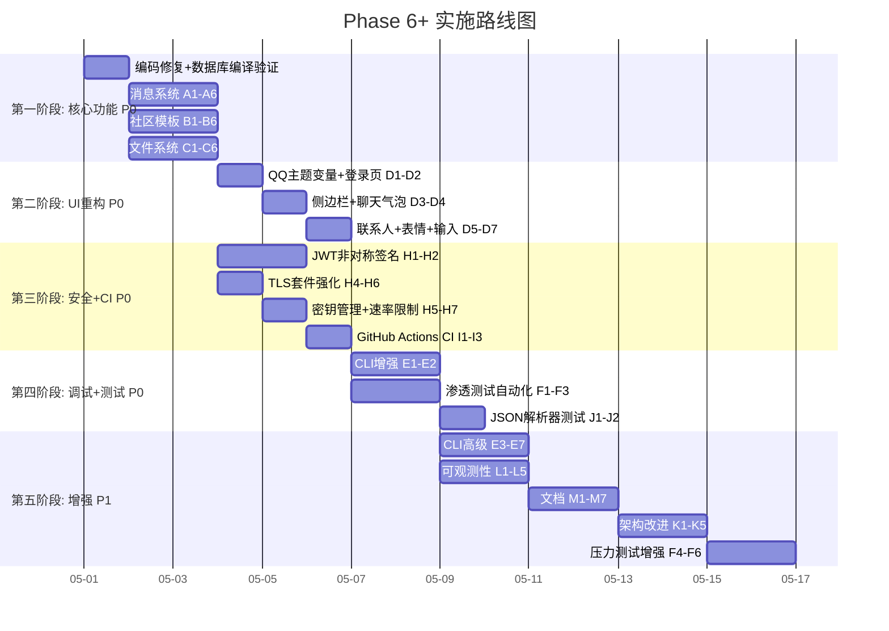
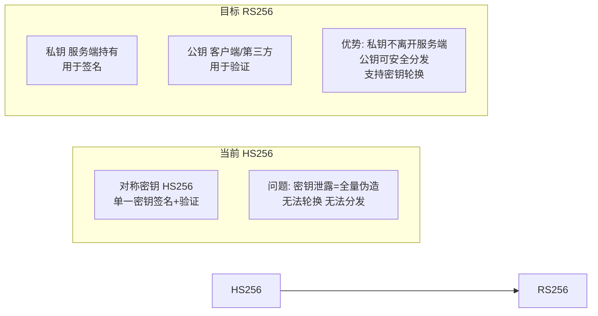
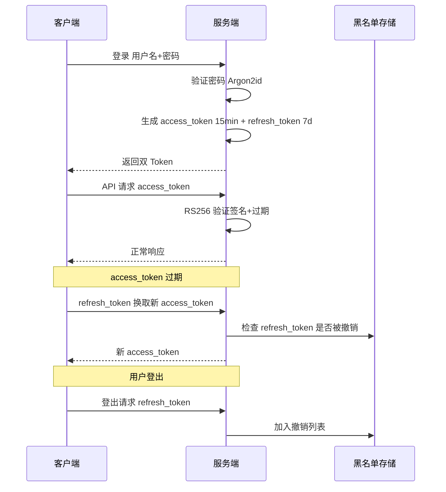

# Phase 6+: 全面重构与优化计划（含安全/CI/架构增强）

## 当前状态评估

### 已完成 (Phase 1-5)
- ✅ TLS/HTTPS 强制加密 (端口 4443)
- ✅ 安全加固: Argon2id 密码哈希, JWT 认证, 安全响应头, JSON 转义
- ✅ CLI 调试工具 (debug_cli.c, 1542 行)
- ✅ 压力测试框架 (stress_test.c, 777 行)
- ✅ 客户端自动重连
- ✅ 内存安全审计, 日志安全审计, 错误处理统一化

### 待完成的核心问题

| 模块 | 状态 | 问题 |
|------|------|------|
| `message_handler.c` | ❌ 空骨架 | 5 个函数全部返回 "功能开发中" |
| `community_handler.c` | ❌ 空骨架 | 5 个函数全部返回 "功能开发中" |
| `file_handler.c` | ❌ 空骨架 | 4 个函数全部返回 "功能开发中" |
| UI/UX | ⚠️ 基础 | 纯白/靛蓝简约风格，缺少 QQ 风格社交元素 |
| 测试覆盖 | ⚠️ 部分 | 渗透测试脚本存在但未完全自动化 |
| CLI 调试 | ⚠️ 基础 | 功能基本但缺少高级调试能力 |
| `database.c` | ✅ 已完成 (G1) | 所有 CRUD 函数已实现，编译通过 |
| 编码问题 | ⚠️ 需修复 | `database.c` 中文注释因 PowerShell 编码问题损坏 |

---

## 总体架构图

```mermaid
flowchart TD
    A["Phase 6+ 总体架构"] --> B["模块 A-G: 功能实现"]
    A --> C["模块 H: 安全加固 P0"]
    A --> D["模块 I: CI/CD P0"]
    A --> E["模块 J: 内存安全 P0"]
    A --> F["模块 K: 架构改进 P1"]
    A --> G["模块 L: 可观测性 P1"]
    A --> H["模块 M: 文档/DevEx P1"]
    A --> I["模块 N: 构建/合规 P2"]

    B --> B1["A: 消息系统 WebSocket+HTTP"]
    B --> B2["B: 社区/模板 CRUD"]
    B --> B3["C: 文件上传/下载/头像"]
    B --> B4["D: UI QQ 风格重构"]
    B --> B5["E: CLI 调试增强"]
    B --> B6["F: 安全测试自动化"]
    B --> B7["G: 数据库层已实现"]

    C --> C1["JWT RS256/ES256 非对称签名"]
    C --> C2["Token 撤销/黑名单机制"]
    C --> C3["TLS 套件强化 TLS1.2+"]
    C --> C4["文件上传路径遍历+MIME校验"]
    C --> C5["密钥管理 环境变量/配置文件"]
    C --> C6["密码策略+Argon2参数文档化"]

    D --> D1["GitHub Actions CI 矩阵"]
    D --> D2["Windows+Linux 构建"]
    D --> D3["Rust 子模块 cargo build"]
    D --> D4["静态分析 clang-tidy/clippy"]
    D --> D5["CodeQL 安全扫描"]

    E --> E1["编译警告即错误 -Werror"]
    E --> E2["ASAN/UBSAN 调试构建"]
    E --> E3["Valgrind 集成测试"]
    E --> E4["Fuzz 测试 JSON/协议解析"]
    E --> E5["JSON 解析器强化测试"]

    F --> F1["SQLite 迁移路径规划"]
    F --> F2["协议版本化 docs/PROTOCOL.md"]
    F --> F3["WebSocket 帧边界校验"]
    F --> F4["线程模型文档化"]

    G --> G1["Prometheus /metrics"]
    G --> G2["结构化 JSON 日志"]
    G --> G3["健康检查 /health /ready"]
    G --> G4["Dockerfile + docker-compose"]

    H --> H1["CONTRIBUTING.md PR模板"]
    H --> H2["OpenAPI/Swagger openapi.yml"]
    H --> H3[".env.example 配置文件"]
    H --> H4["clang-format + pre-commit"]
    H --> H5["README 精简 快速开始前置"]

    I --> I1["统一 CMake 构建"]
    I --> I2["单元测试框架 cmocka/Unity"]
    I --> I3["CI 兼容测试脚本"]
    I --> I4["LICENSE 一致性检查"]
```



---

## 完整任务分解表格

### 模块 A: 消息系统完整实现

| # | 任务 | 文件 | 描述 | 优先级 |
|---|------|------|------|--------|
| A1 | 消息发送实现 | `server/src/message_handler.c` | 实现 handle_send_message — 验证 token, 解析请求体, 调用 db_save_message, 通过 WebSocket 推送 | P0 |
| A2 | 消息列表实现 | `server/src/message_handler.c` | 实现 handle_get_messages — 分页查询, 按 user_id 过滤, 返回 JSON 数组 | P0 |
| A3 | WebSocket 消息处理 | `server/src/message_handler.c` | 实现 ws_on_message — 解析二进制/文本帧, 路由到具体处理函数, 广播/单播 | P0 |
| A4 | WebSocket 连接管理 | `server/src/message_handler.c` | 实现 ws_on_connect / ws_on_close — 维护连接池, 心跳检测, 掉线重连 | P0 |
| A5 | 消息已读回执 | `server/src/message_handler.c` | 实现消息已读状态, 推送已读通知 | P1 |
| A6 | WebSocket 帧大小限制 | `server/src/message_handler.c` | 最大 64KB 帧, 防止内存耗尽攻击 | P0 |

### 模块 B: 社区/模板系统完整实现

| # | 任务 | 文件 | 描述 | 优先级 |
|---|------|------|------|--------|
| B1 | 模板列表实现 | `server/src/community_handler.c` | 实现 handle_template_list — 分页, 按热度/时间排序 | P0 |
| B2 | 模板上传实现 | `server/src/community_handler.c` | 实现 handle_template_upload — 文件类型白名单验证, 存储, 生成预览 | P0 |
| B3 | 模板下载实现 | `server/src/community_handler.c` | 实现 handle_template_download — 文件流式传输, 下载计数递增 | P0 |
| B4 | 模板应用实现 | `server/src/community_handler.c` | 实现 handle_template_apply — 调用 db_apply_template, 生成用户主题配置 | P0 |
| B5 | 模板预览实现 | `server/src/community_handler.c` | 实现 handle_template_preview — 返回缩略图/CSS 预览 | P0 |
| B6 | 路径遍历防护 | `server/src/community_handler.c` | 所有文件路径必须规范化并拒绝 ../ | P0 |

### 模块 C: 文件系统完整实现

| # | 任务 | 文件 | 描述 | 优先级 |
|---|------|------|------|--------|
| C1 | 文件上传实现 | `server/src/file_handler.c` | 实现 handle_file_upload — multipart/form-data 解析, 文件存储, 文件类型白名单 | P0 |
| C2 | 文件下载实现 | `server/src/file_handler.c` | 实现 handle_file_download — 文件流, Range 头支持, Content-Type | P0 |
| C3 | 头像上传实现 | `server/src/file_handler.c` | 实现 handle_avatar_upload — 图片裁剪/缩放, 格式验证, 大小限制 | P0 |
| C4 | 静态文件服务 | `server/src/file_handler.c` | 实现 handle_static_file — 目录遍历防护, MIME 类型, 缓存头 | P0 |
| C5 | 文件存储初始化 | `server/src/file_handler.c` | 完善 file_storage_init — 创建目录结构, 权限检查 | P1 |
| C6 | MIME 白名单校验 | `server/src/file_handler.c` | 上传文件必须校验 MIME type, 禁止可执行文件 | P0 |

### 模块 D: UI 重构 — QQ 风格社交应用

| # | 任务 | 文件 | 描述 | 优先级 |
|---|------|------|------|--------|
| D1 | QQ 蓝主题变量 | `client/ui/css/variables.css` | 将靛蓝主题改为 QQ 风格配色 #07C160 绿 + #4C9AFF 蓝 | P0 |
| D2 | 登录页美化 | `client/ui/css/login.css` | QQ 风格渐变背景, 毛玻璃登录卡片, 动态粒子背景 | P0 |
| D3 | 侧边栏 QQ 风格 | `client/ui/css/main.css` | 底部导航改为顶部 QQ 风格标签, 联系人头像圆角, 在线状态点 | P0 |
| D4 | 聊天气泡 QQ 风格 | `client/ui/css/chat.css` | 绿色/白色气泡, 时间分组, 未读标记, 语音/图片/文件消息卡片 | P0 |
| D5 | 联系人列表增强 | `client/ui/css/community.css` | 字母索引, 在线状态, 最近动态 | P1 |
| D6 | 表情选择器 | `client/ui/index.html` + `chat.js` | 内置 emoji 面板, 支持 Unicode 12.0+ | P1 |
| D7 | 消息输入增强 | `client/ui/js/chat.js` | 回车发送, @提及, 粘贴图片, 文件拖拽 | P1 |
| D8 | 消息时间线 | `client/ui/js/chat.js` | 今天/昨天/本周/更早分组, 时间戳格式化 | P1 |
| D9 | 搜索框功能 | `client/ui/js/app.js` | 全局搜索, 联系人/消息/文件搜索结果分类 | P1 |
| D10 | 设置页面完善 | `client/ui/index.html` + CSS | 账户设置, 通知设置, 隐私设置, 关于页面 | P1 |
| D11 | 深色主题支持 | `client/ui/css/themes/` | 添加 QQ 风格深色主题, 跟随系统自动切换 | P2 |
| D12 | 通知中心 | `client/ui/js/app.js` | 消息通知, 好友请求通知, 系统通知 | P2 |
| D13 | CSS 自定义主题接口 | `client/ui/js/theme_engine.js` | 开放 CSS 变量覆盖接口, 支持用户自定义主题 | P1 |

### 模块 E: CLI 调试增强

| # | 任务 | 文件 | 描述 | 优先级 |
|---|------|------|------|--------|
| E1 | WebSocket 调试 | `server/tools/debug_cli.c` | 添加 ws connect/send/listen 命令, 实时 WebSocket 消息查看 | P0 |
| E2 | 数据库操作 | `server/tools/debug_cli.c` | 添加 db query/insert/delete/export 命令 | P0 |
| E3 | 会话管理 | `server/tools/debug_cli.c` | 多会话切换, 会话历史, 请求录制/回放 | P1 |
| E4 | 性能基准 | `server/tools/debug_cli.c` | 添加 bench 命令 — 延迟分布, QPS, 并发连接 | P1 |
| E5 | 流量重放 | `server/tools/debug_cli.c` | 录制 HTTP 请求, 批量重放, 比较响应 | P1 |
| E6 | 彩色输出 | `server/tools/debug_cli.c` | 语法高亮 JSON, 彩色化的请求/响应展示 | P1 |
| E7 | 自动补全 | `server/tools/debug_cli.c` | Tab 键命令自动补全, 参数提示 | P2 |

### 模块 F: 全面安全测试

| # | 任务 | 文件 | 描述 | 优先级 |
|---|------|------|------|--------|
| F1 | 渗透测试自动化 | `tests/security_pen_test.sh` | 完善测试覆盖: SQLi, XSS, 路径遍历, JWT 伪造, CSRF, SSRF | P0 |
| F2 | API 验证增强 | `tests/api_verification_test.sh` | 添加所有新 API 端点的验证测试 | P0 |
| F3 | 回环测试增强 | `tests/loopback_test.sh` | 添加文件上传/下载, WebSocket, 模板 CRUD 测试 | P0 |
| F4 | DoS 压力测试 | `server/tools/stress_test.c` | 添加慢速攻击测试, HTTP 洪水, TLS 重协商攻击 | P1 |
| F5 | 模糊测试 | `server/tools/stress_test.c` | 随机请求体/参数 fuzzing | P1 |
| F6 | 客户端安全测试 | 新增 `tests/client_security_test.sh` | WebView2 安全配置检查, IPC 注入测试 | P1 |

### 模块 G: 数据库层增强

| # | 任务 | 文件 | 描述 | 优先级 |
|---|------|------|------|--------|
| G1 | 数据库 CRUD | `server/src/database.c` | ✅ **已完成** — 所有 11 个 stub 函数已实现, 编译通过 | P0 |
| G2 | 编码修复 | `server/src/database.c` | ⚠️ 修复中文注释编码损坏 (PowerShell 导致) | P0 |
| G3 | 数据完整性 | `server/src/database.c` | 添加事务支持, 数据校验, 损坏恢复 | P1 |
| G4 | SQLite 迁移准备 | `server/src/database.c` | 定义统一接口层, 为将来替换为 SQLite 做准备 | P1 |

### 模块 H: 安全加固 (新)

| # | 任务 | 文件 | 描述 | 优先级 |
|---|------|------|------|--------|
| H1 | JWT 非对称签名 | `server/security/src/auth.rs` | HS256 → RS256/ES256, 便于密钥轮换和分发 | P0 |
| H2 | Token 撤销机制 | `server/security/src/auth.rs` | Refresh token + short-lived access token, 黑名单/撤销列表 | P0 |
| H3 | Argon2 参数文档化 | `docs/API.md` | 在 README/文档中记录并强制化 time/memory/parallelism 参数 | P0 |
| H4 | TLS 套件强化 | `server/src/tls_server.c` | 仅允许 TLS1.2+/TLS1.3, 仅 AEAD 密码, 禁用弱协议旧版 ciphers | P0 |
| H5 | 密钥管理 | `.env.example` + 配置 | 密钥通过环境变量/受限配置文件加载, 不入源码 | P0 |
| H6 | 开发/生产证书说明 | `docs/HTTPS_MIGRATION.md` | 自签名仅用于 dev, 生产必须使用受信任 CA 证书 | P0 |
| H7 | 速率限制框架 | `server/src/http_server.c` | 添加 API 端点调用频率限制基础框架 (每个 IP/Token) | P1 |
| H8 | 密码策略强化 | `server/src/user_handler.c` | 最小密码长度 8 位+复杂度要求, 错误尝试锁定 | P1 |

### 模块 I: CI/CD 持续集成 (新)

| # | 任务 | 文件 | 描述 | 优先级 |
|---|------|------|------|--------|
| I1 | GitHub Actions CI | `.github/workflows/ci.yml` | 创建 CI 配置文件, ubuntu-latest + windows-latest 矩阵 | P0 |
| I2 | 多平台构建 | `.github/workflows/ci.yml` | Release/Debug 构建, C 编译 + Rust cargo build --release | P0 |
| I3 | 单元测试运行 | `.github/workflows/ci.yml` | 运行所有 shell 测试脚本并在 CI 中报告结果 | P0 |
| I4 | 静态分析 | `.github/workflows/ci.yml` | clang-tidy / cppcheck C 代码 + Rust clippy | P1 |
| I5 | CodeQL 安全扫描 | `.github/workflows/ci.yml` | GitHub CodeQL 分析, 自动安全漏洞检测 | P1 |
| I6 | ASAN 构建矩阵 | `.github/workflows/ci.yml` | Debug 构建启用 AddressSanitizer + UndefinedBehaviorSanitizer | P1 |

### 模块 J: 内存安全与代码质量 (新)

| # | 任务 | 文件 | 描述 | 优先级 |
|---|------|------|------|--------|
| J1 | JSON 解析器测试 | `tests/` | 为 json_parser.c 添加强力单元测试覆盖 | P0 |
| J2 | -Werror 编译 | `server/Makefile` + CMake | 在 CI 中启用 -Wall -Wextra -Werror, 所有警告视为错误 | P0 |
| J3 | ASAN 本地构建 | 构建脚本 | 提供 `make asan` 目标, 使用 -fsanitize=address,undefined -g -O1 | P1 |
| J4 | Valgrind 测试 | `tests/` | Linux 上运行集成测试时使用 Valgrind 检测内存泄漏 | P1 |
| J5 | Fuzz 测试 | `tests/fuzz/` | 针对 JSON 解析器、协议解析、文件处理做模糊测试 | P1 |
| J6 | 内存边界检查 | `server/src/` | 所有数组/snprintf 操作增加边界校验 | P1 |

### 模块 K: 架构改进 (新)

| # | 任务 | 文件 | 描述 | 优先级 |
|---|------|------|------|--------|
| K1 | 协议版本化 | `docs/PROTOCOL.md` | 增加协议版本号与向后兼容策略 | P1 |
| K2 | WebSocket 帧校验 | `server/src/websocket.c` | 二进制帧解析中严格校验边界长度, 避免 integer overflow | P1 |
| K3 | 线程模型文档 | `docs/ARCHITECTURE.md` | 文档说明线程模型, 锁策略, 避免全局锁或潜在死锁 | P1 |
| K4 | SQLite 长期规划 | `docs/ARCHITECTURE.md` | 评估 SQLite/Bolt/LMDB 替代文件 JSON 存储的可行性 | P2 |
| K5 | 压力测试结果归档 | `reports/` | CI 自动归档压力测试结果为 artifact | P1 |

### 模块 L: 可观测性与运维 (新)

| # | 任务 | 文件 | 描述 | 优先级 |
|---|------|------|------|--------|
| L1 | Prometheus 指标 | `server/src/http_server.c` | 添加 /metrics 端点, 暴露连接数/消息队列/延迟 | P1 |
| L2 | 健康检查 | `server/src/http_server.c` | 添加 /health 和 /ready 端点, 用于容器编排 | P1 |
| L3 | 结构化日志 | `server/src/` | 使用 JSON 格式日志, 支持不同级别, 避免生产打印敏感信息 | P1 |
| L4 | Dockerfile | `Dockerfile` | 提供 server Dockerfile, 基于 debian 构建 | P1 |
| L5 | docker-compose | `docker-compose.yml` | 示例编排: 服务+数据库+反向代理+certbot | P1 |

### 模块 M: 文档与开发者体验 (新)

| # | 任务 | 文件 | 描述 | 优先级 |
|---|------|------|------|--------|
| M1 | CONTRIBUTING.md | `CONTRIBUTING.md` | 贡献指南: 如何运行测试, 提交 PR, 开发流程 | P1 |
| M2 | PR/Issue 模板 | `.github/` | ISSUE_TEMPLATE, PULL_REQUEST_TEMPLATE | P1 |
| M3 | OpenAPI 规范 | `docs/openapi.yml` | 将 docs/API.md 转换为 OpenAPI/Swagger 定义 | P1 |
| M4 | 环境配置示例 | `.env.example` | 列出所有必需参数: db 路径, TLS key 路径, JWT key | P1 |
| M5 | clang-format | `.clang-format` | 代码格式化配置 | P1 |
| M6 | pre-commit hooks | `.pre-commit-config.yaml` | 自动格式化, 运行 linters | P2 |
| M7 | README 精简 | `README.md` | 快速开始前置, 深度设计细节移到 docs/ | P1 |

### 模块 N: 构建系统与合规 (新)

| # | 任务 | 文件 | 描述 | 优先级 |
|---|------|------|------|--------|
| N1 | 构建系统统一 | `CMakeLists.txt` | 评估 Makefile vs CMake, 选择主要维护方案 | P2 |
| N2 | 单元测试框架 | `tests/` | 引入 cmocka/Unity/Criterion 做 C 单元测试 | P1 |
| N3 | CI 兼容测试脚本 | `tests/` | 现有 shell 测试改为 CI 无交互运行 (自签名证书自动信任) | P1 |
| N4 | 端到端测试 | `tests/e2e/` | headless curl 脚本测试, PR 自动运行 | P2 |
| N5 | LICENSE 一致性 | `LICENSE` | 确保 ADDITIONAL PERMISSION 段落与 README 一致 | P2 |
| N6 | 隐私合规文档 | `docs/PRIVACY.md` | 日志中是否含 PII, GDPR/个人信息保护策略 | P2 |

---

## 实施路线图



---

## 安全加固详细设计

### JWT 签名方案迁移



### Token 生命周期



### TLS 配置强化

```c
/* 强制安全套件 */
const char* ciphers =
    "TLS_AES_128_GCM_SHA256:"       /* TLS 1.3 */
    "TLS_AES_256_GCM_SHA384:"       /* TLS 1.3 */
    "ECDHE-ECDSA-AES128-GCM-SHA256:" /* TLS 1.2 */
    "ECDHE-RSA-AES128-GCM-SHA256:"   /* TLS 1.2 */
    "ECDHE-ECDSA-AES256-GCM-SHA384:"
    "ECDHE-RSA-AES256-GCM-SHA384";

/* 禁用: SSLv3, TLSv1.0, TLSv1.1, RC4, 3DES, MD5 */
```

---

## 数据库文件结构

```
server/data/db/chrono.db/
├── next_id.txt              # 自增 ID 计数器
├── users/                   # 用户数据目录
│   ├── {user_id}.json       # 每个用户一个 JSON 文件
│   └── ...
├── messages/                # 消息数据目录
│   ├── {msg_id}.json        # 每个消息一个 JSON 文件
│   └── ...
├── friendships/             # 好友关系目录
│   ├── {user_id}.json       # 每个用户的好友ID列表
│   └── ...
├── templates/               # 模板数据目录
│   ├── {template_id}.json   # 模板元数据
│   ├── {user_id}_template.json  # 用户模板配置
│   └── uploads/             # 模板文件/CSS
└── files/                   # 文件存储目录
    ├── avatars/             # 头像文件
    └── uploads/             # 普通上传文件
```

---

## QQ 风格 UI 配色方案

```css
/* QQ 经典蓝绿色系 — 替换当前靛蓝色系 */
--color-primary: #07C160;           /* QQ 绿色 发送按钮/确认操作 */
--color-primary-hover: #06AD56;
--color-primary-active: #059A4C;
--color-primary-light: #E8F8EE;

--color-accent: #4C9AFF;            /* QQ 蓝色 链接/强调 */
--color-accent-hover: #3B82F6;

/* 导航栏 */
--nav-bg: #F8F9FA;                  /* 底部导航浅灰 */
--nav-active-bg: #E8F8EE;          /* 选中项绿色背景 */
--nav-active-color: #07C160;       /* 选中项绿色文字 */

/* 聊天气泡 */
--bubble-self-bg: #95EC69;          /* 自己消息 QQ 浅绿气泡 */
--bubble-self-color: #000000;
--bubble-other-bg: #FFFFFF;         /* 对方消息 白色气泡 */
--bubble-other-color: #000000;

/* 时间线 */
--timeline-divider: #EDEDED;
--timeline-text: #999999;

/* 在线状态 */
--status-online: #4CD964;           /* 在线绿色 */
--status-offline: #C7C7C7;          /* 离线灰色 */
--status-busy: #FF3B30;             /* 忙碌红色 */
```

---

## 安全注意事项

1. **所有用户输入必须通过 json_escape_string 转义** — 防止 XSS/JSON 注入
2. **文件上传类型白名单** — 仅允许 jpg/png/gif/svg/css/json, 禁止可执行文件
3. **路径遍历防护** — 所有文件处理必须规范化路径并拒绝 `../` 和绝对路径
4. **速率限制** — API 端点应添加调用频率限制 (每个 IP/Token)
5. **WebSocket 帧大小限制** — 最大 64KB 帧, 防止内存耗尽攻击
6. **JWT 过期验证** — 所有受保护端点必须验证 token 有效期和签名
7. **TLS 仅允许 AEAD 套件** — 禁用 RC4, 3DES, MD5 等弱算法
8. **密码最小 8 位** — Argon2id time=3, mem=64MB, parallelism=4
9. **密钥不入源码** — 通过环境变量或受限权限配置文件加载
10. **开发/生产分离** — 自签名证书仅用于 dev, 生产使用受信任 CA

---

## 任务优先级总表

| 优先级 | 描述 | 模块 |
|--------|------|------|
| P0 | 必须优先完成, 核心功能和安全 | A, B, C, G(编码修复), H1-H6, I1-I3, J1-J2 |
| P1 | 重要, 核心功能完成后进行 | D5-D10, D13, E1-E6, F4-F6, G3, H7-H8, I4-I6, J3-J6, K1-K5, L1-L5, M1-M7, N2-N3 |
| P2 | 锦上添花, 有余力时进行 | D11-D12, E7, G4, N1, N4-N6 |
