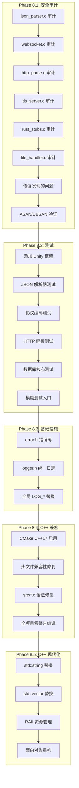

# Phase 8 — 安全审计 + 测试 + C++ 迁移计划

> **基于 Phase 7 优化计划**，将 P7.2~P7.4 合并重组，添加 C++ 迁移路径  
> **目标**: 安全加固 → 测试覆盖 → 现代化重构

---

## 目录

1. [P8.1: 安全审计与修复](#p81-安全审计与修复)
2. [P8.2: 单元测试与模糊测试](#p82-单元测试与模糊测试)
3. [P8.3: 错误码与日志统一](#p83-错误码与日志统一)
4. [P8.4: C++ 迁移 — 第一阶段 (兼容编译)](#p84-c-迁移--第一阶段-兼容编译)
5. [P8.5: C++ 迁移 — 第二阶段 (现代化)](#p85-c-迁移--第二阶段-现代化)
6. [实施路线图](#实施路线图)

---

## P8.1: 安全审计与修复

### 审计目标 (按风险优先级)

| 优先级 | 文件 | 风险点 | 审计项 |
|--------|------|--------|--------|
| 🔴 高 | [`json_parser.c`](server/src/json_parser.c) | 手写解析器，缓冲区操作密集 | 嵌套深度限制、字符串长度限制、键名重复检测、所有 memcpy 越界检查 |
| 🔴 高 | [`websocket.c`](server/src/websocket.c) | 网络帧解析 | 帧长度验证 (≤ 最大帧大小)、掩码键正确性、控制帧处理 |
| 🔴 高 | [`http_parse.c`](server/src/http_parse.c) | HTTP 请求解析 | 请求行/头部分隔验证、Content-Length 验证 (≤ 最大请求体)、Header 注入防护 |
| 🟡 中 | [`tls_server.c`](server/src/tls_server.c) | OpenSSL 调用 | SSL_*/TLS_* 返回值检查、内存泄漏、证书验证 |
| 🟡 中 | [`rust_stubs.c`](server/src/rust_stubs.c) | FFI 边界 | Rust 返回字符串释放、NULL 指针防护、C→Rust 指针生命周期 |
| 🟡 中 | [`file_handler.c`](server/src/file_handler.c) | 文件操作 | 路径规范化后前缀检查 (防止 chroot 绕过)、MIME 类型验证 |
| 🟢 低 | [`protocol.c`](server/src/protocol.c) | 协议编码 | 消息序列化/反序列化边界检查 |

### 8.1.1 json_parser.c 审计清单

```c
// 需要检查：
// 1. json_parse() — 递归深度限制 (≥32 层拒绝)
// 2. json_parse_string() — 字符串长度限制 (≥64KB 拒绝)
// 3. json_parse_value() — 重复键名检测
// 4. 所有 memcpy/memmove — 长度越界检查
// 5. snprintf — 返回值截断检测
```

### 8.1.2 WebSocket/HTTP 审计清单

```c
// websocket.c 检查：
// 1. ws_read_frame() — payload_len 验证 (≤ MAX_FRAME_SIZE)
// 2. ws_handshake() — Sec-WebSocket-Key 长度验证
// 3. Mask 处理 — 客户端帧必须掩码，服务端帧不能掩码

// http_parse.c 检查：
// 1. parse_http_request() — 请求行三个字段用 sscanf 安全解析
// 2. 头部解析 — 冒号位置、值 trimming
// 3. Content-Length — 与 body 实际接收量一致
```

### 8.1.3 FFI/TLS 审计清单

```rust
// rust_stubs.c:
// 1. 为每个 FFI 函数添加 C 侧安全包装器
// 2. NULL 返回值检查
// 3. rust_free_string() 空指针安全

// tls_server.c:
// 1. SSL_accept/SSL_connect — 返回值检查
// 2. SSL_read/SSL_write — 部分读处理
// 3. 内存泄漏: SSL_new 后必须 SSL_free
```

### 8.1.4 修复后的验证

- 启用 AddressSanitizer (ASAN) 和 UndefinedBehaviorSanitizer (UBSAN) 编译
- 运行所有现有功能测试
- 运行模糊测试

---

## P8.2: 单元测试与模糊测试

### 测试框架选择: **Unity** (成熟 C 测试框架)

使用 Unity (https://github.com/ThrowTheSwitch/Unity) — 单头文件，主流 C 项目使用，支持 CMake 集成。

### 8.2.1 JSON 解析器单元测试

**文件**: [`server/tests/unit/test_json_parser.c`](server/tests/unit/test_json_parser.c)

| 测试分组 | 测试用例 |
|---------|---------|
| 基本类型 | null, true, false, 整数 42, 浮点数 3.14, 字符串 "hello" |
| 嵌套对象 | {"a":{"b":{"c":1}}}, 空对象 {} |
| 数组 | [1,2,3], [[1,2],[3,4]], 空数组 [] |
| 转义字符 | \n, \t, \\\\, \\", \\u4E2D (Unicode) |
| 错误路径 | 不完整 JSON, 多重逗号, 未闭合引号, 无效数字, 多余逗号 |
| 边界 | 深度嵌套 32+ 层, 长字符串 64KB+, 空输入 "" |
| Unicode | UTF-8 多字节字符, 无效 UTF-8 序列 |

### 8.2.2 协议编码单元测试

**文件**: [`server/tests/unit/test_protocol.c`](server/tests/unit/test_protocol.c)

| 测试分组 | 测试用例 |
|---------|---------|
| 消息序列化 | 所有 MessageType 编码/解码一致 |
| 边界长度 | 空消息体, 最大长度消息体 |
| 字段验证 | 时间戳有效性, ID 范围 |

### 8.2.3 HTTP 解析单元测试

**文件**: [`server/tests/unit/test_http_parse.c`](server/tests/unit/test_http_parse.c)

| 测试分组 | 测试用例 |
|---------|---------|
| 请求行 | GET/POST/PUT/DELETE, 路径 /api/users, HTTP/1.1 |
| 头部解析 | 标准头, 多值头, 空头值, 大小写不敏感 |
| 查询字符串 | /path?key=value&key2=val2, 空查询, 编码字符 |
| 错误输入 | 空请求, 不完整请求, 超长请求行 |

### 8.2.4 数据库核心单元测试

**文件**: [`server/tests/unit/test_db_core.c`](server/tests/unit/test_db_core.c)

| 测试分组 | 测试用例 |
|---------|---------|
| ID 分配 | 递增, 重置, 并发安全 |
| 文件 I/O | 读写文件, 文件不存在 |
| 路径构建 | 路径规范化, 特殊字符 |

### 8.2.5 JSON 解析器模糊测试

**文件**: [`tests/fuzz/fuzz_json_parser.c`](tests/fuzz/fuzz_json_parser.c)

```c
// libFuzzer 入口
int LLVMFuzzerTestOneInput(const uint8_t* data, size_t size) {
    char* input = (char*)malloc(size + 1);
    memcpy(input, data, size);
    input[size] = '\0';
    
    JsonValue* val = json_parse(input);
    json_value_free(val);
    free(input);
    return 0;
}
```

构建方式:
```bash
clang -fsanitize=fuzzer -Iserver/include tests/fuzz/fuzz_json_parser.c \
    server/src/json_parser.c -o fuzz_json_parser
./fuzz_json_parser -max_len=4096 corpus/
```

### 8.2.6 测试目录结构

```
server/tests/
├── unit/
│   ├── test_json_parser.c
│   ├── test_protocol.c
│   ├── test_http_parse.c
│   └── test_db_core.c
├── fuzz/
│   └── fuzz_json_parser.c
└── CMakeLists.txt        # 测试构建配置
```

---

## P8.3: 错误码与日志统一

### 8.3.1 新增 [`server/include/error.h`](server/include/error.h)

```c
typedef enum {
    ERR_OK = 0,
    ERR_NOMEM,           // 内存不足
    ERR_NOT_FOUND,       // 资源不存在
    ERR_INVALID_PARAM,   // 参数无效
    ERR_PERM_DENIED,     // 权限不足
    ERR_IO_ERROR,        // I/O 错误
    ERR_PARSE_ERROR,     // 解析错误
    ERR_OVERFLOW,        // 缓冲区溢出/截断
    ERR_TIMEOUT,         // 超时
    ERR_INTERNAL,        // 内部错误
} ErrorCode;
```

### 8.3.2 新增 [`server/include/logger.h`](server/include/logger.h)

从 `server.h` / `client.h` 中分离日志宏，统一服务端和客户端的日志行为。

```c
typedef enum {
    LOG_TRACE, LOG_DEBUG, LOG_INFO, LOG_WARN, LOG_ERROR, LOG_FATAL
} LogLevel;

void log_set_level(LogLevel level);
void log_write(LogLevel level, const char* file, int line, const char* fmt, ...);

#define LOG_TRACE(fmt, ...)  log_write(LOG_TRACE, __FILE__, __LINE__, fmt, ##__VA_ARGS__)
#define LOG_DEBUG(fmt, ...)  log_write(LOG_DEBUG, __FILE__, __LINE__, fmt, ##__VA_ARGS__)
#define LOG_INFO(fmt, ...)   log_write(LOG_INFO,  __FILE__, __LINE__, fmt, ##__VA_ARGS__)
#define LOG_WARN(fmt, ...)   log_write(LOG_WARN,  __FILE__, __LINE__, fmt, ##__VA_ARGS__)
#define LOG_ERROR(fmt, ...)  log_write(LOG_ERROR, __FILE__, __LINE__, fmt, ##__VA_ARGS__)
```

### 8.3.3 替换工作

- `server.h` 中的 `LOG_*` 宏 → 保留 `#include "logger.h"` 保持兼容
- `client.h` 中的 `LOG_*` 宏 → 保留 `#include "logger.h"` 保持兼容
- 所有 `fprintf(stderr, ...)` / `printf(...)` → `LOG_*` 替换

---

## P8.4: C++ 迁移 — 第一阶段 (兼容编译)

### 目标

将现有 C 代码**编译为 C++ 而不改变逻辑**。这是最小侵入的迁移方式。

### 8.4.1 CMake 配置变更

| 文件 | 变更 |
|------|------|
| [`CMakeLists.txt`](CMakeLists.txt) | 添加 `project(Chrono-shift LANGUAGES C CXX)` |
| [`server/CMakeLists.txt`](server/CMakeLists.txt) | `set(CMAKE_CXX_STANDARD 17)`，将 `.c` 视为 `.cpp`，或重命名为 `.cpp` |
| [`client/CMakeLists.txt`](client/CMakeLists.txt) | 同上 |

### 8.4.2 C→C++ 兼容性问题及修复

| 问题 | 原因 | 修复方案 |
|------|------|---------|
| `malloc` 返回值隐式转换 | C++ 要求显式 `void*`→`T*` 转换 | 添加 `(Type*)` 强制转换 |
| 指定初始化器 `{.field = val}` | C++20 前不支持 | 改为构造函数或字段赋值 |
| `void*` 指针算术 | C++ 禁止 `void*` 算术 | 转为 `char*` 算术 |
| 枚举作用域 | C++ 中枚举值更严格 | 使用 `enum class` 或 `(int)` 转换 |
| `const char*`→`char*` | C++ 禁止隐式去除 const | 添加 `const` 或 `(char*)` 转换 |
| 可变参数宏 `##__VA_ARGS__` | GCC 扩展 | 改用标准 `__VA_OPT__` (C++20) 或保留扩展 |
| 复合字面量 `(Type){val}` | C 特性，C++ 不支持 | 改为临时变量 |

**关键**: 不改变任何逻辑，只做语法适配。每改一个文件立即可验证。

### 8.4.3 迁移顺序 (从底层到高层)

```
1. server/include/*.h        → 头文件先兼容 (纯声明，极少更改)
2. server/src/platform_*.c   → 无外部依赖的底层模块
3. server/src/protocol.c     → 协议层
4. server/src/json_parser.c  → JSON 解析
5. server/src/db_*.c         → 数据库层
6. server/src/http_*.c       → HTTP 服务器
7. server/src/websocket.c    → WebSocket
8. server/src/user_handler.c → 业务 handler
9. server/src/message_handler.c
10. server/src/community_handler.c
11. server/src/file_handler.c
12. server/src/tls_server.c  → TLS
13. server/src/main.c        → 主程序
14. client/src/              → 客户端同理
```

### 8.4.4 验证方式

每个文件迁移后 `git commit`，然后编译验证零错误零警告。

```
g++ -std=c++17 -Wall -Wextra ... -c file.cpp -o file.o
```

---

## P8.5: C++ 迁移 — 第二阶段 (现代化)

### 目标

在代码已能编译为 C++ 的基础上，逐步引入 C++ 特性消除 C 风格的缺陷。

### 8.5.1 字符串处理现代化

| 现状 (C) | 目标 (C++) | 优势 |
|----------|-----------|------|
| `char buf[256]` + `strncpy` | `std::string` | 自动内存管理, 越界安全 |
| `snprintf(buf, sz, fmt, ...)` | `std::format` (C++20) 或 `fmt::format` | 类型安全, 更可读 |
| `strstr`/`strcmp` | `std::string::find`/`==` | 更直观 |

### 8.5.2 动态数组现代化

| 现状 (C) | 目标 (C++) | 优势 |
|----------|-----------|------|
| `malloc/calloc` → `free` | `std::vector<T>` / `std::unique_ptr<T[]>` | RAII, 自动释放 |
| 手动 `realloc` | `std::vector::push_back` | 异常安全 |
| `connection_list` 链表 | `std::list<Connection>` 或 `std::unordered_map` | 减少手写链表 bug |

### 8.5.3 资源管理 RAII 化

| 资源 | C 方式 | C++ 方式 |
|------|--------|---------|
| SSL* | 手动 new/delete | `std::unique_ptr<SSL, SslDeleter>` |
| socket fd | close() | RAII wrapper 类在析构时 close() |
| FILE* | fopen/fclose | `std::unique_ptr<FILE, FileDeleter>` |
| malloc'd buffer | 手动 free | `std::vector<uint8_t>` |

### 8.5.4 面向对象重构 (可选/渐进)

```cpp
// 示例: Connection 结构体 → 类
class Connection {
public:
    Connection(socket_t fd);
    ~Connection();
    
    bool read_request();
    bool write_response();
    bool is_timed_out() const;
    
private:
    socket_t fd_;
    std::unique_ptr<SSL, SslDeleter> ssl_;
    std::vector<uint8_t> read_buf_;
    std::vector<uint8_t> write_buf_;
    HttpRequest request_;
    HttpResponse response_;
    std::chrono::steady_clock::time_point last_activity_;
};
```

### 8.5.5 现代化迁移顺序

```
阶段 A: 字符串替换 (std::string, std::string_view)
阶段 B: 容器替换 (std::vector, std::unordered_map)
阶段 C: RAII 资源包装 (SSL, socket, FILE)
阶段 D: 面向对象重构 (Connection, Server, Database 类)
```

每个阶段独立可编译、可测试。

---

## 实施路线图

### 第一阶段: P8.1 安全审计 + 修复

| # | 任务 | 文件 | 预计工作量 |
|---|------|------|-----------|
| 1 | json_parser.c 安全审计 | [`server/src/json_parser.c`](server/src/json_parser.c) | 中 |
| 2 | websocket.c 安全审计 | [`server/src/websocket.c`](server/src/websocket.c) | 中 |
| 3 | http_parse.c 安全审计 | [`server/src/http_parse.c`](server/src/http_parse.c) | 中 |
| 4 | tls_server.c 安全审计 | [`server/src/tls_server.c`](server/src/tls_server.c) | 中 |
| 5 | rust_stubs.c FFI 审计 | [`server/src/rust_stubs.c`](server/src/rust_stubs.c) | 小 |
| 6 | file_handler.c 审计 | [`server/src/file_handler.c`](server/src/file_handler.c) | 小 |
| 7 | 修复所有发现的问题 | — | 视发现量 |
| 8 | 添加 ASAN/UBSAN 构建 | [`server/CMakeLists.txt`](server/CMakeLists.txt) | 小 |

### 第二阶段: P8.2 单元测试 + 模糊测试

| # | 任务 | 文件 | 预计工作量 |
|---|------|------|-----------|
| 9 | 添加 Unity 测试框架 | [`server/tests/CMakeLists.txt`](server/tests/CMakeLists.txt) | 小 |
| 10 | JSON 解析器单元测试 | [`server/tests/unit/test_json_parser.c`](server/tests/unit/test_json_parser.c) | 大 |
| 11 | 协议编码单元测试 | [`server/tests/unit/test_protocol.c`](server/tests/unit/test_protocol.c) | 中 |
| 12 | HTTP 解析单元测试 | [`server/tests/unit/test_http_parse.c`](server/tests/unit/test_http_parse.c) | 中 |
| 13 | 数据库核心单元测试 | [`server/tests/unit/test_db_core.c`](server/tests/unit/test_db_core.c) | 中 |
| 14 | JSON 解析器模糊测试 | [`tests/fuzz/fuzz_json_parser.c`](tests/fuzz/fuzz_json_parser.c) | 小 |

### 第三阶段: P8.3 错误码 + 日志

| # | 任务 | 文件 | 预计工作量 |
|---|------|------|-----------|
| 15 | 新增 error.h | [`server/include/error.h`](server/include/error.h) | 小 |
| 16 | 新增 logger.h | [`server/include/logger.h`](server/include/logger.h) | 小 |
| 17 | 替换 printf/fprintf 为 LOG_* | 全局 | 中 |

### 第四阶段: P8.4 C++ 兼容编译

| # | 任务 | 预计工作量 |
|---|------|-----------|
| 18 | 更新 CMake 启用 C++17 | 小 |
| 19 | 修复服务端头文件 C++ 兼容性 | 小 |
| 20 | 修复服务端 src/*.c C++ 兼容性 | 大 |
| 21 | 修复客户端头文件 + src/*.c C++ 兼容性 | 中 |
| 22 | 修复工具文件 (debug_cli.c, stress_test.c) | 中 |
| 23 | 全项目编译零错误零警告 | 中 |

### 第五阶段: P8.5 C++ 现代化 (可选长期)

| # | 任务 | 预计工作量 |
|---|------|-----------|
| 24 | 字符串 → std::string | 大 |
| 25 | 动态数组 → std::vector | 大 |
| 26 | 资源 RAII 化 | 中 |
| 27 | 面向对象重构 | 大 |

---

## 架构图



## Git 使用约定

每次变更前先 `git add . && git commit -m "backup before ..."` 确保可回溯，如:

```bash
# 每次操作前
git add .
git commit -m "backup before [操作说明]"
git push

# 操作后
git add .
git commit -m "[操作说明] 完成"
git push
```

---

## 优先级建议

| 优先级 | 任务 | 原因 |
|--------|------|------|
| 🔴 最高 | P8.1 安全审计 + 修复 | 直接涉及安全，发现 0-day 需立即修复 |
| 🔴 高 | P8.2 单元测试 | 为后续重构提供安全网 |
| 🟡 中 | P8.3 日志+错误码 | 改善调试和错误追踪 |
| 🟡 中 | P8.4 C++ 兼容编译 | C++ 迁移的第一步，需稳定基线 |
| 🟢 低 | P8.5 C++ 现代化 | 长期演进，可并行进行 |
