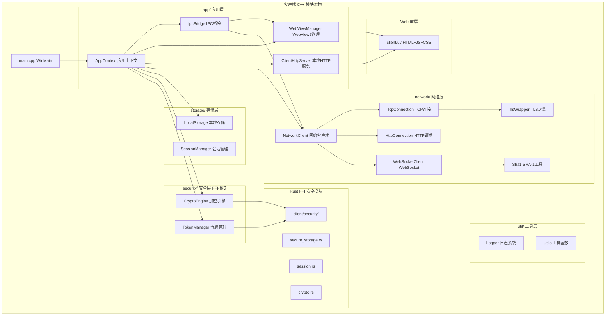

# P9.1b: 客户端 C++ 重构详细实施计划

## 概述

将客户端 11 个 C99 源文件重构为现代 C++17，采用 RAII、`std::string`、智能指针、枚举类等现代 C++ 特性，同时保持与现有 WebView2 前端和 Rust 安全模块的兼容性。

---

## 架构总览



## 文件映射

| 旧 C 文件 | 新 C++ 文件 | 说明 |
|-----------|------------|------|
| `src/main.c` | `src/main.cpp` | WinMain RAII 包装，全局状态类封装 |
| `src/network.c` | `src/network/NetworkClient.cpp` | 网络客户端外观模式 |
| `src/net_tcp.c` | `src/network/TcpConnection.cpp` | RAII Socket + TLS 连接管理 |
| `src/net_http.c` | `src/network/HttpConnection.cpp` | HTTP/1.1 请求/响应 `std::string` 构建 |
| `src/net_ws.c` | `src/network/WebSocketClient.cpp` | OOP WebSocket 握手+帧编解码 |
| `src/net_sha1.c` | `src/network/Sha1.cpp` | SHA-1 + Base64 工具类 |
| `src/ipc_bridge.c` | `src/app/IpcBridge.cpp` | RAII IPC 桥接，Handler 注册 |
| `src/webview_manager.c` | `src/app/WebViewManager.cpp` | RAII Win32 窗口 + WebView2 |
| `src/client_http_server.c` | `src/app/ClientHttpServer.cpp` | 本地 HTTP 服务线程 RAII |
| `src/local_storage.c` | `src/storage/LocalStorage.cpp` | `std::filesystem` 路径管理 |
| `src/updater.c` | `src/app/Updater.cpp` | 自动更新器骨架 |

## 目录结构目标

```
client/
  src/
    main.cpp                       # WinMain + 全局初始化
    app/
      AppContext.h/cpp             # 应用上下文（组合所有模块）
      IpcBridge.h/cpp              # IPC 桥接
      WebViewManager.h/cpp         # WebView2 管理
      ClientHttpServer.h/cpp       # 本地 HTTP 服务
      Updater.h/cpp                # 自动更新
    network/
      NetworkClient.h/cpp          # 网络客户端外观
      TcpConnection.h/cpp          # TCP/TLS 连接
      HttpConnection.h/cpp         # HTTP 请求
      WebSocketClient.h/cpp        # WebSocket
      Sha1.h/cpp                   # SHA-1
      TlsWrapper.h/cpp             # TLS RAII 包装
    storage/
      LocalStorage.h/cpp           # 本地存储
      SessionManager.h/cpp         # 会话管理
    security/
      CryptoEngine.h/cpp           # Rust FFI 加密引擎包装
      TokenManager.h/cpp           # 令牌管理
    util/
      Logger.h/cpp                 # 日志系统
      Utils.h/cpp                  # 工具函数
```

---

## 步骤分解

### Step 1: 创建目录结构

创建以下目录：
- `client/src/app/`
- `client/src/network/`
- `client/src/storage/`
- `client/src/security/`
- `client/src/util/`

同时创建初始 `client/src/util/Logger.h` 和 `client/src/util/Utils.h`，确保客户端具有自包含的日志和工具基础设施（不依赖服务端代码）。

### Step 2: 重构基础工具模块 (util/)

**2a. `Logger.h/cpp`** — 客户端日志系统
- `namespace chrono::client::util`
- `enum class LogLevel { kDebug, kInfo, kWarn, kError }`
- `class Logger` 单例模式 (线程安全)
- 宏: `LOG_DEBUG(...)` / `LOG_INFO(...)` / `LOG_WARN(...)` / `LOG_ERROR(...)`
- 输出到 `stderr` 和/或日志文件
- 支持格式化日志（`fmt::format` 风格或 `printf` 兼容）

**2b. `Utils.h/cpp`** — 客户端工具函数
- `std::string trim(const std::string& s)`
- `std::vector<std::string> split(const std::string& s, char delim)`
- `std::string join(const std::vector<std::string>& parts, const std::string& delim)`
- `std::string wstring_to_string(const std::wstring& ws)` — Win32 辅助
- `std::wstring string_to_wstring(const std::string& s)`
- `bool file_exists(const std::string& path)`
- `bool create_directory(const std::string& path)`

### Step 3: 重构网络模块 (network/)

**3a. `TlsWrapper.h/cpp`** — TLS RAII 包装
- `namespace chrono::client::network`
- `class TlsConnection` — RAII 封装 `SSL*`
  - 构造函数: `TlsConnection(int fd, SSL* ssl)` — 接管所有权
  - 析构函数: `tls_close(ssl)` + `closesocket(fd)`
  - 禁用拷贝，支持移动语义
  - `int read(void* buf, int len)` — 包装 `tls_read`
  - `int write(const void* buf, int len)` — 包装 `tls_write`
  - `bool is_valid() const`
- `class TlsClientContext` — RAII 封装客户端 TLS 上下文
  - 构造函数: `TlsClientContext(const std::string& ca_file = "")` — 调用 `tls_client_init`
  - 析构函数: `tls_client_cleanup()`
  - `std::unique_ptr<TlsConnection> connect(const std::string& host, uint16_t port)` — 调用 `tls_client_connect`
- 依赖: `#include "../../server/include/tls_server.h"` (仍使用现有的 C TLS 抽象层)

**3b. `TcpConnection.h/cpp`** — TCP/TLS 连接 RAII
- `class TcpConnection`
  - 构造函数: 默认构造（未连接状态）
  - `bool connect(const std::string& host, uint16_t port, bool use_tls = false)`
  - `void disconnect()`
  - `int send_all(const uint8_t* data, size_t len)`
  - `int recv_all(uint8_t* buf, size_t len)` — 可能分多次接收
  - `bool is_connected() const`
  - `int get_socket() const`
  - 内部管理: `SOCKET m_sock`, `std::unique_ptr<TlsConnection> m_tls`
  - Winsock 初始化/清理（引用计数）
  - 自动重连支持（指数退避）

**3c. `HttpConnection.h/cpp`** — HTTP 请求/响应
- `class HttpConnection`
  - 构造函数: `explicit HttpConnection(TcpConnection& tcp)`
  - `struct Response { int status_code; std::string status_text; std::string body; std::unordered_map<std::string, std::string> headers; }`
  - `Response request(const std::string& method, const std::string& path, const std::string& headers = "", const uint8_t* body = nullptr, size_t body_len = 0)`
  - 内部使用 `std::string` 构建 HTTP/1.1 请求（替换 `snprintf` 缓冲区方式）

**3d. `WebSocketClient.h/cpp`** — WebSocket 客户端
- `class WebSocketClient`
  - `bool handshake(TcpConnection& tcp, const std::string& host, const std::string& path)`
  - `int send_frame(WsOpcode opcode, const uint8_t* payload, size_t len)`
  - `int recv_frame(WsFrame& frame)`
  - `enum class WsOpcode { kContinuation = 0x0, kText = 0x1, kBinary = 0x2, kClose = 0x8, kPing = 0x9, kPong = 0xA }`
  - `struct WsFrame { WsOpcode opcode; bool mask; std::vector<uint8_t> payload; }`

**3e. `Sha1.h/cpp`** — SHA-1 和 Base64 工具
- `class Sha1`
  - `void init()`, `void update(const uint8_t* data, size_t len)`, `void final(uint8_t digest[20])`
  - `static std::string hash_to_base64(const uint8_t digest[20])` — WebSocket 握手用
- `namespace base64`
  - `std::string encode(const uint8_t* data, size_t len)`
  - `std::vector<uint8_t> decode(const std::string& s)`

**3f. `NetworkClient.h/cpp`** — 网络客户端外观
- `class NetworkClient`
  - 组合: `TcpConnection m_connection`, `HttpConnection m_http`, `WebSocketClient m_ws`
  - `bool init(const std::string& host, uint16_t port, bool use_tls = true)`
  - `bool connect()` / `void disconnect()` / `bool reconnect()`
  - `HttpConnection::Response http_request(const std::string& method, const std::string& path, ...)` — 委托给 `m_http`
  - `bool ws_connect(const std::string& path)` / `int ws_send(...)` / `int ws_recv(...)` — 委托给 `m_ws`
  - `bool is_connected() const`
  - `void set_auto_reconnect(bool enable)` / `void set_auth_token(const std::string& token)`

### Step 4: 重构 IPC 桥接 (app/)

**4a. `IpcBridge.h/cpp`** — IPC 桥接
- `namespace chrono::client::app`
- `enum class IpcMessageType : uint8_t { kLogin = 0x01, kRegister = 0x02, kSendMessage = 0x03, kGetMessages = 0x04, kGetContacts = 0x05, kLogout = 0x06, kGetProfile = 0x07, kUpdateProfile = 0x08, kSearchUsers = 0x09, kAddContact = 0x10, kSystemNotify = 0xFF }`
- `using IpcCallback = std::function<void(IpcMessageType type, const std::string& json_data)>`
- `class IpcBridge`
  - `void init(IpcCallback callback)`
  - `void register_handler(IpcMessageType type, IpcCallback handler)` — 支持特定类型 handler
  - `void handle_from_js(IpcMessageType type, const std::string& json_data)` — 分发
  - `bool send_to_js(void* webview, const std::string& json_data)` — 通过 WebView2 发送到前端
  - 内部: `std::unordered_map<IpcMessageType, std::vector<IpcCallback>> m_handlers`

### Step 5: 重构 WebView2 管理器 (app/)

**5a. `WebViewManager.h/cpp`** — WebView2 管理
- `class WebViewManager`
  - `bool init(HINSTANCE hInstance)`
  - `bool create_window(int width, int height, const std::string& title)`
  - `bool load_html(const std::string& path)`
  - `bool navigate(const std::string& url)`
  - `bool execute_script(const std::string& script)`
  - `void destroy()`
  - `bool process_messages()` — 消息循环
  - `void* get_hwnd() const` / `void* get_webview() const`
  - RAII: 析构自动调用 `destroy()`
  - 内部: `HWND m_hwnd`, `void* m_webview`, `int m_width`, `int m_height`, `std::string m_title`
  - Win32: `RegisterClass` / `CreateWindow` / `WndProc`

### Step 6: 重构客户端本地 HTTP 服务 (app/)

**6a. `ClientHttpServer.h/cpp`** — 本地 HTTP 服务
- `class ClientHttpServer`
  - `bool start(uint16_t port = 9010)` — 创建工作线程
  - `void stop()` — 通知线程退出 + 关闭 socket
  - `bool is_running() const`
  - RAII: 析构自动调用 `stop()`
  - 内部: `SOCKET m_listen_fd`, `std::thread m_thread`, `std::atomic<bool> m_running`
  - 路由: `std::unordered_map<std::string, std::function<void(SOCKET)>> m_routes`
  - 初始路由: `GET /health`, `GET /api/local/status`
  - HTTP 响应构建: 使用 `std::string` 代替 `snprintf` 缓冲区

### Step 7: 重构存储模块 (storage/)

**7a. `LocalStorage.h/cpp`** — 本地存储
- `namespace chrono::client::storage`
- `class LocalStorage`
  - `bool init(const std::string& app_data_path)`
  - `bool save_config(const std::string& key, const std::string& value)`
  - `std::string load_config(const std::string& key, const std::string& default_value = "")`
  - `bool save_file(const std::string& filename, const uint8_t* data, size_t len)`
  - `std::vector<uint8_t> load_file(const std::string& filename)`
  - `bool delete_file(const std::string& filename)`
  - `bool file_exists(const std::string& filename)`
  - `std::string get_config_path() const` / `std::string get_cache_path() const`
  - 内部: `std::string m_base_path`, 使用 `std::filesystem` 替代 `_mkdir`/`access`
  - 缓存: `std::unordered_map<std::string, std::string> m_cache`

**7b. `SessionManager.h/cpp`** — 会话管理
- `class SessionManager`
  - `bool load_session()` — 从本地存储加载持久化会话
  - `bool save_session(const std::string& user_id, const std::string& username, const std::string& token)`
  - `void clear_session()`
  - `std::string get_user_id()` / `std::string get_username()` / `std::string get_token()`
  - `bool is_logged_in() const`
  - 可选: 通过 Rust FFI 委托给 `client/security/src/session.rs`

### Step 8: 重构安全模块 (security/)

**8a. `CryptoEngine.h/cpp`** — 加密引擎（Rust FFI 包装）
- `namespace chrono::client::security`
- `class CryptoEngine`
  - `bool init(const std::string& app_data_path)` — 调用 `rust_client_init`
  - `std::string decrypt(const std::string& encrypted_data)` — 委托给 Rust
  - `std::string encrypt(const std::string& data)` — 委托给 Rust
  - 析构: 自动释放相关资源

**8b. `TokenManager.h/cpp`** — 令牌管理
- `class TokenManager`
  - `bool save_token(const std::string& token)` — 加密存储到本地
  - `std::string get_token()` — 解密读取
  - `void clear_token()`
  - 内部: 使用 `CryptoEngine` 加密存储
  - 可选: 通过 Rust FFI 委托给 `secure_storage.rs`

### Step 9: 重构主入口 (main.cpp)

**9a. `AppContext.h/cpp`** — 应用上下文（如果合理的话可以作为可选组合类，或者直接在 main.cpp 中组合）

实际上我建议**不单独创建 AppContext 类**，而是在 `main.cpp` 中直接用局部变量组合所有模块，因为：
- WinMain 的初始化顺序是线性的
- 全局单例模式会增加耦合
- 用局部 RAII 对象自然管理生命周期

**9b. `main.cpp`** — 主入口
- 将全局静态变量改为 RAII 局部对象
- 初始化顺序: Logger → LocalStorage → NetworkClient → WebViewManager → IpcBridge → ClientHttpServer
- 主循环: `while (m_running)` 消息泵 + 健康检查
- 清理顺序与初始化相反（RAII 析构自动处理）
- 异常安全: `try-catch` 包裹 `WinMain` 主体，记录异常信息

### Step 10: 更新 CMakeLists.txt

将 `client/CMakeLists.txt` 从 C99 项目改为 C++17 项目：
- `project(chrono-client LANGUAGES CXX)`
- `set(CMAKE_CXX_STANDARD 17)`
- `file(GLOB CLIENT_SOURCES src/*.cpp src/*/*.cpp)` — 包含子目录
- 保持 Rust 安全库链接和 Windows 系统库链接
- 添加 `target_include_directories` 包含 `src/` (以便 `#include "network/NetworkClient.h"` 风格)

### Step 11: 编译验证

编译所有新 C++ 文件：
- 使用 MinGW g++ 15.2.0 `-std=c++17 -c` 逐文件语法验证
- 需要链接 `-lws2_32` (Winsock2)
- 需要链接 Rust 编译的静态库 (如果存在)
- 解决编译错误

### Step 12: 保留旧 C 文件（过渡期）

在旧 C 文件前添加 `DEPRECATED` 注释，标记即将删除。**不删除旧文件**，确保在完全验证通过前可以回退。

---

## 关键设计决策

### 1. 与服务端共享 TLS 抽象层

客户端网络模块当前 `#include "../../server/include/tls_server.h"`，使用服务端的 C TLS 抽象层。重构后，`TlsWrapper` 仍然依赖此头文件，但用 C++ RAII 包装器封装。**不将 `tls_server.c` 重写为 C++**，保持其作为 C 底层实现，上层用 C++ RAII 包装。

### 2. 不使用服务端 C++ 模块

客户端有自己的 `util::Logger` 和其他工具类，**不直接复用**服务端的 `server/src/util/Logger.h`，以避免交叉依赖。客户端日志系统独立实现，保持架构清晰。

### 3. 保留 Rust FFI 接口

`client/security/src/*.rs` 中的 Rust 安全模块保持不变。C++ 端通过 `extern "C"` 调用 `rust_client_init`、`rust_session_save`、`rust_session_get_token` 等函数，通过 `CryptoEngine` 和 `TokenManager` 封装。

### 4. RAII 优先

- `TcpConnection` 析构时自动关闭 socket
- `TlsConnection` 析构时自动调用 `tls_close`
- `ClientHttpServer` 析构时自动停止服务线程
- `WebViewManager` 析构时自动销毁窗口
- 禁用拷贝构造/赋值，支持移动语义

### 5. `std::string` 替换 C 风格字符串

所有 C 风格 `char[256]`/`char[1024]` 缓冲区替换为 `std::string`。
- `NetworkContext::server_host[256]` → `TcpConnection::m_host: std::string`
- `ClientConfig::app_data_path[1024]` → `LocalStorage::m_base_path: std::string`
- `WebViewContext::title[256]` → `WebViewManager::m_title: std::string`

---

## 实施顺序建议

按**先底层后上层、先独立后依赖**的原则：

| 顺序 | 模块 | 依赖 | 文件数 |
|------|------|------|--------|
| 1 | 创建目录结构 | 无 | - |
| 2a | util/Logger | 无 | 2 |
| 2b | util/Utils | 无 | 2 |
| 3a | network/TlsWrapper | tls_server.h (外部) | 2 |
| 3b | network/Sha1 | 无 | 2 |
| 3c | network/TcpConnection | TlsWrapper, Logger | 2 |
| 3d | network/HttpConnection | TcpConnection, Logger | 2 |
| 3e | network/WebSocketClient | TcpConnection, Sha1 | 2 |
| 3f | network/NetworkClient | TcpConnection, HttpConnection, WebSocketClient | 2 |
| 4a | app/IpcBridge | Logger | 2 |
| 5a | app/WebViewManager | Logger | 2 |
| 6a | app/ClientHttpServer | Logger | 2 |
| 7a | storage/LocalStorage | Utils, Logger | 2 |
| 7b | storage/SessionManager | LocalStorage | 2 |
| 8a | security/CryptoEngine | Logger, Rust FFI | 2 |
| 8b | security/TokenManager | CryptoEngine | 2 |
| 9a | main.cpp | 所有以上模块 | 1 |
| 10 | CMakeLists.txt | 所有以上文件 | 1 |
| 11 | 编译验证 | 所有以上文件 | - |

---

## 风险与注意事项

1. **WebView2**：当前 `webview_manager.c` 中的 WebView2 实现是骨架（仅有窗口创建，无实际 WebView2 控件）。C++ 重构后仍然保持骨架状态，WebView2 的完整实现在后续阶段完成。

2. **Rust 安全模块**：`client/security/` 需要先通过 `cargo build` 编译为静态库，C++ 端才能链接成功。如果 Rust 编译环境不可用，可以提供桩实现。

3. **TLS 依赖**：`tls_server.h` 依赖 OpenSSL。如果 MinGW 找不到 OpenSSL 头文件，可以使用 `-I` 指定 OpenSSL 头文件路径，或暂时使用 `tls_stub.c` 提供的桩实现。

4. **线程安全**：`ClientHttpServer` 在独立线程中运行，需要确保与主线程的共享数据访问是线程安全的（使用 `std::atomic` 或互斥锁）。

5. **保留旧 C 文件**：在整个 P9.1b 实施过程中，旧 C 文件保留不动，新 C++ 文件创建在新目录中。CMakeLists.txt 切换编译源文件列表。
