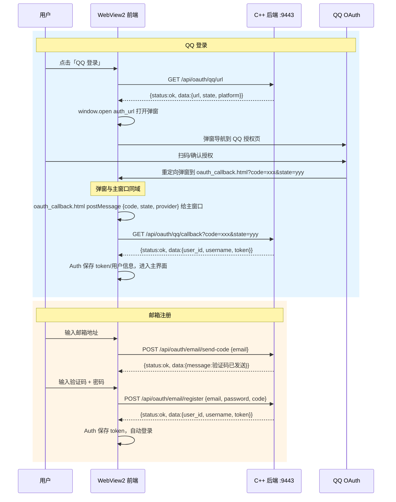

# P9.2 — 前端 OAuth 登录系统实施计划

## 概述

在现有后端（OAuthClient + OAuthHandler + EmailVerifier + 路由）已完成的基础上，实现 WebView2 前端 QQ/微信登录和邮箱注册功能。

## 架构图



## 实施步骤

### Step 6: 创建 client/ui/js/oauth.js

**路径**: [`client/ui/js/oauth.js`](client/ui/js/)

**内容**: 前端 OAuth 核心逻辑，三个主要方法：

#### `Auth.oauthLogin(provider)`

流程：
1. 调用 `GET /api/oauth/{provider}/url` 获取 auth_url 和 state
2. 用 `window.open(auth_url)` 打开弹窗
3. 注册 `window.addEventListener('message', handler)` 监听回调
4. 从 `event.data` 提取 `{code, state, provider}`
5. 验证 state 与请求时一致（CSRF 防护）
6. 调用 `GET /api/oauth/{provider}/callback?code=CODE&state=STATE`
7. 后端返回 `{status:ok, data:{user_id, username, nickname, token, is_new}}`
8. 复用现有 `Auth.login()` 的 token 保存逻辑
9. 关闭弹窗（如果未自动关闭）

#### `Auth.sendEmailCode(email)`
1. 邮箱格式校验
2. 调用 `POST /api/oauth/email/send-code {email}`
3. 60 秒倒计时禁用发送按钮
4. 返回 `{success, message}`

#### `Auth.emailRegister(email, password, code)`
1. 校验验证码和密码
2. 调用 `POST /api/oauth/email/register {email, password, code}`
3. 成功后自动登录（后端返回 token）

**关键代码模式**（与现有 auth.js 一致）:
```javascript
const Auth = window.Auth || {};

Auth.oauthLogin = async function (provider) {
    const result = await API.request('GET', `/api/oauth/${provider}/url`);
    if (result.status !== 'ok' || !result.data) {
        showNotification(result.message || '获取授权地址失败', 'error');
        return;
    }
    const { url, state } = result.data;
    const stateKey = `oauth_state_${provider}`;
    localStorage.setItem(stateKey, state);
    
    // 打开弹窗并监听 postMessage
    const popup = window.open(url, '_blank', 'width=600,height=600');
    return new Promise((resolve) => {
        const handler = async (event) => {
            if (event.data && event.data.provider === provider) {
                window.removeEventListener('message', handler);
                const savedState = localStorage.getItem(stateKey);
                if (event.data.state !== savedState) {
                    showNotification('CSRF 验证失败', 'error');
                    resolve(false); return;
                }
                localStorage.removeItem(stateKey);
                const cb = await API.request('GET', 
                    `/api/oauth/${provider}/callback?code=${event.data.code}&state=${event.data.state}`);
                if (cb.status === 'ok' && cb.data) {
                    await processOAuthResult(cb.data);
                    resolve(true);
                } else {
                    showNotification(cb.message || '登录失败', 'error');
                    resolve(false);
                }
                if (popup && !popup.closed) popup.close();
            }
        };
        window.addEventListener('message', handler);
        // 超时处理
        setTimeout(() => {
            window.removeEventListener('message', handler);
            if (popup && !popup.closed) popup.close();
            resolve(false);
        }, 120000); // 2分钟超时
    });
};
```

#### 辅助方法 `processOAuthResult(data)`（在 auth.js 中）

```javascript
async function processOAuthResult(data) {
    Auth.isLoggedIn = true;
    Auth.currentUser = data;
    API.TOKEN = data.token;
    IPC.send(IPC.MessageType.LOGIN, {
        user_id: data.user_id, token: data.token
    });
    localStorage.setItem('chrono_token', data.token);
    localStorage.setItem('chrono_user', JSON.stringify(data));
    return true;
}
```

---

### Step 7: 更新 client/ui/js/auth.js

在现有 [`client/ui/js/auth.js`](client/ui/js/auth.js) 基础上添加：

1. **`Auth.qqLogin()`** — 委托 `Auth.oauthLogin('qq')`
2. **`Auth.wechatLogin()`** — 委托 `Auth.oauthLogin('wechat')`
3. **`Auth.sendEmailCode(email)`** — 委托 oauth.js 方法
4. **`Auth.emailRegister(email, password, code)`** — 委托 oauth.js 方法

**注意**: 这些方法直接挂载到 `Auth` 对象上，`oauth.js` 和 `auth.js` 共享同一个 `window.Auth`。

---

### Step 11: 创建 client/ui/oauth_callback.html

**路径**: [`client/ui/oauth_callback.html`](client/ui/)

**用途**: OAuth 提供商（QQ/微信）授权成功后的重定向目标页。

```html
<!DOCTYPE html>
<html>
<head><meta charset="UTF-8"><title>授权回调</title></head>
<body>
    <p>登录成功，正在返回应用...</p>
    <script>
        (function() {
            const params = new URLSearchParams(window.location.search);
            const code = params.get('code');
            const state = params.get('state');
            // 从 URL 路径判断 provider
            const path = window.location.pathname;
            let provider = 'qq';
            if (path.includes('wechat')) provider = 'wechat';
            // 发送消息到主窗口
            if (window.opener && code) {
                window.opener.postMessage({ code, state, provider }, '*');
                setTimeout(function() { window.close(); }, 500);
            } else {
                document.body.innerHTML = '<p>授权失败：缺少参数</p>';
            }
        })();
    </script>
</body>
</html>
```

---

### Step 5: 更新 client/ui/index.html

在 [`client/ui/index.html`](client/ui/index.html) 的 `#form-login` 末尾、`auth-switch` 下方添加：

```html
<!-- OAuth 登录 -->
<div class="oauth-divider"><span>其他登录方式</span></div>
<div class="oauth-buttons">
    <button type="button" class="btn-oauth btn-oauth-qq" onclick="Auth.qqLogin()">
        QQ 登录
    </button>
    <button type="button" class="btn-oauth btn-oauth-wechat" onclick="Auth.wechatLogin()">
        微信登录
    </button>
</div>
```

在 `#form-register` 的末尾添加邮箱注册区块（作为备选注册方式）：

```html
<div class="oauth-divider"><span>或邮箱注册</span></div>
<div class="email-register">
    <div class="form-group">
        <input type="email" id="reg-email" placeholder="邮箱地址">
    </div>
    <div class="form-group form-group-with-btn">
        <input type="text" id="reg-email-code" placeholder="验证码" maxlength="6">
        <button type="button" class="btn btn-sm" id="btn-send-code" onclick="Auth.sendEmailCode()">发送验证码</button>
    </div>
    <div class="form-group">
        <input type="password" id="reg-email-password" placeholder="设置密码">
    </div>
    <button type="button" class="btn btn-primary btn-full" onclick="Auth.emailRegister()">邮箱注册</button>
</div>
```

**同时**在 `<head>` 中增加 oauth.js 的引用：
```html
<script src="js/oauth.js" defer></script>
```

---

### Step 8: 更新 client/ui/css/login.css

在 [`client/ui/css/login.css`](client/ui/css/login.css) 末尾添加：

```css
/* === OAuth 分隔线 === */
.oauth-divider {
    display: flex;
    align-items: center;
    margin: var(--spacing-lg) 0;
    color: var(--color-text-tertiary);
    font-size: var(--font-size-sm);
}
.oauth-divider::before,
.oauth-divider::after {
    content: '';
    flex: 1;
    height: 1px;
    background: var(--color-border);
}
.oauth-divider span {
    padding: 0 var(--spacing-md);
}

/* === OAuth 按钮 === */
.oauth-buttons {
    display: flex;
    gap: var(--spacing-md);
    margin-top: var(--spacing-sm);
}
.btn-oauth {
    flex: 1;
    height: 44px;
    border-radius: var(--border-radius-md);
    border: 1px solid var(--color-border);
    background: var(--color-bg-card);
    color: var(--color-text-primary);
    font-size: var(--font-size-sm);
    font-weight: 500;
    cursor: pointer;
    transition: all var(--transition-normal);
    display: flex;
    align-items: center;
    justify-content: center;
    gap: 6px;
}
.btn-oauth:hover {
    transform: translateY(-1px);
    box-shadow: 0 2px 8px rgba(0,0,0,0.08);
}
.btn-oauth-qq:hover {
    border-color: #12B7F5;
    color: #12B7F5;
}
.btn-oauth-wechat:hover {
    border-color: #07C160;
    color: #07C160;
}

/* === 邮箱注册区 === */
.email-register {
    margin-top: var(--spacing-md);
}
.form-group-with-btn {
    display: flex;
    gap: var(--spacing-sm);
}
.form-group-with-btn input {
    flex: 1;
}
.form-group-with-btn .btn-sm {
    width: 120px;
    flex-shrink: 0;
    font-size: var(--font-size-xs);
    height: 44px;
    background: var(--color-bg-secondary);
    color: var(--color-text-primary);
    border: 1px solid var(--color-border);
    border-radius: var(--border-radius-md);
    cursor: pointer;
    transition: all var(--transition-fast);
}
.form-group-with-btn .btn-sm:hover {
    background: var(--color-primary);
    color: #fff;
    border-color: var(--color-primary);
}
.form-group-with-btn .btn-sm:disabled {
    opacity: 0.5;
    cursor: not-allowed;
}
```

---

### Step 12: 配置 redirect_uri（修改 main_cpp.cpp）

**路径**: [`server/src/main_cpp.cpp`](server/src/main_cpp.cpp)

在构造 `OAuthConfig` 时，添加 `redirect_uri` 配置：

```cpp
chrono::handler::OAuthConfig oauth_config;
oauth_config.qq.app_id = "YOUR_QQ_APP_ID";
oauth_config.qq.app_key = "YOUR_QQ_APP_KEY";
oauth_config.qq.redirect_uri = "http://127.0.0.1:4500/oauth_callback.html"; // 指向前端
oauth_config.wechat.app_id = "YOUR_WECHAT_APP_ID";
oauth_config.wechat.app_key = "YOUR_WECHAT_APP_KEY";
oauth_config.wechat.redirect_uri = "http://127.0.0.1:4500/oauth_callback.html";
// ...
oauth_handler.init_oauth_config(oauth_config);
```

**端口 4500** 是 ClientHttpServer 的典型端口。如果前端端口不同，相应调整。

**影响**: 这个修改改变了 OAuth 回调的重定向目标地址，使 QQ/微信授权后重定向到前端的 `oauth_callback.html`，而不是后端的 callback API。后端 callback API 仍然可用，但由前端显式调用而非 OAuth 提供商直接调用。

---

## 执行顺序

| 顺序 | 步骤 | 文件 | 说明 |
|------|------|------|------|
| 1 | Step 11 | `client/ui/oauth_callback.html` | ✨ 新建：OAuth 回调页 |
| 2 | Step 6 | `client/ui/js/oauth.js` | ✨ 新建：前端 OAuth 核心逻辑 |
| 3 | Step 7 | `client/ui/js/auth.js` | 🔧 修改：添加 OAuth 入口方法 |
| 4 | Step 5 | `client/ui/index.html` | 🔧 修改：添加 OAuth 按钮和邮箱注册字段 |
| 5 | Step 8 | `client/ui/css/login.css` | 🔧 修改：添加 OAuth 按钮样式 |
| 6 | Step 12 | `server/src/main_cpp.cpp` | 🔧 修改：配置 redirect_uri 指向前端 |
