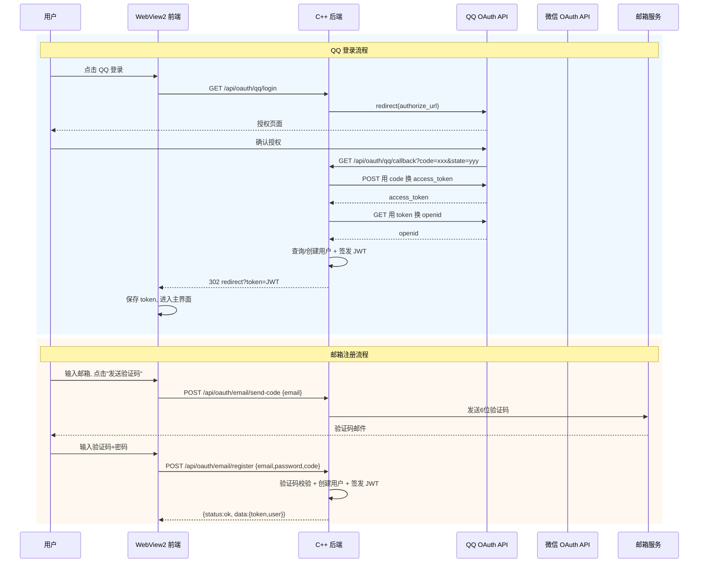

# P9.2: OAuth 登录系统 — 详细实施计划

## 概述

在现有 C++ 服务器基础上新增 **QQ 登录**、**微信登录** 和 **邮箱验证码注册** 功能。采用 OAuth2.0 授权码流程，前端 WebView2 弹窗处理授权跳转，后端完成 token 交换和用户绑定。

## 架构图



## 现有代码分析

### 已存在的文件 (不需要创建)

| 文件 | 内容 | 状态 |
|------|------|------|
| `server/src/handler/OAuthHandler.h` | OAuthHandler 类声明 | ✅ 已存在 |
| `server/src/handler/OAuthHandler.cpp` | OAuth 处理实现 (verify_oauth_token 是 stub) | ✅ 需更新 |
| `server/src/db/Database.h/cpp` | save_oauth_account/get_user_by_oauth/remove_oauth_account | ✅ 已实现 |
| `server/src/http/HttpServer.h/cpp` | register_route() 路由注册 | ✅ 已实现 |
| `server/src/security/SecurityManager.h` | InputSanitizer/RateLimiter/CsrfProtector | ✅ 已实现 |
| `server/src/ffi/RustBridge.h/cpp` | Rust FFI (JWT/密码哈希) | ✅ 已实现 |
| `server/src/json/JsonValue.h/cpp` | JSON 值类型 | ✅ 已实现 |
| `server/src/json/JsonParser.h/cpp` | JSON 解析器 | ✅ 已实现 |

### 已注册的路由 (在 main_cpp.cpp 中)

| 路由 | 方法 | 处理函数 | 状态 |
|------|------|----------|------|
| `/api/oauth/qq` | POST | OAuthHandler::handle_qq_login | ✅ 已注册 |
| `/api/oauth/wechat` | POST | OAuthHandler::handle_wechat_login | ✅ 已注册 |
| `/api/oauth/email/login` | POST | OAuthHandler::handle_email_login | ✅ 已注册 |
| `/api/oauth/email/register` | POST | OAuthHandler::handle_email_register | ✅ 已注册 |

## 实施步骤

### Step 1: 创建 OAuthClient.h/cpp

**路径**: `server/src/security/OAuthClient.h`, `server/src/security/OAuthClient.cpp`

**命名空间**: `chrono::security`

**类设计**:

```
class OAuthClient {
public:
    struct OAuthConfig {
        std::string app_id;       // QQ App ID / 微信 AppID
        std::string app_key;      // QQ App Key / 微信 AppSecret
        std::string redirect_uri; // 回调地址
    };

    class QQClient {
    public:
        explicit QQClient(OAuthConfig config);
        // 构建授权 URL
        std::string build_auth_url(const std::string& state);
        // 用 code 换 access_token
        bool exchange_code(const std::string& code, std::string& access_token, std::string& open_id);
        // 获取用户信息(昵称、头像)
        bool get_user_info(const std::string& access_token, const std::string& open_id,
                          std::string& nickname, std::string& avatar_url);

    private:
        OAuthConfig config_;
        // 使用平台 socket 发送 HTTP GET/POST 请求
        bool http_get(const std::string& url, std::string& response);
    };

    class WechatClient {
    public:
        explicit WechatClient(OAuthConfig config);
        std::string build_auth_url(const std::string& state);
        bool exchange_code(const std::string& code, std::string& access_token, std::string& open_id);
        bool get_user_info(const std::string& access_token, const std::string& open_id,
                          std::string& nickname, std::string& avatar_url);
    private:
        OAuthConfig config_;
        bool http_get(const std::string& url, std::string& response);
    };
};
```

**QQ API 调用**:
- 授权 URL: `https://graph.qq.com/oauth2.0/authorize?response_type=code&client_id=APP_ID&redirect_uri=URI&state=STATE`
- Token 交换: `GET https://graph.qq.com/oauth2.0/token?grant_type=authorization_code&client_id=APP_ID&client_secret=KEY&code=CODE&redirect_uri=URI`
- OpenID 获取: `GET https://graph.qq.com/oauth2.0/me?access_token=TOKEN`
- 用户信息: `GET https://graph.qq.com/user/get_user_info?access_token=TOKEN&oauth_consumer_key=APP_ID&openid=OPENID`

**微信 API 调用**:
- 授权 URL: `https://open.weixin.qq.com/connect/qrconnect?appid=APP_ID&redirect_uri=URI&response_type=code&scope=snsapi_login&state=STATE`
- Token 交换: `GET https://api.weixin.qq.com/sns/oauth2/access_token?appid=APP_ID&secret=KEY&code=CODE&grant_type=authorization_code`
- 用户信息: `GET https://api.weixin.qq.com/sns/userinfo?access_token=TOKEN&openid=OPENID`

**http_get 实现**: 使用平台 socket (winsock2), 构造 HTTP GET 请求, 解析 JSON 响应。不需要引入 libcurl 依赖。

---

### Step 2: 更新 OAuthHandler.cpp

**修改内容**:
1. 将 `verify_oauth_token()` 从 stub 替换为真实实现
2. 新增 `handle_qq_callback()`, `handle_wechat_callback()` 方法
3. 新增 `handle_send_email_code()` 方法
4. 使用 OAuthClient 验证 token/获取用户信息

**OAuthHandler.h 新增方法**:
```cpp
// 新增
json::JsonValue handle_qq_auth_url(const json::JsonValue& params);  // 返回 QQ 授权 URL
json::JsonValue handle_qq_callback(const json::JsonValue& params);  // QQ 回调处理
json::JsonValue handle_wechat_auth_url(const json::JsonValue& params);
json::JsonValue handle_wechat_callback(const json::JsonValue& params);
json::JsonValue handle_send_email_code(const json::JsonValue& params);  // 发送邮箱验证码
json::JsonValue handle_list_providers(const json::JsonValue& params);   // 列出已绑定 OAuth

// 新增私有成员
security::OAuthClient::QQClient qq_client_;
security::OAuthClient::WechatClient wechat_client_;
std::unordered_map<std::string, std::string> email_codes_;  // email→code 缓存
std::mutex code_mutex_;
```

**OAuthHandler.cpp 修改要点**:
- `oauth_login_impl()` — 保留现有逻辑，oauth_login 仍接受 open_id+access_token
- `handle_qq_callback()` — 用 code 调 OAuthClient 换 token/openid, 然后复用 oauth_login_impl
- `handle_send_email_code()` — 生成6位随机码, 通过 SMTP 发送, 缓存5分钟
- `verify_oauth_token()` — 调 OAuthClient::get_user_info() 验证 token 有效性

---

### Step 3: 创建 EmailVerifier.h/cpp

**路径**: `server/src/security/EmailVerifier.h`, `server/src/security/EmailVerifier.cpp`

**命名空间**: `chrono::security`

```
class EmailVerifier {
public:
    struct SmtpConfig {
        std::string host = "smtp.qq.com";
        int port = 465;
        std::string username;  // 邮箱账号
        std::string password;  // 邮箱密码/授权码
        bool use_ssl = true;
        std::string from_addr;
    };

    explicit EmailVerifier(SmtpConfig config);

    // 发送验证码
    bool send_code(const std::string& to_email, const std::string& code);

private:
    SmtpConfig config_;

    // SMTP 协议实现 (基于 socket)
    bool connect_server(SOCKET& sock);
    bool send_command(SOCKET sock, const std::string& cmd, std::string& response);
    bool base64_encode(const std::string& input, std::string& output);
};
```

**SMTP 协议流程**:
```
C: EHLO chrono-shift
S: 250-smtp.qq.com
C: AUTH LOGIN
S: 334 base64
C: base64(username)
S: 334 base64
C: base64(password)
S: 235 Authentication successful
C: MAIL FROM:<from@qq.com>
S: 250 Ok
C: RCPT TO:<to@example.com>
S: 250 Ok
C: DATA
S: 354 End data with <CRLF>.<CRLF>
C: From: from@qq.com
C: To: to@example.com
C: Subject: 墨竹 - 邮箱验证码
C: Content-Type: text/plain; charset=UTF-8
C:
C: 您的验证码是: 123456
C: 5分钟内有效
C: .
S: 250 Ok: queued
```

---

### Step 4: 注册新路由到 HttpServer (修改 main_cpp.cpp)

**需要新增的路由**:

| 路由 | 方法 | 用途 |
|------|------|------|
| `GET /api/oauth/qq/url` | GET | 返回 QQ 授权 URL (JSON) |
| `GET /api/oauth/qq/callback` | GET | QQ 授权回调，code→token→JWT→302 |
| `GET /api/oauth/wechat/url` | GET | 返回微信授权 URL |
| `GET /api/oauth/wechat/callback` | GET | 微信授权回调 |
| `POST /api/oauth/email/send-code` | POST | 发送邮箱验证码 |
| `GET /api/oauth/providers` | GET | 列出用户绑定的 OAuth 提供商 |
| `POST /api/oauth/bind` | POST | 绑定 OAuth 到现有用户 |
| `POST /api/oauth/unbind` | POST | 解绑 OAuth |

**注意**: 现有的 POST `/api/oauth/qq`, `/api/oauth/wechat` 路由保留兼容。

**回调路由实现示例**:
```cpp
// QQ 回调
server.register_route(Method::kGet, "/api/oauth/qq/callback",
    [&oauth_handler](const Request& req, Response& res) {
        std::string code = req.query("code");
        std::string state = req.query("state");
        JsonValue params = json_object();
        params.object_insert("code", JsonValue(code));
        params.object_insert("state", JsonValue(state));
        auto result = oauth_handler.handle_qq_callback(params);
        // 302 跳转回前端, 携带 token
        std::string redirect = "/?oauth=qq&token=" + result["data"]["token"].get_string("");
        res.set_status(302, "Found");
        res.set_header("Location", redirect);
    });
```

---

### Step 5: 更新前端 index.html

**在 auth-box 内, 登录/注册表单下方添加**:

```html
<!-- OAuth 登录按钮 -->
<div class="oauth-divider">
    <span class="oauth-divider-text">其他登录方式</span>
</div>
<div class="oauth-buttons">
    <button class="btn-oauth btn-oauth-qq" onclick="OAuth.login('qq')">
        <span class="oauth-icon">💬</span> QQ 登录
    </button>
    <button class="btn-oauth btn-oauth-wechat" onclick="OAuth.login('wechat')">
        <span class="oauth-icon">💚</span> 微信登录
    </button>
</div>
```

**在注册表单中添加邮箱和验证码字段**:
```html
<div class="form-group">
    <input type="email" id="reg-email" placeholder="邮箱" required>
</div>
<div class="form-group form-group-with-btn">
    <input type="text" id="reg-code" placeholder="验证码" maxlength="6">
    <button class="btn btn-sm" id="btn-send-code" onclick="OAuth.sendEmailCode()">发送验证码</button>
</div>
```

---

### Step 6: 创建 oauth.js

**路径**: `client/ui/js/oauth.js`

```javascript
const OAuth = window.OAuth || {};

// 打开 OAuth 登录弹窗
OAuth.login = function(platform) {
    // 1. 从后端获取授权 URL
    API.request('GET', `/api/oauth/${platform}/url`)
        .then(result => {
            if (result.status !== 'ok') {
                showNotification('获取授权链接失败', 'error');
                return;
            }
            const authUrl = result.data.url;
            // 2. 打开新窗口进行 OAuth 授权
            const popup = window.open(authUrl, 'oauth_popup', 
                'width=600,height=500,left=200,top=200');
            
            // 3. 轮询等待回调结果 (通过检测 URL 变化或 localStorage)
            OAuth._pollCallback(platform, popup);
        });
};

// 轮询回调结果
OAuth._pollCallback = function(platform, popup) {
    const checkExist = setInterval(() => {
        if (!popup || popup.closed) {
            clearInterval(checkExist);
            // 尝试检测 localStorage 中的 token
            const token = localStorage.getItem('chrono_oauth_token');
            if (token) {
                localStorage.removeItem('chrono_oauth_token');
                OAuth._handleSuccess(token);
            }
            return;
        }
        try {
            // 尝试读取弹出窗口 URL
            if (popup.location.href.includes('token=')) {
                const token = new URL(popup.location.href).searchParams.get('token');
                popup.close();
                clearInterval(checkExist);
                if (token) OAuth._handleSuccess(token);
            }
        } catch(e) {
            // 跨域限制，忽略
        }
    }, 500);
};

// OAuth 登录成功处理
OAuth._handleSuccess = function(token) {
    // 用 token 获取用户信息
    API.TOKEN = token;
    API.getProfile().then(result => {
        if (result.status === 'ok') {
            Auth.isLoggedIn = true;
            Auth.currentUser = result.data;
            API.TOKEN = token;
            localStorage.setItem('chrono_token', token);
            localStorage.setItem('chrono_user', JSON.stringify(result.data));
            showMainPage();
        }
    });
};

// 发送邮箱验证码
OAuth.sendEmailCode = function() {
    const email = document.getElementById('reg-email').value;
    if (!email) {
        showNotification('请输入邮箱', 'error');
        return;
    }
    const btn = document.getElementById('btn-send-code');
    btn.disabled = true;
    
    API.request('POST', '/api/oauth/email/send-code', { email })
        .then(result => {
            if (result.status === 'ok') {
                showNotification('验证码已发送', 'success');
                // 60秒倒计时
                let countdown = 60;
                const timer = setInterval(() => {
                    btn.textContent = `${countdown}s`;
                    countdown--;
                    if (countdown < 0) {
                        clearInterval(timer);
                        btn.textContent = '重新发送';
                        btn.disabled = false;
                    }
                }, 1000);
            } else {
                showNotification(result.message || '发送失败', 'error');
                btn.disabled = false;
            }
        })
        .catch(() => {
            btn.disabled = false;
        });
};
```

---

### Step 7: 更新 auth.js

**修改注册函数**，添加邮箱和验证码参数:

```javascript
// 注册 (新增邮箱和验证码)
Auth.register = async function(username, password, nickname, email, code) {
    // 前端验证
    if (email && !/^[^\s@]+@[^\s@]+\.[^\s@]+$/.test(email)) {
        showNotification('邮箱格式不正确', 'error');
        return false;
    }
    
    const result = await API.register(username, password, nickname, email, code);
    // ... 后续不变
};
```

**更新 API.js 注册函数**:
```javascript
API.register = function(username, password, nickname, email, code) {
    return API.request('POST', '/api/user/register', {
        username, password, nickname, email, code
    });
};
```

---

### Step 8: 更新 login.css

**添加 OAuth 按钮样式**:
```css
/* OAuth 分割线 */
.oauth-divider {
    display: flex;
    align-items: center;
    margin: var(--spacing-lg) 0;
}
.oauth-divider::before,
.oauth-divider::after {
    content: '';
    flex: 1;
    height: 1px;
    background: var(--color-border);
}
.oauth-divider-text {
    padding: 0 var(--spacing-md);
    color: var(--color-text-tertiary);
    font-size: var(--font-size-sm);
}

/* OAuth 按钮容器 */
.oauth-buttons {
    display: flex;
    gap: var(--spacing-md);
}

/* OAuth 按钮 */
.btn-oauth {
    flex: 1;
    height: 44px;
    border: 1px solid var(--color-border);
    border-radius: var(--border-radius-md);
    background: var(--color-bg-card);
    cursor: pointer;
    display: flex;
    align-items: center;
    justify-content: center;
    gap: 8px;
    font-size: var(--font-size-sm);
    transition: all var(--transition-normal);
}
.btn-oauth:hover {
    border-color: var(--color-primary);
    background: var(--color-bg-secondary);
}
.btn-oauth-qq .oauth-icon { color: #12B7F5; }
.btn-oauth-wechat .oauth-icon { color: #07C160; }

/* 带按钮的输入组 */
.form-group-with-btn {
    display: flex;
    gap: var(--spacing-sm);
}
.form-group-with-btn input {
    flex: 1;
}
.form-group-with-btn .btn {
    width: auto;
    padding: 0 var(--spacing-lg);
    height: 44px;
    white-space: nowrap;
    font-size: var(--font-size-sm);
}
```

---

### Step 9: 编译验证

使用 `g++ -std=c++17 -fsyntax-only` 验证所有新增和修改的 C++ 文件。

### Step 10: 更新 server/CMakeLists.txt

将新文件添加到 `GLOB_RECURSE` 或显式列出:
```cmake
${CMAKE_CURRENT_SOURCE_DIR}/src/security/OAuthClient.cpp
${CMAKE_CURRENT_SOURCE_DIR}/src/security/EmailVerifier.cpp
```

## 路由汇总

```
# OAuth 授权流程 (新增)
GET  /api/oauth/qq/url        → {status:ok, data:{url:"https://graph.qq.com/..."}}
GET  /api/oauth/qq/callback   ?code=xxx&state=yyy  → 302 /?token=JWT
GET  /api/oauth/wechat/url    → {status:ok, data:{url:"https://open.weixin.qq.com/..."}}
GET  /api/oauth/wechat/callback ?code=xxx&state=yyy → 302 /?token=JWT

# 邮箱验证 (新增)
POST /api/oauth/email/send-code  → {status:ok} (发送验证码)

# OAuth 绑定管理 (新增)
GET  /api/oauth/providers?user_id=xxx  → {status:ok, data:{providers:["qq","wechat"]}}

# 现有 (保留兼容)
POST /api/oauth/qq        → {open_id, access_token, nickname} 令牌交换模式
POST /api/oauth/wechat    → {open_id, access_token, nickname}
POST /api/oauth/email/login    → {email, password}
POST /api/oauth/email/register → {email, password, nickname, code}
POST /api/oauth/bind      → {user_id, platform, open_id}
POST /api/oauth/unbind    → {platform, open_id}
```

## 实施顺序

1. **Step 1**: OAuthClient.h/cpp — 无依赖, 可先行
2. **Step 2**: 更新 OAuthHandler.h/cpp — 依赖 OAuthClient
3. **Step 3**: EmailVerifier.h/cpp — 独立, 可与 Step 1 并行
4. **Step 4**: 注册路由到 main_cpp.cpp — 依赖 Step 2
5. **Step 5-8**: 前端更新 — 依赖后端路由定义
6. **Step 9**: 编译验证
7. **Step 10**: CMakeLists.txt 更新

## 注意事项

1. QQ 和微信的 `app_id` / `app_key` 需要在部署时配置，目前使用占位符
2. SMTP 配置同样需要部署时配置，默认使用 QQ 邮箱 SMTP
3. 邮箱验证码使用内存缓存 (std::unordered_map), 服务重启后失效
4. OAuth 回调使用 302 重定向回前端，通过 URL query 传递 token
5. 前端检测 token 的方式: ① 同域下直接读取 popup URL; ② localStorage 桥接
