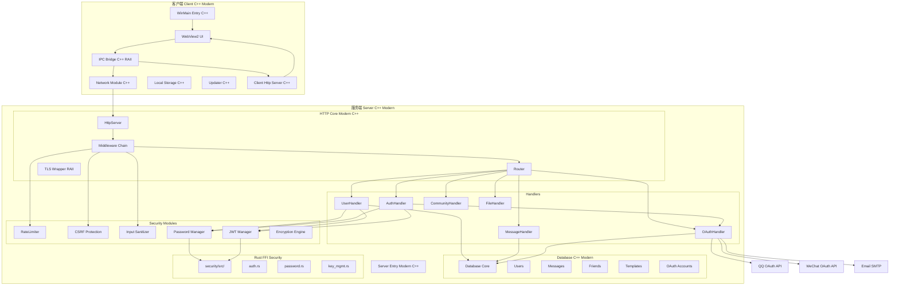

# P9: C++ 全量重构 + OAuth 登录 + 安全增强计划

## 概述

基于现有 C++17 兼容编译成果，对 **服务端和客户端** 进行全量 C++ 现代化重构，同时新增 QQ/微信/邮箱 OAuth 登录，增强安全模组，彻底替换旧 HTTP C 代码。

---

## 架构总览



---

## 阶段划分

### P9.1: C++ 基础设施重构

目标: 将现有 C 代码逐模块重写为现代 C++17

| 旧 C 文件 (server/src/) | 新 C++ 文件 (server/src/) | 关键变更 |
|------------------------|--------------------------|---------|
| `main.c` | `main.cpp` | `std::string`, RAII 全局状态 |
| `http_server.c` | `http/HttpServer.cpp` | 类封装, `std::function` 路由 |
| `http_core.c` | `http/HttpCore.cpp` | `std::vector<Route>`, 智能指针 |
| `http_conn.c` | `http/HttpConnection.cpp` | RAII socket/SSL* |
| `http_parse.c` | `http/HttpParser.cpp` | `std::string_view`, 零拷贝解析 |
| `http_response.c` | `http/HttpResponse.cpp` | 流式构建, move语义 |
| `websocket.c` | `ws/WebSocket.cpp` | `std::function` 回调, OOP |
| `json_parser.c` | `json/JsonParser.cpp` | `std::variant` 节点类型, 模板 |
| `tls_server.c` | `tls/TlsServer.cpp` | RAII SSL_CTX*, 异常安全 |
| `db_core.c` + `database.c` | `db/DbCore.cpp` + `db/*.cpp` | `std::filesystem` 路径 |
| `protocol.c` | `protocol/Protocol.cpp` | `enum class` 消息类型 |
| `user_handler.c` | `handler/UserHandler.cpp` | 类+方法 |
| `message_handler.c` | `handler/MessageHandler.cpp` | 类+方法 |
| `community_handler.c` | `handler/CommunityHandler.cpp` | 类+方法 |
| `file_handler.c` | `handler/FileHandler.cpp` | 类+方法 |
| `utils.c` | `util/Utils.cpp` | 命名空间工具函数 |
| `rust_stubs.c` | `ffi/RustStubs.cpp` | `extern "C"` 包装 |
| `platform_*.c` | `platform/Platform*.cpp` | 命名空间 |

### P9.1b: C++ 基础设施重构 (客户端)

| 旧 C 文件 (client/src/) | 新 C++ 文件 (client/src/) | 关键变更 |
|------------------------|--------------------------|---------|
| `main.c` | `main.cpp` | RAII WinMain, 异常安全 |
| `network.c` | `network/NetworkClient.cpp` | `std::async`, RAII 连接 |
| `net_tcp.c` | `network/TcpConnection.cpp` | RAII socket |
| `net_http.c` | `network/HttpConnection.cpp` | `std::string` 构建 |
| `net_ws.c` | `network/WebSocketClient.cpp` | OOP WebSocket |
| `net_sha1.c` | `network/Sha1.cpp` | 函数对象 |
| `ipc_bridge.c` | `app/IpcBridge.cpp` | RAII IPC |
| `webview_manager.c` | `app/WebViewManager.cpp` | RAII WebView2 |
| `client_http_server.c` | `app/ClientHttpServer.cpp` | 局部 HTTP 服务 |
| `local_storage.c` | `storage/LocalStorage.cpp` | `std::map` 缓存 |
| `updater.c` | `app/Updater.cpp` | RAII 更新器 |

目录结构目标:

**服务端:**
```
server/
  src/
    main.cpp
    http/
      HttpServer.h/cpp      # 服务器主循环
      HttpConnection.h/cpp  # 连接管理
      HttpParser.h/cpp      # HTTP 解析
      HttpResponse.h/cpp    # 响应构建
      Router.h/cpp          # 路由表
      Middleware.h/cpp      # 中间件链
    ws/
      WebSocket.h/cpp       # WebSocket
    tls/
      TlsServer.h/cpp       # TLS/SSL
    json/
      JsonParser.h/cpp      # JSON
    db/
      DbCore.h/cpp          # 数据库核心
      DbUsers.h/cpp         # 用户表
      DbMessages.h/cpp      # 消息表
      DbFriends.h/cpp       # 好友表
      DbTemplates.h/cpp     # 模板表
      DbOAuth.h/cpp         # OAuth 账号绑定
    handler/
      UserHandler.h/cpp     # 用户业务
      AuthHandler.h/cpp     # 认证业务
      OAuthHandler.h/cpp    # OAuth 登录
      MessageHandler.h/cpp  # 消息业务
      CommunityHandler.h/cpp # 社区业务
      FileHandler.h/cpp     # 文件业务
    security/
      RateLimiter.h/cpp     # 速率限制
      CsrfProtection.h/cpp  # CSRF 防护
      InputSanitizer.h/cpp  # 输入净化
      JwtManager.h/cpp      # JWT 管理
      PasswordManager.h/cpp # 密码管理
    ffi/
      RustStubs.h/cpp       # Rust FFI 桥接
    util/
      Utils.h/cpp           # 工具函数
      Logger.h/cpp          # 日志系统
  include/
    (旧头文件逐步迁移到 src/ 各模块中)
```

**客户端:**
```
client/
  src/
    main.cpp                # WinMain RAII 包装
    app/
      AppContext.h/cpp      # 应用上下文
      IpcBridge.h/cpp       # IPC 桥接 RAII
      WebViewManager.h/cpp  # WebView2 RAII
    network/
      NetworkClient.h/cpp   # 网络客户端
      HttpConnection.h/cpp  # HTTP 连接
      WebSocket.h/cpp       # WebSocket
      TlsWrapper.h/cpp      # TLS RAII
    storage/
      LocalStorage.h/cpp    # 本地存储
      SessionManager.h/cpp  # 会话管理
    security/
      CryptoEngine.h/cpp    # 加密引擎
      TokenManager.h/cpp    # 令牌管理
    util/
      Logger.h/cpp          # 日志
      Utils.h/cpp           # 工具
  include/
    (旧头文件逐步迁移)
```

### P9.2: OAuth 登录系统

#### 9.2.1 QQ 登录接口

1. **OAuth 流程**
   ```
   用户点击"QQ登录" → 后端生成 state + redirect_uri
   → 302 跳转到 QQ 授权页 → 用户授权
   → QQ 回调到 /api/oauth/qq/callback?code=xxx&state=yyy
   → 后端用 code 换 access_token → 用 token 换 openid
   → 查询或创建用户 → 签发 JWT → 302 回前端
   ```

2. **新增文件**
   - [`server/src/handler/OAuthHandler.h/cpp`](server/src/handler/OAuthHandler.h) - OAuth 处理器
   - [`server/src/db/DbOAuth.h/cpp`](server/src/db/DbOAuth.h) - OAuth 账号绑定表
   - [`server/src/security/OAuthClient.h/cpp`](server/src/security/OAuthClient.h) - OAuth HTTP 客户端

3. **新增路由**
   ```
   GET  /api/oauth/qq/login     → 跳转 QQ 授权页
   GET  /api/oauth/qq/callback  → QQ 回调处理
   POST /api/oauth/bind         → 绑定 OAuth 账号到现有用户
   GET  /api/oauth/providers    → 获取已绑定的 OAuth 列表
   ```

#### 9.2.2 微信登录接口

流程同 QQ 登录，使用微信开放平台 OAuth2.0:
```
GET /api/oauth/wechat/login    → 跳转微信授权页
GET /api/oauth/wechat/callback → 微信回调处理
```

#### 9.2.3 邮箱登录 + 注册

1. **邮箱密码登录** (增强现有)
   ```
   POST /api/auth/email/login
   Body: { email, password }
   Response: { status: "ok", data: { token, user } }
   ```

2. **邮箱注册** (增强现有)
   ```
   POST /api/auth/email/register
   Body: { email, password, nickname, code }
   Response: { status: "ok", data: { token, user } }
   ```

3. **邮箱验证码**
   ```
   POST /api/auth/email/send-code
   Body: { email }
   Response: 发送验证码到邮箱
   ```

4. **新增文件**
   - [`server/src/handler/AuthHandler.h/cpp`](server/src/handler/AuthHandler.h)
   - [`server/src/security/EmailVerifier.h/cpp`](server/src/security/EmailVerifier.h) - SMTP 客户端

### P9.3: 安全模块增强

| 模块 | 文件 | 功能 |
|------|------|------|
| 速率限制器 | [`RateLimiter.h/cpp`](server/src/security/RateLimiter.h) | 基于 IP/用户 的令牌桶, 防止暴力破解 |
| CSRF 防护 | [`CsrfProtection.h/cpp`](server/src/security/CsrfProtection.h) | Double-submit cookie 模式 |
| 输入净化器 | [`InputSanitizer.h/cpp`](server/src/security/InputSanitizer.h) | XSS 过滤, SQL 注入防护, 白名单验证 |
| JWT 管理器 | [`JwtManager.h/cpp`](server/src/security/JwtManager.h) | 令牌签发/验证/刷新/吊销 |
| 密码管理器 | [`PasswordManager.h/cpp`](server/src/security/PasswordManager.h) | Rust FFI 封装 Argon2id |
| 加密引擎 | [`EncryptionEngine.h/cpp`](server/src/security/EncryptionEngine.h) | AES-256-GCM 消息加密 |

### P9.4: 中间件链

新增中间件架构，每个请求经过以下链:
```
Request → RateLimiter → CsrfCheck → AuthCheck → Router → Handler → Response
```

中间件接口:
```cpp
class Middleware {
public:
    virtual ~Middleware() = default;
    virtual bool process(HttpRequest& req, HttpResponse& resp) = 0;
};
```

### P9.5: 数据库 OAuth 账号表

扩展数据库以支持 OAuth:
```sql
-- OAuth 账号绑定表 (文件数据库实现)
CREATE TABLE oauth_accounts (
    id INTEGER PRIMARY KEY,
    user_id INTEGER NOT NULL,
    provider TEXT NOT NULL,        -- 'qq', 'wechat', 'email'
    provider_account_id TEXT NOT NULL, -- QQ openid / 微信 unionid / 邮箱地址
    access_token TEXT,
    refresh_token TEXT,
    expires_at INTEGER,
    created_at INTEGER DEFAULT (strftime('%s','now')),
    UNIQUE(provider, provider_account_id)
);
```

### P9.6: 彻底删除旧 HTTP C 代码

当 C++ 实现完全覆盖后，删除以下文件:

| 删除的文件 | 替换为 |
|-----------|--------|
| `server/src/http_server.c` | `server/src/http/HttpServer.cpp` |
| `server/src/http_core.c` | `server/src/http/HttpCore.cpp` |
| `server/src/http_conn.c` | `server/src/http/HttpConnection.cpp` |
| `server/src/http_parse.c` | `server/src/http/HttpParser.cpp` |
| `server/src/http_response.c` | `server/src/http/HttpResponse.cpp` |
| `server/include/http_server.h` | 内联到 cpp 模块 |
| `server/include/http_core.h` | 内联到 cpp 模块 |

---

## 执行顺序

```
Phase 1: P9.1 服务端 C++ 基础设施重构
  Step 1: 创建服务端目录结构 server/src/{http,ws,tls,json,db,handler,security,ffi,util}/
  Step 2: 重构基础模块 (json_parser, utils, protocol → C++)
  Step 3: 重构 HTTP 核心 (http_server → HttpServer, http_conn → HttpConnection, etc.)
  Step 4: 重构数据库层 (db_core, database → C++)
  Step 5: 重构处理器层 (user_handler, message_handler, etc. → C++)
  Step 6: 重构 TLS/WebSocket
  Step 7: 更新 server/CMakeLists.txt 指向新 C++ 文件
  Step 8: 编译验证 + 测试通过

Phase 1b: P9.1b 客户端 C++ 基础设施重构
  Step 1: 创建客户端目录结构 client/src/{app,network,storage,security,util}/
  Step 2: 重构网络模块 (network.c, net_tcp.c, net_http.c, net_ws.c → C++)
  Step 3: 重构应用模块 (ipc_bridge.c, webview_manager.c, client_http_server.c → C++)
  Step 4: 重构存储模块 (local_storage.c → C++)
  Step 5: 更新 client/CMakeLists.txt 指向新 C++ 文件
  Step 6: 编译验证

Phase 2: P9.2 OAuth 登录系统
  Step 1: 实现 OAuthClient (QQ/微信 HTTP 请求封装)
  Step 2: 实现 DbOAuth (OAuth 账号绑定)
  Step 3: 实现 QQ 登录流程
  Step 4: 实现微信登录流程
  Step 5: 实现邮箱验证码 (SMTP 客户端)
  Step 6: 实现邮箱注册/登录增强
  Step 7: 更新前端登录页 UI (index.html + auth.js + api.js)
  Step 8: 集成测试

Phase 3: P9.3 安全模块增强
  Step 1: 实现 RateLimiter (令牌桶)
  Step 2: 实现 CsrfProtection
  Step 3: 实现 InputSanitizer
  Step 4: 实现 Middleware 中间件链 (服务端)
  Step 5: 将所有安全模块挂载到中间件链
  Step 6: 单元测试 RateLimiter/CsrfProtection/InputSanitizer

Phase 4: P9.4 清理旧 C 代码
  Step 1: 确认所有 C++ 模块功能完整
  Step 2: 运行全部 56+ 测试通过
  Step 3: 删除旧 C 文件 (server/src/*.c, client/src/*.c)
  Step 4: 彻底删除旧 HTTP 相关文件 (http_server.c, http_core.c, http_conn.c, http_parse.c, http_response.c + 对应 include/*.h)
  Step 5: 最终编译验证 + git 提交
```

---

## 关键设计决策

1. **渐进式重构**: 不一次性全部重写，而是按模块逐个迁移，每个模块保持功能完整
2. **RAII everywhere**: 所有资源 (SSL*, socket fd, FILE*, malloc 内存) 用 RAII 包裹
3. **`std::variant` 替代 `JsonValue` 联合体**: 类型安全的 JSON 节点
4. **`std::string_view` 零拷贝解析**: HTTP 解析避免不必要的字符串复制
5. **`std::function` 路由处理器**: 支持 lambda 和闭包
6. **中间件链模式**: 可插拔的安全检查
7. **Rust FFI 保持不变**: 现有的 `auth.rs` / `password.rs` Rust 安全库继续使用

---

## 测试策略

- 每个 C++ 模块迁移后运行旧的 C 测试确保行为一致
- OAuth 流程添加集成测试 (mock HTTP server)
- 安全模块添加单元测试 (RateLimiter, CsrfProtection, InputSanitizer)
- 使用 `libFuzzer` 对新的 C++ JSON 解析器做模糊测试
