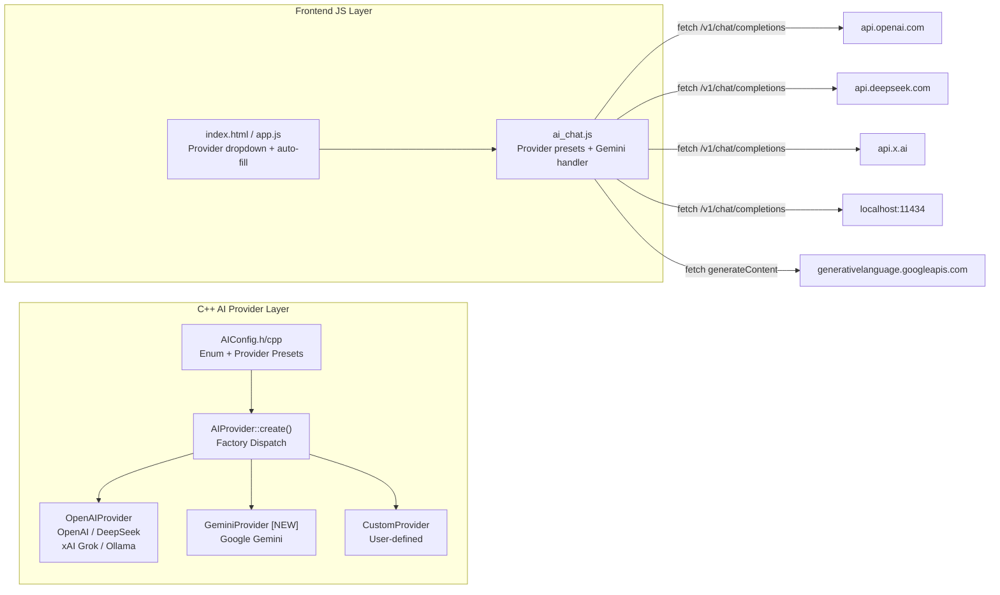
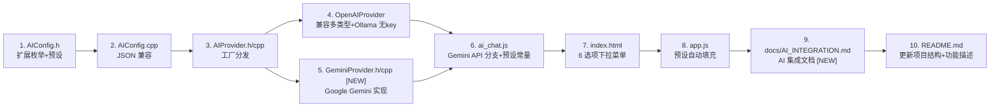

# AI 多提供商支持实施计划

## 目标

将现有的 AI 集成（仅支持 OpenAI 和 Custom）扩展为支持 **6 种提供商**的多选模式：

| 提供商 | API 格式 | 基础端点 | 默认模型 |
|--------|----------|----------|----------|
| **OpenAI** | OpenAI 兼容 | `https://api.openai.com` | `gpt-4o`, `gpt-4o-mini` |
| **DeepSeek** | OpenAI 兼容 | `https://api.deepseek.com` | `deepseek-v4-flash`, `deepseek-v4-pro` |
| **xAI Grok** | OpenAI 兼容 | `https://api.x.ai` | `grok-3`, `grok-3-mini` |
| **Ollama** | OpenAI 兼容 | `http://localhost:11434` | `llama3`, `qwen2.5` |
| **Google Gemini** | Google 专有 | `https://generativelanguage.googleapis.com` | `gemini-2.0-flash`, `gemini-2.0-pro` |
| **自定义** | 用户定义 | 用户定义 | 用户定义 |

**核心发现**: OpenAI、DeepSeek、xAI、Ollama 均使用 **OpenAI 兼容 API** (`/v1/chat/completions`)，可复用 `OpenAIProvider`。仅 Google Gemini 需要独立实现。

---

## 架构变更



---

## 详细实施步骤

### 步骤 1: 更新 `AIConfig.h` — 扩展提供商枚举

**文件**: [`client/src/ai/AIConfig.h`](client/src/ai/AIConfig.h)

将 `AIProviderType` 从 3 个值扩展为 7 个值：

```cpp
enum class AIProviderType : std::uint8_t {
    kNone      = 0,
    kOpenAI    = 1,   // OpenAI
    kDeepSeek  = 2,   // DeepSeek
    kXAI       = 3,   // xAI Grok
    kOllama    = 4,   // Ollama local
    kGemini    = 5,   // Google Gemini
    kCustom    = 6    // 自定义 API
};
```

添加辅助方法 `is_openai_compatible()` 和 `provider_name()`：

```cpp
static bool is_openai_compatible(AIProviderType type) {
    return type == AIProviderType::kOpenAI ||
           type == AIProviderType::kDeepSeek ||
           type == AIProviderType::kXAI ||
           type == AIProviderType::kOllama;
}

static const char* provider_name(AIProviderType type) {
    switch (type) {
        case AIProviderType::kOpenAI:   return "OpenAI";
        case AIProviderType::kDeepSeek: return "DeepSeek";
        case AIProviderType::kXAI:      return "xAI Grok";
        case AIProviderType::kOllama:   return "Ollama";
        case AIProviderType::kGemini:   return "Google Gemini";
        case AIProviderType::kCustom:   return "自定义 API";
        default:                        return "未配置";
    }
}
```

添加 **提供商预设** 信息结构体：

```cpp
struct ProviderPreset {
    const char* name;
    const char* default_endpoint;
    const char* default_model;
    bool        requires_api_key;
};

static ProviderPreset get_preset(AIProviderType type) {
    switch (type) {
        case AIProviderType::kOpenAI:
            return {"OpenAI", "https://api.openai.com", "gpt-4o", true};
        case AIProviderType::kDeepSeek:
            return {"DeepSeek", "https://api.deepseek.com", "deepseek-v4-flash", true};
        case AIProviderType::kXAI:
            return {"xAI Grok", "https://api.x.ai", "grok-3", true};
        case AIProviderType::kOllama:
            return {"Ollama", "http://localhost:11434", "llama3", false};
        case AIProviderType::kGemini:
            return {"Google Gemini", "https://generativelanguage.googleapis.com", "gemini-2.0-flash", true};
        case AIProviderType::kCustom:
            return {"自定义 API", "", "", false};
        default:
            return {"未配置", "", "", false};
    }
}
```

### 步骤 2: 更新 `AIConfig.cpp` — JSON 序列化适配新枚举

**文件**: [`client/src/ai/AIConfig.cpp`](client/src/ai/AIConfig.cpp)

`to_json()` 和 `from_json()` 需要处理新的枚举值。当前使用 `static_cast<int>` 序列化，无需改动序列化逻辑，但 `from_json()` 需要能解析 2-6 的新值。

### 步骤 3: 更新 `AIProvider.h` — 添加提供商信息查询方法

**文件**: [`client/src/ai/AIProvider.h`](client/src/ai/AIProvider.h)

在 `AIProvider` 类中添加静态方法：

```cpp
/** 获取提供商预设信息 */
struct ProviderInfo {
    std::string display_name;
    std::string default_endpoint;
    std::string default_model;
    bool requires_api_key;
};
static ProviderInfo get_provider_info(AIProviderType type);
```

### 步骤 4: 更新 `AIProvider.cpp` — 工厂方法支持多提供商

**文件**: [`client/src/ai/AIProvider.cpp`](client/src/ai/AIProvider.cpp)

```cpp
std::unique_ptr<AIProvider> AIProvider::create(
    AIProviderType type,
    const AIConfig& config) {
    switch (type) {
        case AIProviderType::kOpenAI:
        case AIProviderType::kDeepSeek:
        case AIProviderType::kXAI:
        case AIProviderType::kOllama:
            return CreateOpenAIProvider(config);
        case AIProviderType::kGemini:
            return CreateGeminiProvider(config);
        case AIProviderType::kCustom:
            return CreateCustomProvider(config);
        default:
            return nullptr;
    }
}

// 前向声明
std::unique_ptr<AIProvider> CreateGeminiProvider(const AIConfig& config);
```

### 步骤 5: 更新 `OpenAIProvider.h/cpp` — 支持多 OpenAI 兼容提供商

**文件**: [`client/src/ai/OpenAIProvider.h`](client/src/ai/OpenAIProvider.h) & [`OpenAIProvider.cpp`](client/src/ai/OpenAIProvider.cpp)

在 `set_config()` 中根据 `config.provider_type` 应用预设：

```cpp
void OpenAIProvider::set_config(const AIConfig& config) {
    config_ = config;
    api_endpoint_ = config.api_endpoint;
    api_key_ = config.api_key;
    model_ = config.model_name;
    max_tokens_ = config.max_tokens;
    temperature_ = config.temperature;
}

AIProviderType OpenAIProvider::type() const {
    return config_.provider_type;  // 返回实际类型
}

std::string OpenAIProvider::name() const {
    return AIConfig::provider_name(config_.provider_type);
}
```

测试连接方法也需要增强：Ollama 不需要 API key，应直接测试端点连通性。

### 步骤 6: 新增 `GeminiProvider.h/cpp` — Google Gemini 专用 Provider

**文件**: [`client/src/ai/GeminiProvider.h`](client/src/ai/GeminiProvider.h) (NEW)
**文件**: [`client/src/ai/GeminiProvider.cpp`](client/src/ai/GeminiProvider.cpp) (NEW)

Gemini API 与 OpenAI 完全不同：

**请求格式**:
```
POST https://generativelanguage.googleapis.com/v1beta/models/{model}:generateContent?key={API_KEY}
Body: {
  "contents": [{
    "parts":[{"text": "..."}]
  }],
  "generationConfig": {
    "maxOutputTokens": 2048,
    "temperature": 0.7
  }
}
```

**响应格式**:
```json
{
  "candidates": [{
    "content": {
      "parts": [{"text": "回复内容"}]
    }
  }]
}
```

`GeminiProvider` 继承 `AIProvider`，实现：
- `chat()` - 构建 Gemini 格式请求并解析响应
- `generate()` - 简单文本生成
- `test_connection()` - 调用 `list models` 接口
- `http_post()` - WinHTTP 实现（API key 作为 URL 参数 `?key=`）

### 步骤 7: 更新 `CMakeLists.txt` — 添加新源文件

**文件**: [`client/CMakeLists.txt`](client/CMakeLists.txt)

```cmake
file(GLOB CLIENT_CPP_SOURCES
    src/ai/*.cpp      # 已有 glob，自动包含新文件
    ...
)
```

使用 glob 的话，`GeminiProvider.cpp` 创建在 `src/ai/` 下会自动被包含。确认无误。

### 步骤 8: 更新 `ai_chat.js` — 前端多提供商支持

**文件**: [`client/ui/js/ai_chat.js`](client/ui/js/ai_chat.js)

添加提供商预设常量：

```javascript
AIChat.PROVIDERS = {
    openai:  { name: 'OpenAI',         endpoint: 'https://api.openai.com',                   model: 'gpt-4o',           keyRequired: true },
    deepseek:{ name: 'DeepSeek',       endpoint: 'https://api.deepseek.com',                 model: 'deepseek-v4-flash', keyRequired: true },
    xai:     { name: 'xAI Grok',       endpoint: 'https://api.x.ai',                         model: 'grok-3',            keyRequired: true },
    ollama:  { name: 'Ollama',         endpoint: 'http://localhost:11434',                    model: 'llama3',            keyRequired: false },
    gemini:  { name: 'Google Gemini',  endpoint: 'https://generativelanguage.googleapis.com',  model: 'gemini-2.0-flash',  keyRequired: true },
    custom:  { name: '自定义 API',      endpoint: '',                                          model: '',                  keyRequired: false }
};
```

更新 `callAPI()` 添加 Gemini 分支：

```javascript
AIChat.callAPI = async function (content) {
    const config = AIChat.config;
    const messages = [{ role: 'system', content: config.systemPrompt }];
    // ... 历史消息逻辑 ...
    messages.push({ role: 'user', content: content });

    if (config.provider === 'gemini') {
        return await AIChat.callGeminiAPI(messages);
    } else {
        // OpenAI 兼容 (openai / deepseek / xai / ollama / custom)
        return await AIChat.callOpenAICompatibleAPI(messages);
    }
};
```

新增 `callGeminiAPI()` 方法：

```javascript
AIChat.callGeminiAPI = async function (messages) {
    const config = AIChat.config;
    const endpoint = config.apiEndpoint.replace(/\/+$/, '')
        + '/v1beta/models/' + config.model + ':generateContent?key=' + config.apiKey;
    
    const contents = [];
    for (const msg of messages) {
        if (msg.role === 'system') continue; // Gemini 使用 system_instruction 参数
        contents.push({ role: msg.role === 'assistant' ? 'model' : 'user', parts: [{ text: msg.content }] });
    }
    
    const body = {
        contents: contents,
        system_instruction: { parts: [{ text: config.systemPrompt }] },
        generationConfig: { maxOutputTokens: config.maxTokens, temperature: config.temperature }
    };
    
    const response = await fetch(endpoint, {
        method: 'POST',
        headers: { 'Content-Type': 'application/json' },
        body: JSON.stringify(body)
    });
    
    if (!response.ok) throw new Error('HTTP ' + response.status);
    const data = await response.json();
    if (data.candidates && data.candidates[0] && data.candidates[0].content) {
        return data.candidates[0].content.parts.map(p => p.text).join('');
    }
    throw new Error('Gemini API 返回格式异常');
};
```

更新 `testConnection()` 支持 Gemini：

```javascript
AIChat.testConnection = async function () {
    const config = AIChat.config;
    if (!config.apiEndpoint) return { success: false, message: '请先填写 API 端点' };
    if (config.provider === 'gemini' && !config.apiKey) {
        return { success: false, message: '请先填写 API Key' };
    }
    if (config.provider !== 'ollama' && config.provider !== 'custom' && !config.apiKey) {
        return { success: false, message: '请先填写 API Key' };
    }

    try {
        if (config.provider === 'gemini') {
            const url = config.apiEndpoint.replace(/\/+$/, '') + '/v1beta/models?key=' + config.apiKey;
            const resp = await fetch(url);
            if (resp.ok) return { success: true, message: '连接成功！' };
            return { success: false, message: '连接失败: HTTP ' + resp.status };
        } else {
            // OpenAI 兼容 providers
            const endpoint = config.apiEndpoint.replace(/\/+$/, '') + '/v1/models';
            const headers = { 'Content-Type': 'application/json' };
            if (config.apiKey) headers['Authorization'] = 'Bearer ' + config.apiKey;
            const response = await fetch(endpoint, { headers });
            if (response.ok) {
                const data = await response.json();
                return { success: true, message: '连接成功！可用模型: ' + (data.data ? data.data.length : '未知') + ' 个' };
            }
            return { success: false, message: '连接失败: HTTP ' + response.status };
        }
    } catch (e) {
        return { success: false, message: '连接失败: ' + e.message };
    }
};
```

更新 `getSmartReply()` 支持 Gemini：

```javascript
AIChat.getSmartReply = async function (messageContent) {
    if (!AIChat.enabled) return [];
    try {
        if (AIChat.config.provider === 'gemini') {
            const result = await AIChat.callGeminiAPI([
                { role: 'system', content: '你是一个智能回复助手。请根据用户的消息，生成 3 条简短、自然的回复建议。以 JSON 数组格式返回，如 ["回复1","回复2","回复3"]' },
                { role: 'user', content: messageContent }
            ]);
            try { const s = JSON.parse(result); return Array.isArray(s) ? s.slice(0, 3) : []; } catch(e) { return []; }
        } else {
            // 现有 OpenAI 兼容逻辑 ...
        }
    } catch(e) { return []; }
};
```

### 步骤 9: 更新 `index.html` — 设置 UI 多提供商选择

**文件**: [`client/ui/index.html`](client/ui/index.html)

更新 AI 提供商下拉框：

```html
<select id="ai-provider" onchange="onAIProviderChange()">
    <option value="openai">OpenAI</option>
    <option value="deepseek">DeepSeek</option>
    <option value="xai">xAI Grok</option>
    <option value="ollama">Ollama (本地)</option>
    <option value="gemini">Google Gemini</option>
    <option value="custom">自定义 API</option>
</select>
```

端点输入框添加自动填充提示：

```html
<input type="text" id="ai-endpoint" placeholder="选择提供商后自动填充">
```

### 步骤 10: 更新 `app.js` — 预设自动填充逻辑

**文件**: [`client/ui/js/app.js`](client/ui/js/app.js)

更新 `onAIProviderChange()` 应用预设：

```javascript
function onAIProviderChange() {
    const provider = document.getElementById('ai-provider')?.value;
    if (!provider || !window.AIChat) return;
    
    const preset = AIChat.PROVIDERS[provider];
    if (!preset) return;
    
    const set = (id, value) => {
        const el = document.getElementById(id);
        if (el) el.value = value;
    };
    
    set('ai-endpoint', preset.endpoint);
    set('ai-model', preset.model);
    
    // 更新 placeholder 提示
    const endpointInput = document.getElementById('ai-endpoint');
    if (endpointInput) endpointInput.placeholder = preset.endpoint || '输入 API 端点';
    
    // 更新 API key 输入提示
    const keyInput = document.getElementById('ai-key');
    if (keyInput) keyInput.placeholder = preset.keyRequired ? '输入 API Key' : '无需 API Key（本地模型）';
    
    // 显示/隐藏 key 提示
    const keyGroup = document.getElementById('ai-key')?.closest('.form-group');
    if (keyGroup) keyGroup.style.opacity = preset.keyRequired ? '1' : '0.5';
}
```

更新 `saveAIConfig()` 保存 provider 类型：

```javascript
function saveAIConfig() {
    if (!window.AIChat) return;
    const provider = document.getElementById('ai-provider')?.value || 'openai';
    AIChat.config.provider = provider;
    // ... 其余字段同上 ...
    AIChat.saveConfig();
    showNotification('AI 配置已保存', 'success');
}
```

### 步骤 11: 更新 `OpenAIProvider.cpp` — Ollama 无 key 支持

**文件**: [`client/src/ai/OpenAIProvider.cpp`](client/src/ai/OpenAIProvider.cpp)

`is_available()` 和 `http_post()` 需要允许 Ollama 无 API key：

```cpp
bool OpenAIProvider::is_available() const {
    if (config_.provider_type == AIProviderType::kOllama) {
        return !api_endpoint_.empty(); // Ollama 不需要 API key
    }
    return !api_endpoint_.empty() && !api_key_.empty();
}
```

`http_post()` 中，如果是 Ollama 且无 key，跳过 Authorization header：

```cpp
// 只在有 API key 时添加 Authorization header
if (!api_key_.empty()) {
    std::wstring auth_header = L"Authorization: Bearer " + std::wstring(api_key_.begin(), api_key_.end());
    WinHttpAddRequestHeaders(hRequest, auth_header.c_str(), -1, WINHTTP_ADDREQ_FLAG_ADD);
}
```

### 步骤 12: 创建 `docs/AI_INTEGRATION.md` — AI 集成文档

**文件**: [`docs/AI_INTEGRATION.md`](docs/AI_INTEGRATION.md) (NEW)

包含：
- 支持的 AI 提供商一览表
- 快速配置指南（各提供商的 API Key 获取方式）
- DeepSeek v4 模型说明（deepseek-v4-flash / deepseek-v4-pro）
- Gemini API Key 获取方式
- Ollama 本地部署指南
- 架构说明
- 开发扩展指南（如何添加新提供商）

### 步骤 13: 更新 `README.md` — 添加 AI 功能描述

**文件**: [`README.md`](README.md)

在功能特性中添加 AI 集成章节：

```markdown
### AI 智能集成

Chrono-shift 集成了 AI 聊天功能，支持 **6 种 AI 提供商**：

| 提供商 | API 类型 | 默认模型 | 免费额度 |
|--------|----------|----------|----------|
| **OpenAI** | 兼容 OpenAI API | gpt-4o / gpt-4o-mini | 付费 |
| **DeepSeek** | 兼容 OpenAI API | deepseek-v4-flash / deepseek-v4-pro | 有免费额度 |
| **xAI Grok** | 兼容 OpenAI API | grok-3 | 付费 |
| **Ollama** | 兼容 OpenAI API (本地) | llama3 | 完全免费 |
| **Google Gemini** | Gemini API | gemini-2.0-flash | 有免费额度 |
| **自定义** | 用户定义 | — | — |

功能：
- 🤖 AI 聊天助手 — 在聊天界面中与 AI 对话
- 💡 智能回复建议 — 自动生成 3 条回复建议
- ⚙️ 可配置提供商、模型、参数
- 🔌 插件系统集成 — 可通过插件扩展 AI 功能
```

更新项目结构树，添加 `ai/` 目录：

```markdown
│   ├── src/ai/                   # AI 集成模块 [NEW]
│   │   ├── AIConfig.h/cpp        # AI 配置与提供商预设
│   │   ├── AIProvider.h/cpp       # 抽象基类 + 工厂
│   │   ├── OpenAIProvider.h/cpp   # OpenAI 兼容 (OpenAI/DeepSeek/xAI/Ollama)
│   │   ├── GeminiProvider.h/cpp   # Google Gemini [NEW]
│   │   └── AIChatSession.h/cpp    # 聊天会话管理
```

以及前端文件：

```markdown
│   │   ├── js/ai_chat.js          # AI 聊天模块 [NEW]
│   │   ├── js/ai_smart_reply.js   # 智能回复 [NEW]
│   │   └── css/ai.css             # AI 面板样式 [NEW]
```

---

## 实施顺序



---

## 风险与注意事项

1. **Ollama CORS**: Ollama 默认运行在 `localhost:11434`，前端 fetch 可能遇到 CORS 问题。需在 Ollama 启动时设置 `OLLAMA_ORIGINS=*` 或通过 C++ 后端代理请求。
2. **Gemini API Key**: Google Gemini 的 API key 作为 URL 参数传递（`?key=...`），而非 Authorization header。URL 中的 key 可能被日志记录，需注意安全。
3. **DeepSeek v4 弃用模型**: `deepseek-chat` 和 `deepseek-reasoner` 将于 2026/07/24 弃用，应默认推荐 `deepseek-v4-flash` 和 `deepseek-v4-pro`。
4. **xAI 可用性**: xAI 的 Grok API 需要通过审核才能获取访问权限，界面应提示用户。
