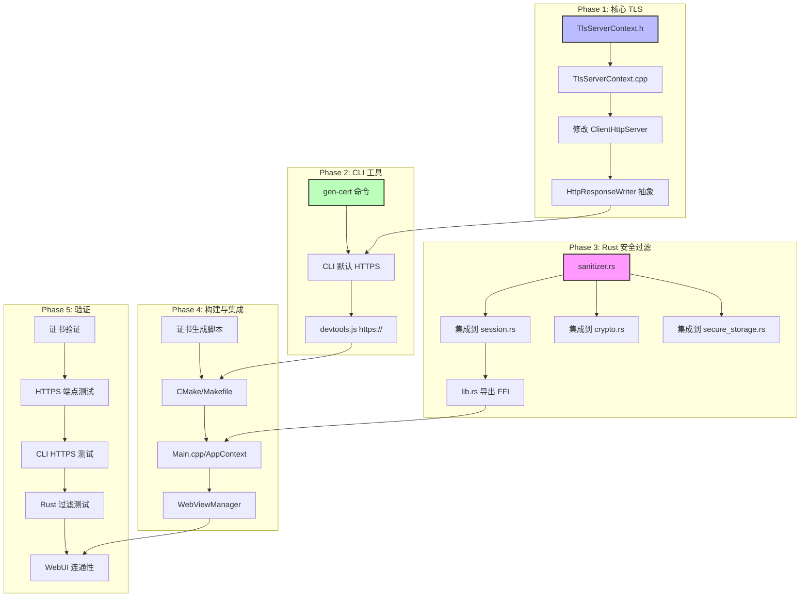

# 客户端全链路 HTTPS 安全迁移计划（含 Rust 安全过滤与 CLI 自签）

## 背景

```
┌──────────────────────────────────────────────────────────────────────────┐
│                         Chrono-shift 客户端架构                            │
│                                                                          │
│  ┌──────────┐     IPC (WebView2)     ┌────────────────────┐              │
│  │ WebUI    │ ◄───────────────────── │  C++ 后端           │              │
│  │ (JS)     │     postMessage         │  (AppContext,       │              │
│  │          │     (已加密/隔离)        │   ClientHttpServer, │              │
│  │          │                        │   NetworkClient)    │              │
│  │          │     HTTP → HTTPS        │         │          │              │
│  │          │ ◄───────────────────── │  port 9010          │              │
│  │          │     (DevTools API)      │  (本地 Web 服务)     │              │
│  └──────────┘                        └────────┬────────────┘              │
│                                               │                           │
│                                        ┌──────▼──────┐     ┌───────────┐  │
│                                        │ DevTools CLI │────→│ Rust FFI  │  │
│                                        │ (C 命令行)    │     │ (安全层)   │  │
│                                        │ HTTP → HTTPS │     │ 过滤+加密  │  │
│                                        └─────────────┘     └───────────┘  │
└──────────────────────────────────────────────────────────────────────────┘
```

## 当前安全审计结果

| 组件 | 当前协议 | 风险 | 目标 |
|------|---------|------|------|
| ClientHttpServer (port 9010) | HTTP 明文 | 本地进程可嗅探 API 请求/响应 | HTTPS |
| devtools.js → localhost:9010 | HTTP 明文 | 调试数据明文传输 | HTTPS |
| CLI 工具出站连接 | HTTP (默认) | 远程 API 调用被中间人攻击 | HTTPS |
| Rust FFI 安全层 (crypto/session/storage) | 无输入校验 | 恶意输入可导致 FFI 崩溃或信息泄露 | 添加安全过滤 |
| IPC (WebView2 postMessage) | 进程隔离 | ✅ 安全 (无需改动) | — |
| 前端 api.js → 远程 API | HTTPS ✅ | 已在 `api.js:11` 配置 | — |

## 架构决策

### 证书策略

```
┌──────────────────────────────────────────────┐
│          自签名证书 (开发/单机适用)               │
│                                                │
│  1. 首次启动时自动生成 (OpenSSL CLI)             │
│  2. 生成路径: client/certs/                    │
│  3. 文件:                                     │
│     - server.crt  (自签名证书)                  │
│     - server.key  (私钥, 权限 600)              │
│  4. 有效期: 3650 天 (10年)                     │
│  5. 仅在 127.0.0.1 使用                        │
│  6. MSYS2 路径: D:\mys32\bin\openssl.exe       │
└──────────────────────────────────────────────┘
```

**为什么选择自签名：**
- 服务仅在 `127.0.0.1` 监听，不对外暴露
- 自签名证书足够防止本地流量嗅探
- 无需 CA 签发，零成本
- 开发者工具场景下用户可手动信任

### 技术选型

```
服务端 TLS (ClientHttpServer)     客户端 TLS (CLI/NetworkClient)
┌─────────────────────┐          ┌─────────────────────┐
│ OpenSSL SSL_CTX     │          │ tls_client.c        │
│ (server mode)        │          │ (client mode)       │
│                      │          │                     │
│ SSL_accept()         │          │ SSL_connect()       │
│ SSL_read()/write()   │          │ SSL_read()/write()  │
└─────────────────────┘          └─────────────────────┘
         ▲                                ▲
         │                                │
         └────────── OpenSSL ─────────────┘
                    (D:\mys32\bin\openssl.exe)
```

---

## Phase 1: ClientHttpServer TLS 支持

### 1.1 创建服务端 TLS 封装头文件

**文件**: `client/src/app/TlsServerContext.h`

```cpp
#ifndef CHRONO_CLIENT_TLS_SERVER_CONTEXT_H
#define CHRONO_CLIENT_TLS_SERVER_CONTEXT_H

#include <string>
#include <memory>

struct ssl_st;     // SSL*
struct ssl_ctx_st; // SSL_CTX*

namespace chrono {
namespace client {
namespace app {

/**
 * 服务端 TLS 上下文 RAII 封装
 *
 * 用于 ClientHttpServer 的 HTTPS 加密
 * 加载自签名证书，对每个客户端连接执行 SSL_accept
 */
class TlsServerContext {
public:
    /**
     * 初始化服务端 TLS 上下文
     * @param cert_file 证书文件路径 (PEM)
     * @param key_file  私钥文件路径 (PEM)
     */
    TlsServerContext(const std::string& cert_file,
                     const std::string& key_file);
    ~TlsServerContext();

    // 禁止拷贝
    TlsServerContext(const TlsServerContext&) = delete;
    TlsServerContext& operator=(const TlsServerContext&) = delete;

    // 允许移动
    TlsServerContext(TlsServerContext&& other) noexcept;
    TlsServerContext& operator=(TlsServerContext&& other) noexcept;

    /** 是否初始化成功 */
    bool is_valid() const { return ctx_ != nullptr; }

    /**
     * 在已接受的 socket 上执行 TLS 握手
     * @param fd 已 accept 的 socket
     * @return SSL 对象指针 (需通过 tls_close 释放)
     */
    struct ssl_st* accept(int fd);

    /**
     * 获取最后错误描述
     */
    const char* last_error() const;

private:
    struct ssl_ctx_st* ctx_;
    std::string last_error_;
};

} // namespace app
} // namespace client
} // namespace chrono

#endif
```

### 1.2 实现服务端 TLS

**文件**: `client/src/app/TlsServerContext.cpp`

```cpp
/**
 * 服务端 TLS 上下文实现
 *
 * 基于 OpenSSL，为 ClientHttpServer 提供 HTTPS 能力
 *
 * 依赖:
 *   client/certs/server.crt — 自签名证书
 *   client/certs/server.key — 私钥
 */

#include "TlsServerContext.h"

#include <openssl/ssl.h>
#include <openssl/err.h>
#include <openssl/crypto.h>

#include <cstring>

namespace chrono {
namespace client {
namespace app {

// === 静态初始化：OpenSSL 全局初始化 ===
namespace {
    bool g_openssl_inited = false;
    void ensure_openssl_init() {
        if (!g_openssl_inited) {
            SSL_load_error_strings();
            OpenSSL_add_ssl_algorithms();
            g_openssl_inited = true;
        }
    }
}

TlsServerContext::TlsServerContext(const std::string& cert_file,
                                   const std::string& key_file)
    : ctx_(nullptr)
{
    ensure_openssl_init();

    // 创建服务端 SSL_CTX (TLS 1.2+)
    ctx_ = SSL_CTX_new(TLS_server_method());
    if (!ctx_) {
        last_error_ = "SSL_CTX_new failed";
        return;
    }

    // 仅允许 TLS 1.2+
    SSL_CTX_set_min_proto_version(ctx_, TLS1_2_VERSION);

    // 加载证书
    if (SSL_CTX_use_certificate_file(ctx_, cert_file.c_str(),
                                     SSL_FILETYPE_PEM) <= 0) {
        last_error_ = "Failed to load certificate: " + cert_file;
        SSL_CTX_free(ctx_);
        ctx_ = nullptr;
        return;
    }

    // 加载私钥
    if (SSL_CTX_use_PrivateKey_file(ctx_, key_file.c_str(),
                                    SSL_FILETYPE_PEM) <= 0) {
        last_error_ = "Failed to load private key: " + key_file;
        SSL_CTX_free(ctx_);
        ctx_ = nullptr;
        return;
    }

    // 验证密钥匹配
    if (!SSL_CTX_check_private_key(ctx_)) {
        last_error_ = "Private key does not match certificate";
        SSL_CTX_free(ctx_);
        ctx_ = nullptr;
        return;
    }
}

TlsServerContext::~TlsServerContext()
{
    if (ctx_) {
        SSL_CTX_free(ctx_);
    }
}

TlsServerContext::TlsServerContext(TlsServerContext&& other) noexcept
    : ctx_(other.ctx_)
    , last_error_(std::move(other.last_error_))
{
    other.ctx_ = nullptr;
}

TlsServerContext& TlsServerContext::operator=(TlsServerContext&& other) noexcept
{
    if (this != &other) {
        if (ctx_) SSL_CTX_free(ctx_);
        ctx_ = other.ctx_;
        last_error_ = std::move(other.last_error_);
        other.ctx_ = nullptr;
    }
    return *this;
}

struct ssl_st* TlsServerContext::accept(int fd)
{
    SSL* ssl = SSL_new(ctx_);
    if (!ssl) {
        last_error_ = "SSL_new failed";
        return nullptr;
    }

    SSL_set_fd(ssl, fd);

    int ret = SSL_accept(ssl);
    if (ret <= 0) {
        unsigned long err = ERR_get_error();
        if (err) {
            char buf[256];
            ERR_error_string_n(err, buf, sizeof(buf));
            last_error_ = buf;
        } else {
            last_error_ = "SSL_accept failed";
        }
        SSL_free(ssl);
        return nullptr;
    }

    return ssl;
}

const char* TlsServerContext::last_error() const
{
    return last_error_.c_str();
}

} // namespace app
} // namespace client
} // namespace chrono
```

### 1.3 修改 ClientHttpServer 头文件

**文件**: `client/src/app/ClientHttpServer.h`

变更：
1. 添加 `#include <openssl/ssl.h>` 前向声明或 `TlsServerContext.h`
2. 添加 `TlsServerContext` 成员
3. 添加 `set_cert_paths()` 方法设置证书路径
4. 修改 `handle_client()` 签名适配 SSL

```cpp
// 新增前向声明
namespace chrono {
namespace client {
namespace app {
class TlsServerContext;
}

// ClientHttpServer 类新增:
class ClientHttpServer {
public:
    // ... 已有代码 ...

    // === 新增: TLS 配置 ===
    /** 设置证书路径 (启用 HTTPS) */
    void set_tls_cert_paths(const std::string& cert_file,
                            const std::string& key_file);

private:
    // ... 已有代码 ...

    // === 新增: TLS 成员 ===
    std::unique_ptr<TlsServerContext> tls_ctx_;
    bool use_https_ = false;
};
```

### 1.4 修改 ClientHttpServer 实现

**文件**: `client/src/app/ClientHttpServer.cpp`

核心变更：
1. `start()` 中初始化 `TlsServerContext`
2. `handle_client()` 中在 `recv/send` 之前执行 `SSL_accept`
3. 新增 `ssl_send()` / `ssl_recv()` 辅助方法
4. `send_response()` 区分明文/TLS 发送

```cpp
// === handle_client 修改 ===

void ClientHttpServer::handle_client(SOCKET fd)
{
    if (use_https_) {
        // HTTPS 模式
        SSL* ssl = tls_ctx_->accept(fd);
        if (!ssl) {
            LOG_ERROR("TLS 握手失败: %s", tls_ctx_->last_error());
            closesocket(fd);
            return;
        }
        handle_client_tls(fd, ssl);
    } else {
        // HTTP 明文模式 (兼容旧版)
        handle_client_plain(fd);
    }
}

void ClientHttpServer::handle_client_plain(SOCKET fd)
{
    // ... 原有 handle_client 逻辑 ...
}

void ClientHttpServer::handle_client_tls(SOCKET fd, SSL* ssl)
{
    char buf[kMaxBufSize] = {};
    int received = SSL_read(ssl, buf, sizeof(buf) - 1);
    if (received <= 0) {
        tls_close(ssl);
        closesocket(fd);
        return;
    }
    buf[received] = '\0';

    // 解析请求...
    char method[16] = {}, path[256] = {};
    if (sscanf(buf, "%15s %255s", method, path) < 2) {
        send_error_json_tls(ssl, 400, "Bad Request");
        tls_close(ssl);
        closesocket(fd);
        return;
    }

    // ... 路由分发 (使用 SSL 版本) ...
    if (dispatch_dynamic_route_tls(ssl, fd, path, method, request_body)) {
        tls_close(ssl);
        closesocket(fd);
        return;
    }

    // 静态路由
    if (std::strcmp(method, "GET") == 0) {
        if (std::strcmp(path, "/health") == 0) {
            send_json_response_tls(ssl, 200, "OK", R"({"status":"ok"})");
        } // ...
    }

    tls_close(ssl);
    closesocket(fd);
}
```

> **设计原则**: 为了避免重复代码，可以将 `send_response` 拆分为底层方法（接受回调用于发送），或者直接使用 `::send` 和 `SSL_write` 两套路径。推荐将路由处理逻辑提取为模板/回调，发送操作作为参数传入。

### 1.5 修改 DevToolsHttpApi 适配 TLS

`DevToolsHttpApi` 的路由处理器接收 `SOCKET fd` 作为参数，需要同时支持明文和 TLS 两种模式。

**方案**: 使用**接口抽象**方式：

```cpp
// 新增: HTTP 响应发送接口
class HttpResponseWriter {
public:
    virtual ~HttpResponseWriter() = default;
    virtual void send(int status, const std::string& status_text,
                      const std::string& content_type,
                      const std::string& body) = 0;
    virtual void send_json(int status, const std::string& status_text,
                           const std::string& json) = 0;
};

// 明文版本
class PlainResponseWriter : public HttpResponseWriter {
    SOCKET fd_;
    // 使用 ::send()
};
// TLS 版本
class TlsResponseWriter : public HttpResponseWriter {
    SSL* ssl_;
    // 使用 SSL_write()
};
```

> 此改动影响较大，建议作为独立子任务。

---

## Phase 2: DevTools CLI 默认启用 HTTPS

### 2.1 修改 `client/devtools/cli/devtools_cli.h`

```c
// 在 DevToolsConfig 结构体中添加或修改默认值
typedef struct {
    // ... 已有字段 ...
    int  use_tls;        // 0=HTTP, 1=HTTPS (默认改为 1)
    int  port;           // 默认端口改为 443 (HTTPS)
    // ...
} DevToolsConfig;

// 或修改 main.c 中的默认初始化
```

### 2.2 修改 `client/devtools/cli/main.c`

```c
// 默认配置初始化处 (约 line 50-60)
g_config.use_tls = 1;    // ← 改为 HTTPS 默认
g_config.port = 443;     // ← 默认端口改为 443
```

### 2.3 修改 `client/devtools/cli/net_http.c`

当前 `http_request()` 函数已支持 TLS（通过 `g_config.use_tls` 判断），只需确保默认值为 1。

---

## Phase 3: CLI gen-cert 快速自签证书命令（新增）

**新增文件**: `client/devtools/cli/commands/cmd_gen_cert.c`

利用 MSYS2 环境中的 `openssl.exe`（位于 `D:\mys32\bin\openssl.exe`）在 CLI 中一键生成自签名证书。

### 3.1 创建 gen-cert 命令

```c
/**
 * cmd_gen_cert.c — 快速生成自签名 TLS 证书
 *
 * 用于开发/调试场景下的 HTTPS 测试
 * 调用 openssl CLI 生成证书
 */

#include "../devtools_cli.h"
#include <stdlib.h>

#ifdef _WIN32
#define OPENSSL_PATH "D:\\mys32\\bin\\openssl.exe"
#else
#define OPENSSL_PATH "openssl"
#endif

static int cmd_gen_cert(int argc, char** argv)
{
    const char* cert_dir = "certs";
    const char* days = "3650";
    const char* key_size = "2048";

    // 解析参数: gen-cert [--dir <path>] [--days <N>]
    for (int i = 1; i < argc; i++) {
        if (strcmp(argv[i], "--dir") == 0 && i + 1 < argc) {
            cert_dir = argv[++i];
        } else if (strcmp(argv[i], "--days") == 0 && i + 1 < argc) {
            days = argv[++i];
        } else if (strcmp(argv[i], "--help") == 0) {
            printf("用法: gen-cert [--dir <目录>] [--days <天数>]\n");
            printf("  默认目录: certs/\n");
            printf("  默认天数: 3650 (10年)\n");
            return 0;
        }
    }

    // 确保目录存在
#ifdef _WIN32
    char mkdir_cmd[512];
    snprintf(mkdir_cmd, sizeof(mkdir_cmd),
             "if not exist \"%s\" mkdir \"%s\"", cert_dir, cert_dir);
    system(mkdir_cmd);
#else
    char mkdir_cmd[512];
    snprintf(mkdir_cmd, sizeof(mkdir_cmd),
             "mkdir -p \"%s\"", cert_dir);
    system(mkdir_cmd);
#endif

    // 生成自签名证书
    char cmd[2048];
    snprintf(cmd, sizeof(cmd),
        "\"%s\" req -x509 -nodes -days %s -newkey rsa:%s "
        "-keyout \"%s/server.key\" "
        "-out \"%s/server.crt\" "
        "-subj \"/CN=127.0.0.1/O=Chrono-shift Dev/OU=CLI\" "
        "-addext \"subjectAltName=DNS:localhost,IP:127.0.0.1\" 2>&1",
        OPENSSL_PATH, days, key_size,
        cert_dir, cert_dir);

    printf("[*] 正在生成自签名证书...\n");
    printf("[*] 命令: %s\n", cmd);

    int ret = system(cmd);
    if (ret != 0) {
        fprintf(stderr, "[-] 证书生成失败 (错误码: %d)\n", ret);
        fprintf(stderr, "[-] 请确保障openssl 可用 (D:\\mys32\\bin\\openssl.exe)\n");
        return -1;
    }

    // 验证证书
    char verify_cmd[1024];
    snprintf(verify_cmd, sizeof(verify_cmd),
        "\"%s\" x509 -in \"%s/server.crt\" -text -noout "
        "| %s findstr /C:\"Not Before\" /C:\"Not After\"",
        OPENSSL_PATH, cert_dir,
    #ifdef _WIN32
        ""
    #else
        ""
    #endif
        );

    printf("[+] 证书已生成:\n");
    printf("    证书: %s/server.crt\n", cert_dir);
    printf("    私钥: %s/server.key\n", cert_dir);
    printf("[*] 证书信息:\n");
    system(verify_cmd);

    return 0;
}

int init_cmd_gen_cert(void)
{
    register_command("gen-cert",
        "快速生成自签名 TLS 证书 (开发调试用)",
        "gen-cert [--dir <目录>] [--days <天数>]",
        cmd_gen_cert);
    return 0;
}
```

### 3.2 注册 gen-cert 命令

在 `init_commands.c` 中添加：
```c
extern int init_cmd_gen_cert(void);

// 在 init_commands() 函数中添加:
init_cmd_gen_cert();
```

### 3.3 更新 CLI Makefile 确认 openssl 路径

在 `client/devtools/cli/Makefile` 中确认添加 `-DOPENSSL_PATH` 宏或确保 Makefile 可以找到 openssl。

---

## Phase 4: Rust FFI 安全过滤层（新增）

### 4.1 当前 Rust FFI 安全分析

对 [`client/security/`](client/security/) 的审计结果：

| 模块 | 当前状态 | 风险 | 需要改进 |
|------|---------|------|----------|
| [`crypto.rs`](client/security/src/crypto.rs) | 基础空指针检查，无长度校验 | 超长输入可导致内存压力 | 添加长度限制、内容格式校验 |
| [`session.rs`](client/security/src/session.rs) | 基础空指针检查，无内容校验 | 恶意 token/username 可导致 XSS | 添加字符白名单、长度限制 |
| [`secure_storage.rs`](client/security/src/secure_storage.rs) | 无路径遍历保护 | 可读写任意路径文件 | 添加路径规范化、遍历检测 |
| [`lib.rs`](client/security/src/lib.rs) | 基础空指针检查 | 无版本/完整性校验 | 添加参数校验中间件 |

### 4.2 创建安全过滤模块

**新增文件**: `client/security/src/sanitizer.rs`

```rust
//! 客户端安全过滤模块
//!
//! 为所有 FFI 入口点提供输入校验和安全过滤。
//! 包括：长度限制、字符白名单、路径遍历检测、内容格式校验。

use std::path::Path;

/// 最大输入长度常量
pub const MAX_TOKEN_LENGTH: usize = 4096;
pub const MAX_USERNAME_LENGTH: usize = 64;
pub const MAX_USERID_LENGTH: usize = 64;
pub const MAX_MESSAGE_LENGTH: usize = 65536;  // 64KB
pub const MAX_KEY_LENGTH: usize = 1024;
pub const MAX_PATH_LENGTH: usize = 4096;

/// 校验并安全截断字符串
pub fn sanitize_string(input: &str, max_len: usize) -> Result<&str, String> {
    if input.len() > max_len {
        return Err(format!(
            "输入超长: {} 字节 (最大 {})",
            input.len(), max_len
        ));
    }
    Ok(input)
}

/// 校验用户名：只允许字母、数字、下划线、中文字符
pub fn sanitize_username(input: &str) -> Result<&str, String> {
    let s = sanitize_string(input, MAX_USERNAME_LENGTH)?;
    if s.is_empty() {
        return Err("用户名为空".to_string());
    }
    for c in s.chars() {
        match c {
            'a'..='z' | 'A'..='Z' | '0'..='9' | '_' | '-' => continue,
            '\u{4e00}'..='\u{9fff}' => continue, // CJK 统一表意文字
            _ => return Err(format!("用户名包含非法字符: {:?}", c)),
        }
    }
    Ok(s)
}

/// 校验 Token 格式：只允许 Base64 字符集和有限长度
pub fn sanitize_token(input: &str) -> Result<&str, String> {
    let s = sanitize_string(input, MAX_TOKEN_LENGTH)?;
    if s.is_empty() {
        return Err("Token 为空".to_string());
    }
    // Base64 字符集: A-Z, a-z, 0-9, +, /, =
    for c in s.chars() {
        match c {
            'A'..='Z' | 'a'..='z' | '0'..='9' | '+' | '/' | '=' => continue,
            _ => return Err(format!("Token 包含非法字符: {:?}", c)),
        }
    }
    Ok(s)
}

/// 校验会话 ID 格式
pub fn sanitize_user_id(input: &str) -> Result<&str, String> {
    let s = sanitize_string(input, MAX_USERID_LENGTH)?;
    if s.is_empty() {
        return Err("用户 ID 为空".to_string());
    }
    // 用户 ID 只允许数字
    for c in s.chars() {
        if !c.is_ascii_digit() {
            return Err(format!("用户 ID 包含非数字字符: {:?}", c));
        }
    }
    Ok(s)
}

/// 路径遍历防护：确保路径在允许的基目录内
pub fn sanitize_path(input: &str, base_dir: &Path) -> Result<String, String> {
    let s = sanitize_string(input, MAX_PATH_LENGTH)?;
    let input_path = Path::new(s);

    // 拒绝绝对路径
    if input_path.is_absolute() {
        return Err("不支持绝对路径".to_string());
    }

    // 拒绝包含 .. 的路径 (路径遍历攻击)
    let components: Vec<_> = input_path.components().collect();
    for comp in &components {
        use std::path::Component;
        if let Component::ParentDir = comp {
            return Err("路径包含 '..' 遍历攻击".to_string());
        }
    }

    // 规范化并拼接
    let full_path = base_dir.join(input_path);
    let canonical = full_path.canonicalize()
        .map_err(|_| "路径解析失败".to_string())?;

    // 确保仍在基目录内
    if !canonical.starts_with(base_dir) {
        return Err("路径越界: 不在允许的基目录内".to_string());
    }

    Ok(canonical.to_string_lossy().to_string())
}

/// Base64 格式校验
pub fn validate_base64(input: &str) -> Result<&str, String> {
    let s = sanitize_string(input, MAX_KEY_LENGTH)?;
    if s.is_empty() {
        return Err("Base64 数据为空".to_string());
    }
    // 检查长度是否为 4 的倍数
    if s.len() % 4 != 0 {
        return Err("Base64 长度无效".to_string());
    }
    // 检查字符集
    for c in s.chars() {
        match c {
            'A'..='Z' | 'a'..='z' | '0'..='9' | '+' | '/' | '=' => continue,
            _ => return Err(format!("Base64 包含非法字符: {:?}", c)),
        }
    }
    Ok(s)
}

#[cfg(test)]
mod tests {
    use super::*;

    #[test]
    fn test_sanitize_username_ok() {
        assert!(sanitize_username("test_user").is_ok());
        assert!(sanitize_username("张三").is_ok());
        assert!(sanitize_username("test-123").is_ok());
    }

    #[test]
    fn test_sanitize_username_invalid() {
        assert!(sanitize_username("<script>").is_err());
        assert!(sanitize_username("").is_err());
        assert!(sanitize_username("user@host").is_err());
    }

    #[test]
    fn test_sanitize_token_ok() {
        assert!(sanitize_token("ABC123abc+/=").is_ok());
    }

    #[test]
    fn test_sanitize_token_invalid() {
        assert!(sanitize_token("token with spaces").is_err());
        assert!(sanitize_token("<script>").is_err());
    }

    #[test]
    fn test_sanitize_user_id_ok() {
        assert!(sanitize_user_id("12345").is_ok());
    }

    #[test]
    fn test_sanitize_user_id_invalid() {
        assert!(sanitize_user_id("abc").is_err());
        assert!(sanitize_user_id("").is_err());
    }
}
```

### 4.3 在 session.rs 中集成安全过滤

```rust
// 在 rust_session_save 中添加过滤:
use crate::sanitizer;

#[no_mangle]
pub extern "C" fn rust_session_save(
    user_id: *const c_char,
    username: *const c_char,
    token: *const c_char,
) -> i32 {
    if user_id.is_null() || username.is_null() || token.is_null() {
        return -1;
    }

    let uid = match unsafe { CStr::from_ptr(user_id) }.to_str() {
        Ok(s) => match sanitizer::sanitize_user_id(s) {
            Ok(v) => v.to_string(),
            Err(_) => return -1,
        },
        Err(_) => return -1,
    };
    let name = match unsafe { CStr::from_ptr(username) }.to_str() {
        Ok(s) => match sanitizer::sanitize_username(s) {
            Ok(v) => v.to_string(),
            Err(_) => return -1,
        },
        Err(_) => return -1,
    };
    let t = match unsafe { CStr::from_ptr(token) }.to_str() {
        Ok(s) => match sanitizer::sanitize_token(s) {
            Ok(v) => v.to_string(),
            Err(_) => return -1,
        },
        Err(_) => return -1,
    };

    let mut session = SESSION.lock().unwrap();
    session.user_id = uid;
    session.username = name;
    session.token = t;
    session.is_logged_in = true;

    0
}
```

### 4.4 在 crypto.rs 中集成安全过滤

```rust
// 在 encrypt_e2e / decrypt_e2e 中添加:
use crate::sanitizer;

// 加密前校验输入
pub extern "C" fn rust_client_encrypt_e2e(
    plaintext: *const c_char,
    pubkey_b64: *const c_char,
) -> *mut c_char {
    // ... 空指针检查 ...

    let text = unsafe { CStr::from_ptr(plaintext) }.to_str().ok()?;
    // 添加长度限制
    sanitizer::sanitize_string(text, sanitizer::MAX_MESSAGE_LENGTH).ok()?;

    let key_str = unsafe { CStr::from_ptr(pubkey_b64) }.to_str().ok()?;
    // 校验 Base64 格式
    sanitizer::validate_base64(key_str).ok()?;

    // ... 原有加密逻辑 ...
}
```

### 4.5 在 secure_storage.rs 中集成路径防护

```rust
// 在文件操作前添加路径遍历检测:
use crate::sanitizer;

pub fn init_secure_storage(app_data_path: &str) -> Result<(), String> {
    let base = PathBuf::from(app_data_path);
    // 规范化并校验路径
    let safe_path = sanitizer::sanitize_path("secure", &base)?;
    let path = PathBuf::from(&safe_path);
    fs::create_dir_all(&path).map_err(|e| ...)?;
    // ...
}
```

### 4.6 添加安全过滤到 lib.rs 的导出

**文件**: `client/security/src/lib.rs`

```rust
// 添加安全过滤模块
pub mod sanitizer;

// 新增 FFI 导出: 安全校验函数
#[no_mangle]
pub extern "C" fn rust_validate_username(username: *const c_char) -> i32 {
    if username.is_null() { return -1; }
    let s = match unsafe { CStr::from_ptr(username) }.to_str() {
        Ok(s) => s,
        Err(_) => return -1,
    };
    if sanitizer::sanitize_username(s).is_ok() { 0 } else { -1 }
}

#[no_mangle]
pub extern "C" fn rust_validate_token(token: *const c_char) -> i32 {
    if token.is_null() { return -1; }
    let s = match unsafe { CStr::from_ptr(token) }.to_str() {
        Ok(s) => s,
        Err(_) => return -1,
    };
    if sanitizer::sanitize_token(s).is_ok() { 0 } else { -1 }
}
```

### 4.7 更新 Cargo.toml（如需）

```toml
# 当前依赖已包含 serde, serde_json, ring
# sanitizer 模块仅使用标准库，无需新增外部依赖
```

---

## Phase 5: DevTools WebUI 前端 HTTPS 适配

### 5.1 修改 `client/devtools/ui/js/devtools.js`

```javascript
// 第 58 行: 将 http 改为 https
// 修改前:
var url = 'http://127.0.0.1:9010' + API_PREFIX + path;
// 修改后:
var url = 'https://127.0.0.1:9010' + API_PREFIX + path;
```

> 此变更要求 WebView2 信任自签名证书（通过 `--ignore-certificate-errors` 或在 WebView2 环境中添加证书例外）。

### 5.2 WebView2 证书信任

在 `WebViewManager` 中配置 WebView2 环境以信任自签名证书：

```cpp
// WebView2 创建时的配置 (在 WebViewManager 中)
// 方案 A: 开发模式放宽容错
webview2_env->put_AdditionalBrowserArguments(
    L"--ignore-certificate-errors");

// 方案 B: 将自签名证书添加到 WebView2 的证书存储
// 需要导入 client/certs/server.crt 到受信任根证书存储
```

> **安全警告**: `--ignore-certificate-errors` 仅在开发/调试模式下使用。生产环境应使用方案 B 将证书导入系统信任库。

---

## Phase 6: CMake/Makefile 构建配置更新

### 6.1 创建证书生成脚本

**文件**: `client/scripts/gen_cert.sh` (Linux/macOS)
**文件**: `client/scripts/gen_cert.bat` (Windows, 使用 MSYS2 openssl)

```bash
#!/bin/bash
# 生成自签名证书用于本地 HTTPS 服务
# 输出: client/certs/server.crt, client/certs/server.key

CERT_DIR="$(dirname "$0")/../certs"
mkdir -p "$CERT_DIR"

# 尝试 MSYS2 路径, 回退到 PATH 中的 openssl
OPENSSL=""
if [ -f "/d/mys32/bin/openssl.exe" ]; then
    OPENSSL="/d/mys32/bin/openssl.exe"
elif command -v openssl &> /dev/null; then
    OPENSSL="openssl"
else
    echo "[-] 错误: 未找到 openssl, 请安装 MSYS2 的 openssl"
    echo "     pacman -S openssl"
    exit 1
fi

"$OPENSSL" req -x509 -nodes -days 3650 -newkey rsa:2048 \
    -keyout "$CERT_DIR/server.key" \
    -out "$CERT_DIR/server.crt" \
    -subj "/CN=127.0.0.1/O=Chrono-shift Dev/OU=Local Dev" \
    -addext "subjectAltName=DNS:localhost,IP:127.0.0.1"

chmod 600 "$CERT_DIR/server.key"
echo "自签名证书已生成: $CERT_DIR"
```

```batch
@echo off
REM 生成自签名证书用于本地 HTTPS 服务
SET CERT_DIR=%~dp0..\certs
IF NOT EXIST "%CERT_DIR%" mkdir "%CERT_DIR%"

REM 优先使用 MSYS2 的 openssl
SET OPENSSL=D:\mys32\bin\openssl.exe
IF NOT EXIST "%OPENSSL%" SET OPENSSL=openssl

"%OPENSSL%" req -x509 -nodes -days 3650 -newkey rsa:2048 ^
    -keyout "%CERT_DIR%\server.key" ^
    -out "%CERT_DIR%\server.crt" ^
    -subj "/CN=127.0.0.1/O=Chrono-shift Dev/OU=Local Dev" ^
    -addext "subjectAltName=DNS:localhost,IP:127.0.0.1"

ECHO 自签名证书已生成: %CERT_DIR%
```

### 6.2 修改 `client/CMakeLists.txt`

```cmake
# 添加 OpenSSL 依赖 (如果尚未添加)
find_package(OpenSSL REQUIRED)
target_link_libraries(chrono-client PRIVATE OpenSSL::SSL OpenSSL::Crypto)

# 添加 TlsServerContext 源文件
# (如果已使用 GLOB_RECURSE, 会自动包含 src/app/*.cpp 中的新文件)

# 添加证书生成目标
add_custom_target(gen-certs
    COMMAND ${CMAKE_COMMAND} -E make_directory ${CMAKE_CURRENT_SOURCE_DIR}/certs
    COMMAND D:\mys32\bin\openssl.exe req -x509 -nodes -days 3650 -newkey rsa:2048
            -keyout ${CMAKE_CURRENT_SOURCE_DIR}/certs/server.key
            -out ${CMAKE_CURRENT_SOURCE_DIR}/certs/server.crt
            -subj "/CN=127.0.0.1/O=Chrono-shift/OU=Dev"
            -addext "subjectAltName=DNS:localhost,IP:127.0.0.1"
    COMMENT "生成自签名 TLS 证书..."
)
```

### 6.3 修改 `client/devtools/cli/Makefile`

```makefile
# 当前已有 TLS 支持，需确保默认链接 OpenSSL
# 检查 LDFLAGS 是否包含 -lssl -lcrypto
# 确认 CFLAGS 包含 -DUSE_TLS

# 在 TLS 支持块中，默认启用 (NO_TLS=1 才禁用)
ifneq ($(NO_TLS), 1)
    # ... 已有代码 ...
    CFLAGS += -DUSE_TLS           # 确保定义了 USE_TLS 宏
endif

# 新增: gen-cert 命令不需要额外依赖，直接调用系统 openssl
```

---

## Phase 7: 在 AppContext/Main.cpp 中集成证书生成与 HTTPS 启动

### 7.1 应用启动时自动生成证书

在 `Main.cpp` 或 `AppContext::init()` 中：

```cpp
#include <cstdlib>  // for system()

bool ensure_certificates(const std::string& cert_dir) {
    // 检查证书是否存在
    std::string cert_file = cert_dir + "/server.crt";
    std::string key_file  = cert_dir + "/server.key";

    std::ifstream cert(cert_file);
    std::ifstream key(key_file);

    if (cert.good() && key.good()) {
        return true; // 证书已存在
    }

    // 生成自签名证书 (优先使用 MSYS2 OpenSSL)
    std::string openssl = "openssl";
#ifdef _WIN32
    // 尝试 MSYS2 路径
    std::string msys2_openssl = "D:\\mys32\\bin\\openssl.exe";
    std::ifstream msys2_test(msys2_openssl);
    if (msys2_test.good()) {
        openssl = msys2_openssl;
    }
#endif

    std::string cmd = "\"" + openssl + "\" req -x509 -nodes -days 3650 -newkey rsa:2048 "
        "-keyout \"" + key_file + "\" "
        "-out \"" + cert_file + "\" "
        "-subj \"/CN=127.0.0.1/O=Chrono-shift/OU=Dev\" "
        "-addext \"subjectAltName=DNS:localhost,IP:127.0.0.1\"";

    int ret = std::system(cmd.c_str());
    if (ret != 0) {
        LOG_ERROR("证书生成失败，请手动运行: gen-cert");
        return false;
    }

    LOG_INFO("自签名证书已生成: %s", cert_dir.c_str());
    return true;
}
```

### 7.2 在 ClientHttpServer 启动时加载证书

```cpp
// AppContext::init() 或 Main.cpp 中:

// 1. 确保证书存在
std::string cert_dir = app_data_path + "/certs";
ensure_certificates(cert_dir);

// 2. 启动 HTTPS 服务
http_server_.set_tls_cert_paths(
    cert_dir + "/server.crt",
    cert_dir + "/server.key");
http_server_.start(9010);  // 内部自动启用 TLS
```

---

## Phase 8: 验证与测试

### 8.1 证书验证

```bash
# 验证证书有效性 (使用 MSYS2 openssl)
D:\mys32\bin\openssl.exe x509 -in client/certs/server.crt -text -noout

# 验证私钥
D:\mys32\bin\openssl.exe rsa -in client/certs/server.key -check

# 验证证书和密钥匹配
D:\mys32\bin\openssl.exe x509 -noout -modulus -in client/certs/server.crt | D:\mys32\bin\openssl.exe md5
D:\mys32\bin\openssl.exe rsa -noout -modulus -in client/certs/server.key | D:\mys32\bin\openssl.exe md5
# 两个 MD5 应相同
```

### 8.2 HTTPS 功能验证

```bash
# curl 验证本地 HTTPS (信任自签名证书)
curl -k https://127.0.0.1:9010/health
# 预期: {"status":"ok","service":"chrono-client-local"}

# curl 验证 HTTP 应拒绝
curl http://127.0.0.1:9010/health
# 预期: 连接失败或重定向
```

### 8.3 DevTools CLI 验证

```bash
# 使用 gen-cert 命令生成证书
cd client/devtools/cli && make
./chrono-devtools gen-cert

# 默认 HTTPS 连接
./chrono-devtools connect --host 127.0.0.1 --port 9010
./chrono-devtools health
# 预期: 成功连接并返回健康状态

# 降级 HTTP 模式
./chrono-devtools --no-tls connect --host 127.0.0.1 --port 9010
# 预期: 连接失败 (服务端已改为 HTTPS-only)
```

### 8.4 WebUI 验证

1. 启动客户端应用程序
2. 打开开发者工具面板
3. 验证所有 API 调用正常返回 (Console → Network 面板)
4. 验证 WebView2 无证书错误提示

### 8.5 Rust 安全过滤验证

```bash
# 使用 CLI 测试安全过滤
./chrono-devtools connect --host 127.0.0.1 --port 9010

# 尝试注入测试 (通过 Rust FFI)
./chrono-devtools session save --user-id "12345" --username "test_user"
# 预期: 成功

./chrono-devtools session save --user-id "<script>" --username "test"
# 预期: 失败 (安全过滤拒绝)

./chrono-devtools session save --user-id "12345" --username "<script>alert(1)</script>"
# 预期: 失败 (用户名包含非法字符)
```

---

## 文件变更清单

| 文件 | 操作 | 说明 |
|------|------|------|
| `client/src/app/TlsServerContext.h` | **新建** | 服务端 TLS RAII 封装头文件 |
| `client/src/app/TlsServerContext.cpp` | **新建** | 服务端 TLS RAII 封装实现 |
| `client/src/app/ClientHttpServer.h` | 修改 | 添加 TLS 成员和方法 |
| `client/src/app/ClientHttpServer.cpp` | 修改 | 添加 TLS 处理分支 |
| `client/devtools/ui/js/devtools.js` | 修改 | `http://` → `https://` |
| `client/devtools/cli/devtools_cli.h` | 修改 | `use_tls` 默认值改为 1 |
| `client/devtools/cli/main.c` | 修改 | 默认端口和 TLS 配置 |
| `client/devtools/cli/commands/cmd_gen_cert.c` | **新建** | CLI 快速自签证书命令 |
| `client/devtools/cli/commands/init_commands.c` | 修改 | 注册 gen-cert 命令 |
| `client/CMakeLists.txt` | 修改 | 添加 OpenSSL 链接和证书生成目标 |
| `client/devtools/cli/Makefile` | 修改 | 确认默认 TLS 编译标志 |
| `client/scripts/gen_cert.sh` | **新建** | Linux/macOS 证书生成脚本 (含 MSYS2 路径) |
| `client/scripts/gen_cert.bat` | **新建** | Windows 证书生成脚本 (使用 MSYS2 openssl) |
| `client/src/app/Main.cpp` | 修改 | 启动时自动生成证书 |
| `client/src/app/AppContext.cpp` | 修改 | 集成 HTTPS 初始化 |
| `client/src/app/WebViewManager.cpp` | 修改 | 配置 WebView2 证书信任 |
| `client/security/src/sanitizer.rs` | **新建** | Rust 安全过滤模块 (输入校验/路径防护) |
| `client/security/src/session.rs` | 修改 | 集成 sanitizer 过滤 |
| `client/security/src/crypto.rs` | 修改 | 集成 sanitizer 校验 |
| `client/security/src/secure_storage.rs` | 修改 | 集成路径遍历防护 |
| `client/security/src/lib.rs` | 修改 | 导出安全校验函数, 注册 sanitizer 模块 |

---

## 实现顺序建议



---

## 风险与注意事项

1. **OpenSSL 依赖**: 新增 `TlsServerContext` 需要 OpenSSL 库。当前客户端已有的 `TlsWrapper` 和 `tls_client.c` 已依赖 OpenSSL，因此不会引入新的外部依赖。

2. **MSYS2 路径**: Windows 下 OpenSSL 位于 `D:\mys32\bin\openssl.exe`，需要在脚本和代码中正确处理路径。建议同时提供 PATH 回退。

3. **性能影响**: TLS 握手对本地 127.0.0.1 连接的开销极小（微秒级），不影响开发体验。

4. **WebView2 证书警告**: 自签名证书可能导致 WebView2 显示安全警告。需要在 WebView2 初始化时配置 `--ignore-certificate-errors` 或导入证书到受信任存储。

5. **向后兼容**: `ClientHttpServer` 应保留 `use_https_` 标志位，允许通过配置降级为 HTTP（开发调试场景）。

6. **DevToolsHttpApi 路由处理器改造**: 现有的路由处理器签名使用 `SOCKET fd`，需改造为支持 TLS 的抽象接口。这是影响最大的变更，建议分步实施。

7. **Rust sanitizer 无额外依赖**: `sanitizer.rs` 仅使用 Rust 标准库，不需要新增 Cargo 依赖。

8. **CLI gen-cert 跨平台**: `cmd_gen_cert.c` 中 `openssl.exe` 路径仅在 Windows 下使用 `D:\mys32\bin\openssl.exe`，Linux/macOS 使用 `openssl`。通过 `#ifdef _WIN32` 预处理器区分。
