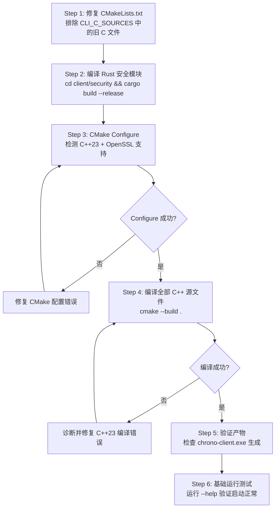

# Phase: C++23 迁移构建验证计划

> **目标**: 使用 GCC 15.2.0 (MinGW-w64) 编译验证整个 C++23 迁移无编译/链接错误
> **前提**: Rust 安全模块需先编译为静态库 (`libchrono_client_security.a`)

---

## 当前构建配置分析

### 源文件结构 (`client/CMakeLists.txt`)

```
CLIENT_CPP_SOURCES  → src/**/*.cpp + devtools/core/*.cpp        ✅ C++17
CLI_CPP_SOURCES     → devtools/cli/**/*.cpp + tools/*.cpp       ✅ C++23 (已迁移)
CLIENT_C_SOURCES    → src/*.c + src/network/*.c                 ⚠️ 遗留 C
CLI_C_SOURCES       → devtools/cli/commands/*.c                 ⚠️ 旧 C 文件 (需排除)
```

### ⚠️ 关键发现: C/C++ 重复编译冲突

[`client/CMakeLists.txt:73-75`](client/CMakeLists.txt#L73) 仍包含 `CLI_C_SOURCES`，会将 `cmd_*.c` 与新的 `cmd_*.cpp` 一起编译，造成**链接期符号冲突**。必须在构建前修复。

---

## 实施步骤



### Step 1: 修复 CMakeLists.txt — 排除旧 C 文件

**问题**: [`client/CMakeLists.txt:L73-L75`](client/CMakeLists.txt#L73) 中 `CLI_C_SOURCES` 将旧 `cmd_*.c` 与新 `cmd_*.cpp` 同时编译，导致重复定义。

**修复方案**: 将 `CLI_C_SOURCES` 的 glob 改为仅包含尚未迁移的 `.c` 文件，或在 C++ 迁移完成后移除该变量。由于所有 24 个命令均已迁移完成，应**移除 `CLI_C_SOURCES` 变量及其在 `CLIENT_SOURCES` 中的引用**。

同时检查 `CLIENT_C_SOURCES` 中是否还有未迁移到 C++ 的 `.c` 文件:
- [`client/src/network/tls_client.c`](client/src/network/tls_client.c) — 通过 [`TlsWrapper.cpp`](client/src/network/TlsWrapper.cpp) C++ 包装调用，保留为 C
- `client/src/main.c` — 已被 [`Main.cpp`](client/src/app/Main.cpp) 替代? 需确认
- `client/src/ipc_bridge.c` — 已被 [`IpcBridge.cpp`](client/src/app/IpcBridge.cpp) 替代?
- `client/src/webview_manager.c` — 已被 [`WebViewManager.cpp`](client/src/app/WebViewManager.cpp) 替代?
- `client/src/local_storage.c` — 已被 [`LocalStorage.cpp`](client/src/storage/LocalStorage.cpp) 替代?
- `client/src/updater.c` — 已被 [`Updater.cpp`](client/src/app/Updater.cpp) 替代?
- `client/src/network.c`, `client/src/net_http.c`, `client/src/net_tcp.c`, `client/src/net_ws.c`, `client/src/net_sha1.c` — 已被 C++ 版本替代?

实际需要确认这些 C 文件是否仍被引用。如果已被 C++ 等价物完全替代，也应从 `CLIENT_C_SOURCES` 中移除，避免重复定义。

### Step 2: 编译 Rust 安全模块

```bash
cd client/security
cargo build --release
```

**预期产物**: `client/security/target/release/libchrono_client_security.a`

**验证**: 检查文件是否存在，以及 `cargo test` 是否通过。

### Step 3: CMake Configure

```bash
cd client
cmake -B build -G "MinGW Makefiles"
```

**验证项**:
| 检查项 | 预期 | 失败处理 |
|--------|------|---------|
| C++23 标准检测 | `CMAKE_CXX_STANDARD 23` → GCC 15.2.0 ✅ | 确认 GCC 版本 ≥ 13 |
| `std::println` 检测 | `HAS_CPP23_PRINT` = TRUE | 回退 printf |
| OpenSSL 检测 | 版本 ≥ 1.1 | 安装 OpenSSL |
| Rust 静态库 | `libchrono_client_security.a` 找到 | 先执行 Step 2 |

### Step 4: 编译全部源文件

```bash
cd client
cmake --build build
```

**需要编译的文件清单**:

| 模块 | 文件列表 | 数量 |
|------|---------|------|
| src/ai/ | AIChatSession, AIConfig, AIProvider, CustomProvider, GeminiProvider, OpenAIProvider | 6 + headers |
| src/app/ | AppContext, ClientHttpServer, IpcBridge, Main, TlsServerContext, Updater, WebViewManager | 7 + headers |
| src/network/ | HttpConnection, NetworkClient, Sha1, TcpConnection, TlsWrapper, WebSocketClient | 6 + headers |
| src/storage/ | LocalStorage, SessionManager | 2 + headers |
| src/security/ | CryptoEngine, TokenManager | 2 + headers |
| src/util/ | Logger, Utils | 2 + headers |
| src/plugin/ | PluginManager, PluginManifest | 2 + headers |
| devtools/core/ | DevToolsEngine, DevToolsHttpApi, DevToolsIpcHandler | 3 + headers |
| devtools/cli/ | main.cpp, net_http.cpp, commands/init_commands.cpp + 24 cmd_*.cpp | 27 |
| tools/ | stress_test.cpp, debug_cli.c | 2 |
| src/ (C) | network.c, net_*.c, ipc_bridge.c, main.c, etc. | 待确认 |

### Step 5: 验证产物

检查 `client/build/chrono-client.exe` 是否存在且可执行。

### Step 6: 基础运行测试

```bash
client/build/chrono-client.exe --help
```

验证程序正确启动、命令行解析正常。

---

## 已知风险

| 风险 | 概率 | 影响 | 缓解措施 |
|------|------|------|---------|
| C/C++ 重复定义导致链接失败 | 高 | 阻断 | Step 1 修复 CMakeLists.txt |
| `std::print`/`std::println` 需要 GCC 13+ `<print>` 头 | 低 | 阻断 | GCC 15.2.0 已支持 |
| `std::jthread`/`std::stop_token` 可在 win32 线程模型工作 | 中 | 运行期 | MinGW-w64 GCC 15 支持 |
| Rust 静态库路径问题 | 中 | 阻断 | 确认 `cargo build --release` 产物路径 |
| OpenSSL 未安装 | 中 | 功能受限 | 安装或设置 `HTTPS_SUPPORT=0` |
| Windows GUI 子系统 `-mwindows` 导致控制台无输出 | 低 | 调试不便 | 临时移除 `/SUBSYSTEM:WINDOWS` 或使用 `--help` 测试 |
