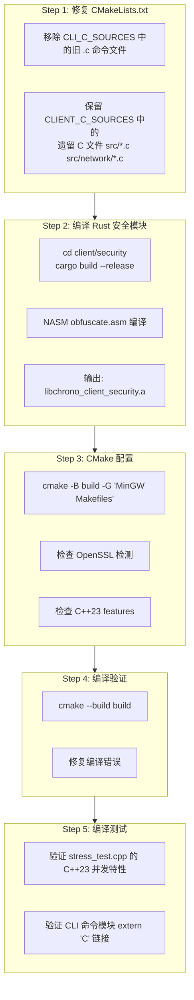

# 构建验证计划 — C++23 迁移后编译确认

> **目标**: 使用 GCC 15.2.0 (MinGW-w64) 验证 C++23 迁移后的完整编译链
> **日期**: 2026-05-03
> **编译器**: GCC 15.2.0 (x86_64-w64-mingw32, thread model: win32)

---

## 构建流程总览



---

## Step 1: 修复 CMakeLists.txt — 清理旧 C 命令源

### 现状问题

[`client/CMakeLists.txt`](client/CMakeLists.txt:L72-L75) 中的 `CLI_C_SOURCES` 仍然会编译所有 `devtools/cli/commands/*.c` 文件：

```cmake
file(GLOB CLI_C_SOURCES
    devtools/cli/commands/*.c   # 包含 cmd_health.c, cmd_ws.c 等 24 个旧文件
)
```

而 `CLI_CPP_SOURCES` 通过 GLOB_RECURSE 已经包含了 `devtools/cli/commands/*.cpp`：
```cmake
file(GLOB_RECURSE CLI_CPP_SOURCES
    devtools/cli/*.cpp          # 递归包含了 commands/ 子目录
    tools/*.cpp
)
```

**后果**: 同时编译 `cmd_health.c` 和 `cmd_health.cpp` → 重复定义 `init_cmd_health()` 符号 → 链接错误。

### 修复方案

删除 `CLI_C_SOURCES` 变量和其 `file(GLOB ...)` 调用，从 `CLIENT_SOURCES` 中移除 `${CLI_C_SOURCES}`。

但需要注意：`main.c` 和 `net_http.c` 也在 `devtools/cli/` 目录下 — 但它们已有对应的 `.cpp` 版本（`main.cpp`, `net_http.cpp`）。确认 `.cpp` 版本已完整覆盖所有功能后，旧 `.c` 可以安全移除。

### 清理清单

| 旧文件 (已转换) | 新文件 | 状态 |
|----------------|--------|------|
| `devtools/cli/main.c` | `devtools/cli/main.cpp` | ✅ .cpp 完整覆盖 |
| `devtools/cli/net_http.c` | `devtools/cli/net_http.cpp` | ✅ .cpp 完整覆盖 |
| `devtools/cli/commands/init_commands.c` | `devtools/cli/commands/init_commands.cpp` | ✅ .cpp 完整覆盖 |
| `devtools/cli/commands/cmd_*.c` (24个) | `devtools/cli/commands/cmd_*.cpp` | ✅ .cpp 完整覆盖 |

**注意**: 暂不物理删除 `.c` 文件，仅从 CMake 编译中排除，保留为备份。验证通过后可后续清理。

---

## Step 2: 编译 Rust 安全模块 (含 NASM ASM)

命令序列:
```bash
cd client/security
cargo build --release
```

| 组件 | 文件 | 说明 |
|------|------|------|
| NASM 汇编 | `asm/obfuscate.asm` | chrono_stream v1 算法核心 |
| Rust FFI 桥接 | `src/asm_bridge.rs` | NASM 函数 Rust 封装 |
| Rust 加密 | `src/crypto.rs` | AES-256-GCM E2E |
| Rust 安全存储 | `src/secure_storage.rs` | 设备密钥管理 |
| 输出 | `target/release/libchrono_client_security.a` | 静态库 |

**预期结果**: `cargo test` 4/4 通过 + `.a` 静态库生成。

---

## Step 3: CMake 配置检测

命令序列:
```bash
cd client
cmake -B build -G "MinGW Makefiles"
```

CMake 配置阶段会执行以下检测:

| 检测项 | CMake 行 | 预期结果 |
|--------|---------|---------|
| C++23 特性: std::println | L96-L104 | ✅ GCC 15 支持 |
| OpenSSL 检测 | L31-L42 | ✅ 或 ⚠️ 警告 |
| Rust 静态库存在性 | L109-L112 | ✅ 需要先完成 Step 2 |
| 编译器版本 ≥ GCC 13 | L15-L17 | ✅ GCC 15.2.0 |

---

## Step 4: 编译项目

命令序列:
```bash
cmake --build build
```

### 预期可能出现的编译问题

| # | 问题 | 可能原因 | 修复方案 |
|---|------|---------|---------|
| 1 | 重复符号 `init_cmd_health` | `.c` + `.cpp` 同时编译 | 移除 CLI_C_SOURCES |
| 2 | `std::println` 未找到 | `<print>` 头文件缺失 | 检查 GCC 版本和 `-std=c++23` |
| 3 | `std::stop_token` 未找到 | 线程模型限制 | MinGW win32 线程模型支持有限制 |
| 4 | `extern "C"` 链接错误 | C/C++ 混编不一致 | 检查 `__cplusplus` 守卫 |
| 5 | OpenSSL 链接错误 | 库路径未找到 | 设置 `CMAKE_PREFIX_PATH` |
| 6 | `ws2_32` 链接错误 | MinGW 环境问题 | 确认 winsock 库可用 |

### 编译目标

| 目标 | 文件 | 行数估算 |
|------|------|---------|
| **CLI C++ 命令** | 24 `cmd_*.cpp` + `init_commands.cpp` | ~3000 |
| **CLI 主入口** | `main.cpp` | ~420 |
| **CLI HTTP 客户端** | `net_http.cpp` | ~425 |
| **客户端 C++ 核心** | `src/**/*.cpp` (network/app/storage/security/ai/plugin/util) | ~8000 |
| **客户端 C 遗留** | `src/*.c` + `src/network/tls_client.c` | ~500 |
| **压力测试** | `tools/stress_test.cpp` | ~784 |
| **DevTools 核心** | `devtools/core/*.cpp` | ~1000 |

---

## Step 5: 编译测试

编译成功后，验证以下关键功能:

### 5.1 stress_test C++23 并发验证

[`client/tools/stress_test.cpp`](client/tools/stress_test.cpp) 使用了:
- `std::jthread` — C++20 自动 join 线程
- `std::stop_token` — C++20 协作式取消
- `std::atomic` — C++11 无锁操作
- `std::chrono` — C++11 时间库
- `std::println` — C++23 格式化输出

验证方式: 确认可正常编译且无链接错误。

### 5.2 CLI 命令模块 extern "C" 验证

确认所有 `extern "C"` 函数在 C++ 编译下正确导出:
- `init_cmd_*()` — 24 个命令初始化函数
- `register_command()` — 命令注册
- `http_request()` — HTTP 客户端接口

---

## 构建环境依赖确认

| 依赖 | 版本 | 安装检查 |
|------|------|---------|
| GCC/MinGW | 15.2.0 (已确认) | `g++ --version` |
| CMake | ≥ 3.20 | `cmake --version` |
| NASM | ≥ 2.15 | `nasm --version` |
| Rust/Cargo | ≥ 1.70 | `cargo --version` |
| OpenSSL | ≥ 1.1 | 已安装在系统中 |
| MinGW Make | — | `mingw32-make --version` |

---

## 成功标准

1. ✅ `cargo build --release` — Rust 安全模块编译成功
2. ✅ `cargo test` — 4 个 ASM 单元测试通过
3. ✅ CMake 配置成功 — GCC 15.2.0 + C++23 + OpenSSL 正确识别
4. ✅ `cmake --build build` — 无错误（允许 warnings）
5. ✅ `stress_test.cpp` 中的 `std::jthread`/`std::stop_token`/`std::println` 正确编译

---

## 回退方案

如果编译出现阻塞性问题:

| 问题 | 回退措施 |
|------|---------|
| C++23 特性编译失败 | 在 CMakeLists.txt 中添加 `#ifdef` 回退宏 |
| OpenSSL 未找到 | `HTTPS_SUPPORT=0` 模式继续 |
| Rust ASM 链接问题 | 注释掉 RUST_SECURITY_LIB 链接 |
