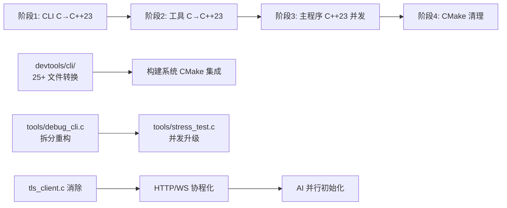

# Chrono-shift C→C++23 迁移与并发升级计划

## 一、现状分析

### 1.1 当前编译标准
- **C++ 标准**: C++17（`client/CMakeLists.txt:7`）
- **C 标准**: C99（根 `CMakeLists.txt:4-5`）
- **编译器**: GCC/MinGW（默认），兼容 MSVC

### 1.2 当前并发能力（极度薄弱）
| 特性 | 使用情况 |
|------|---------|
| `std::mutex` + `std::lock_guard` | 仅在 `Logger.cpp:42-80` 的 5 处使用 |
| `std::thread` | 仅在 `ClientHttpServer.cpp:147` 的 1 处使用（HTTP server loop） |
| `std::atomic` | **未使用** |
| `std::async`/`std::future` | **未使用** |
| `std::jthread`/协程 | **未使用** |

### 1.3 仍需 C→C++ 转换的 C 代码清单

#### 第一梯队：devtools/cli/（25+ 文件，~5000 行）
```
client/devtools/cli/main.c                    (371 行) - REPL 主入口
client/devtools/cli/net_http.c                HTTP 请求工具函数
client/devtools/cli/devtools_cli.h            (115 行) - 公共头文件
client/devtools/cli/commands/init_commands.c  (96 行) - 命令注册
client/devtools/cli/commands/cmd_health.c
client/devtools/cli/commands/cmd_endpoint.c
client/devtools/cli/commands/cmd_token.c
client/devtools/cli/commands/cmd_user.c
client/devtools/cli/commands/cmd_ipc.c
client/devtools/cli/commands/cmd_ws.c
client/devtools/cli/commands/cmd_msg.c
client/devtools/cli/commands/cmd_friend.c
client/devtools/cli/commands/cmd_db.c
client/devtools/cli/commands/cmd_session.c
client/devtools/cli/commands/cmd_config.c
client/devtools/cli/commands/cmd_storage.c
client/devtools/cli/commands/cmd_ping.c
client/devtools/cli/commands/cmd_watch.c
client/devtools/cli/commands/cmd_rate_test.c
client/devtools/cli/commands/cmd_json.c
client/devtools/cli/commands/cmd_tls.c
client/devtools/cli/commands/cmd_trace.c
client/devtools/cli/commands/cmd_connect.c
client/devtools/cli/commands/cmd_disconnect.c
client/devtools/cli/commands/cmd_crypto.c
client/devtools/cli/commands/cmd_network.c
client/devtools/cli/commands/cmd_gen_cert.c
client/devtools/cli/commands/cmd_obfuscate.c
```

#### 第二梯队：tools/ 独立工具（2 个文件，~3869 行）
```
client/tools/debug_cli.c    (3093 行) - 旧版单体调试 CLI
client/tools/stress_test.c  (776 行)  - 压力测试工具
```

#### 第三梯队：主程序残余 C 代码（1 个文件）
```
client/src/network/tls_client.c - OpenSSL TLS 底层 C 封装
  注：已经被 C++ TlsWrapper.cpp 包装使用，可作为 C 链接保留或内联重写
```

## 二、目标架构

### 2.1 最终目标
```
C99 → C++23 全体升级
├── devtools/cli/   → devtools/cli/   (C++23, 面向对象的命令系统)
├── tools/          → tools/          (C++23, 模块化工具)
├── src/network/    → 纯 C++23         (消除 tls_client.c 依赖)
└── 整个 client/    → CMAKE_CXX_STANDARD 23
```

### 2.2 C++23 关键并发特性应用映射

| C++23/20 特性 | 本项目应用场景 |
|---------------|-------------|
| `std::jthread` + `std::stop_token` | 替代 `std::thread` 手动管理，用于 HTTP server、WebSocket 连接的生命周期管理 |
| `std::latch` (C++20) | 并行初始化多个 AI 提供商的连接池，等待所有就绪后开始服务 |
| `std::barrier` (C++20) | 压力测试工具中多阶段并发请求的同步点 |
| `std::counting_semaphore` (C++20) | 限制并发 WebSocket 连接数 / HTTP 请求池大小 |
| `std::execution::parallel_policy` (C++17) | 并行处理消息队列、批量数据库查询 |
| 协程 `co_await` / `co_yield` / `std::generator` (C++23) | 异步 HTTP 请求链、IPC 消息流处理、WebSocket 事件流 |
| `std::expected` (C++23) | 替代异常/错误码的混合错误处理，适合 CLI 工具的错误传播 |
| `std::println` (C++23) | 替代 `printf`/`std::cout`，类型安全的格式化输出，CLI 输出更简洁 |
| `std::flat_map` / `std::flat_set` (C++23) | 缓存命令注册表，替代 `CommandEntry[]` 数组 |
| `std::move_only_function` (C++23) | 命令处理器的移动语义注册，比函数指针更灵活 |
| `std::out_ptr` / `std::inout_ptr` (C++23) | 简化 OpenSSL C 指针的 RAII 包装，消除 `tls_client.c` |

## 三、分阶段迁移计划

### 阶段 1：CLI 调试工具 C→C++23 改造

**目标**: 将 `client/devtools/cli/` 全部 25+ 个 C 文件转换为 C++23

**核心改动**:

```
devtools_cli.h  → 重构为命名空间 + 类
├── namespace cli { 封装全局范围
├── class Command { 替代 CommandEntry 结构体
│   ├── std::string_view name, description, usage;
│   ├── std::move_only_function<...> handler;
│   └── auto operator<=> 等 C++20 三路比较
├── class CommandRegistry { 替代全局数组
│   ├── std::flat_map<std::string, Command> commands_;
│   └── 自动排序、快速查找
├── struct Config { 替代 DevToolsConfig 结构体
│   ├── std::string host, token, storage_path;
│   └── RAII 构造/析构
└── namespace util { 工具函数

main.c → main.cpp
├── REPL 循环使用 std::print / std::println
├── 输入处理使用 std::string_view
└── 错误处理使用 std::expected

每个 cmd_*.c → cmd_*.cpp
├── 独立的 register() 函数
├── 使用 C++ 标准库替换 POSIX socket 封装
└── 参数解析使用 std::span<char*>
```

**头文件依赖消除**:
- `devtools_cli.h` 中的 `#ifdef _WIN32` 条件包含 → 统一使用 C++ `<network>` / ASIO 或原生 socket RAII
- OpenSSL 指针 (`void* ws_ssl`) → `std::unique_ptr<SSL, decltype(&SSL_free)>`

**构建系统调整**:
- `client/devtools/cli/Makefile` → 切换到 CMake 集成
- 编译器 `gcc` → `g++`，`-std=c99` → `-std=c++23`

---

### 阶段 2：独立工具 C→C++23 改造

**目标**: 将 `client/tools/debug_cli.c` 和 `stress_test.c` 迁移为 C++23 模块化工具

**`debug_cli.c` (3093 行) 拆分方案**:
```
tools/debug_cli.cpp
├── 只保留 main() 和 REPL 框架（~150 行）
├── 将 30+ 功能函数按领域拆分为模块：
│   ├── tools/net/       - HTTP/WS 网络操作
│   ├── tools/crypto/    - 加密测试
│   ├── tools/db/        - 数据库操作
│   ├── tools/session/   - 会话管理
│   └── tools/perf/      - 性能测试
└── 与 devtools/cli/ 共享命令注册架构
```

**并发应用 - 压力测试升级**:
- `stress_test.c` 中的手动线程管理 → `std::jthread` + `std::barrier` 实现多阶段并发请求
- 结果聚合使用 `std::atomic` 计数器
- 使用 `std::counting_semaphore` 控制并发数

---

### 阶段 3：主程序 C→C++23 + 并发升级

**目标**:
1. 消除 `client/src/network/tls_client.c`，将 TLS 逻辑完全内联到 `TlsWrapper.cpp`
2. 升级 `client/CMakeLists.txt` 中 `CMAKE_CXX_STANDARD 17` → `23`
3. 应用 C++23 并发特性到主程序

**tls_client.c 消除方案**:
- 使用 `std::inout_ptr` 管理 `SSL_CTX*` / `SSL*` 的创建和释放
- 将 C 风格的 `tls_connect()` / `tls_read()` → `TlsConnection::connect()` / `read()` 成员函数
- RAII 包装完全消除手动 `SSL_free()` 和 `SSL_CTX_free()` 调用

**主程序并发增强**:

```
ClientHttpServer (当前: 1 个 std::thread)
├── → std::jthread + std::stop_token
├── → 连接池使用 std::counting_semaphore
└── → 请求处理使用 std::execution::parallel_policy

WebSocketClient (当前: 阻塞 I/O)
├── → 使用 C++23 协程实现异步读写
├── → co_await 等待消息到达
└── → std::generator 产生消息流

AI 多提供商 (当前: 串行初始化)
├── → std::latch 并行初始化所有 Provider
├── → std::barrier 同步请求结果
└── → std::future 并发 API 调用

Logger (当前: std::mutex)
├── → std::atomic<LogLevel> 无锁级别读取
├── → std::jthread 后台异步写入
└── → 协程异步日志流
```

---

### 阶段 4：根 CMakeLists.txt 清理

```
CMakeLists.txt 当前: LANGUAGES C
├── → LANGUAGES CXX (移除 C，因为所有代码都已 C++23)
├── 移除 set(CMAKE_C_STANDARD 99)
├── set(CMAKE_CXX_STANDARD 23)
└── set(CMAKE_CXX_STANDARD_REQUIRED ON)

client/CMakeLists.txt 当前: LANGUAGES C CXX
├── → LANGUAGES CXX
├── 移除 C 源文件 glob (CLIENT_C_SOURCES)
├── CMAKE_CXX_STANDARD 17 → 23
└── 添加 devtools/cli/ 到源文件列表
```

## 四、分阶段执行时间线



## 五、技术风险与注意事项

### 5.1 编译器支持
- **GCC**: GCC 13+ 已完整支持 C++23，MinGW-w64 需要更新到 GCC 13+
- **MSVC**: VS 2022 17.6+ 支持 C++23
- **Clang**: Clang 17+ 支持 C++23
- **建议**: 在 `CMakeLists.txt` 中做编译器版本检测，提供降级选项

### 5.2 第三方库兼容性
- **OpenSSL**: C 链接库，通过 `std::inout_ptr` 桥接，无需修改
- **WebView2**: COM 接口，C++/WinRT 包装，C++23 兼容
- **Rust FFI** (`client/security/`): extern "C" 链接，不受影响

### 5.3 协程注意事项
- C++23 协程需要 `<coroutine>` 头文件和编译器特定支持
- `std::generator` 是 C++23 正式特性，需要 GCC 14+ / Clang 18+
- 协程的 stackful vs stackless 选择：推荐 stackless（C++23 标准）

### 5.4 向后兼容
- 保留旧的 Makefile 作为 fallback 构建方式
- 所有迁移需通过现有测试套件验证
- 保持 Rust 安全模块的 FFI 接口不变

## 六、文件清单总结

| 阶段 | 文件 | 当前 | 目标 |
|------|------|------|------|
| 1 | `client/devtools/cli/main.c` | C99 | C++23 |
| 1 | `client/devtools/cli/net_http.c` | C99 | C++23 |
| 1 | `client/devtools/cli/devtools_cli.h` | C99 | C++23 header |
| 1 | `client/devtools/cli/commands/init_commands.c` | C99 | C++23 |
| 1 | `client/devtools/cli/commands/cmd_*.c` (25 files) | C99 | C++23 |
| 1 | `client/devtools/cli/Makefile` | Makefile | CMake |
| 2 | `client/tools/debug_cli.c` | C99 | C++23 多模块 |
| 2 | `client/tools/stress_test.c` | C99 | C++23 并发版 |
| 2 | `client/tools/Makefile` | Makefile | CMake |
| 3 | `client/src/network/tls_client.c` | C99 | 消除（内联到 C++） |
| 3 | `client/src/network/TlsWrapper.cpp` | C++17 | C++23 |
| 3 | `client/src/app/ClientHttpServer.cpp` | C++17 | C++23 并发 |
| 3 | `client/src/network/WebSocketClient.cpp` | C++17 | C++23 协程 |
| 3 | `client/src/ai/*.cpp` (9 files) | C++17 | C++23 并行 |
| 3 | `client/src/util/Logger.cpp` | C++17 | C++23 异步 |
| 4 | `CMakeLists.txt` | LANGUAGES C | LANGUAGES CXX |
| 4 | `client/CMakeLists.txt` | C++17 + C99 | C++23 only |
