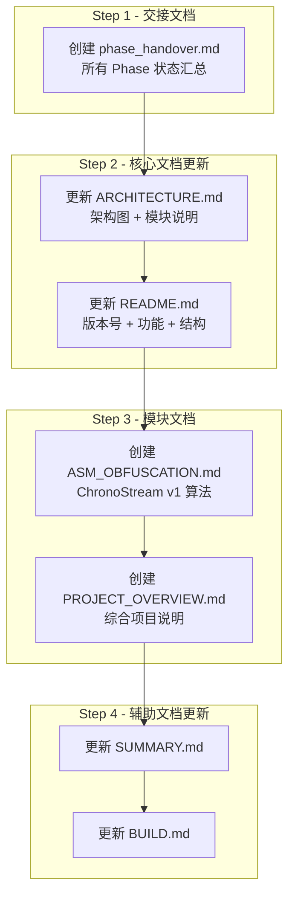
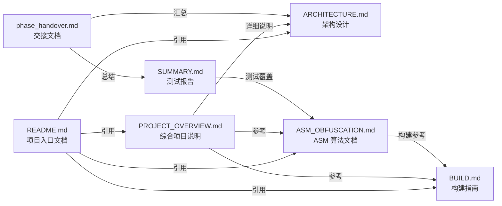

# Chrono-shift 文档整理与综合更新计划

> **目标**: 全面整理项目文档体系，更新所有 MD 文档以反映最新架构状态，创建 ASM 混淆模块新文档，生成综合项目说明
> **版本**: v1.0 | **日期**: 2026-05-03

---

## 一、当前项目全景总览

### 项目定位
**Chrono-shift (墨竹)** — 跨平台 QQ 风格即时通讯桌面客户端，支持 AI 集成、私有加密、插件扩展。

### 技术栈
| 层级 | 语言/技术 | 说明 |
|------|----------|------|
| 客户端外壳 | C++17 | WebView2 集成、IPC 桥接、网络通信、安全引擎 |
| 安全模块 | Rust + NASM | AES-256-GCM E2E 加密、安全存储、会话管理、ChronoStream v1 ASM 混淆 |
| 前端 UI | HTML5 + CSS3 + JS | QQ 风格 Web 界面（纯白背景、蓝色主色、绿色气泡） |
| CLI 工具 | C99 | debug_cli 调试接口、stress_test 压力测试 |
| 构建系统 | CMake + Cargo + Makefile + NSIS | 多语言混合编译、安装包制作 |

### 全部 Phase 完成状态

| Phase | 名称 | 内容 | 状态 |
|-------|------|------|------|
| 1 | 项目骨架 | 目录结构、Rust FFI、C 基础框架、HTML 结构 | ✅ 完成 |
| 2 | 核心通信层 | HTTP/WebSocket 服务器、客户端网络层、协议定义 | ✅ 完成 |
| 3 | 用户系统 | 注册/登录、JWT 认证、个人信息、好友系统 | ✅ 完成 |
| 4 | 消息系统 | 一对一通讯、消息存储、在线状态 | ✅ 完成 |
| 5 | 主题/模板系统 | 纯白默认主题、CSS 变量引擎、模板 CRUD | ✅ 完成 |
| 6 | UI QQ 风格重构 | QQ 风格 CSS、CLI 调试增强、安全测试自动化 | ✅ 完成 |
| 7 | 安全加固 | CSRF/SSRF 防护、文件类型校验、路径遍历防护 | ✅ 完成 |
| 8 | 安装包与发布 | NSIS 安装脚本、HTTPS 迁移、文档完善 | ✅ 完成 |
| 9 | C++ 重构 + OAuth | 客户端 C++ 重构、OAuth 登录、邮箱验证 | ✅ 完成 |
| 9-1b | 客户端 C++ 重构 | C 到 C++ 迁移、模块化重构 | ✅ 完成 |
| 9-2 | OAuth 登录 | QQ/微信/OAuth/邮箱注册登录 | ✅ 完成 |
| 10 | Rust+ASM 混淆 | ChronoStream v1 私有加密、NASM 汇编核心 | ✅ 完成 |
| 11 | AI 多提供商 | OpenAI/DeepSeek/xAI/Ollama/Gemini 6 提供商 | ✅ 完成 |
| 12 | 综合扩展规划 | 插件系统、QQ 社交功能、开发者工具（计划阶段） | 📋 规划中 |
| D | 开发者工具 | DevTools 面板、CSS/JS 实时调试 | ✅ 完成 |
| - | 服务端移除 | `server/` 目录移除，项目聚焦客户端 | ✅ 完成 |
| - | HTTPS 迁移 | 自签名证书、TLS 1.3 强制 | ✅ 完成 |

### 目录结构现状

```
Chrono-shift/
├── client/                           # 桌面客户端
│   ├── include/                      # C 头文件 (8 个)
│   ├── src/
│   │   ├── network/                  # 网络通信 (8 个文件)
│   │   ├── security/                 # 安全引擎 (4 个文件)
│   │   ├── storage/                  # 本地存储 (4 个文件)
│   │   ├── app/                      # 应用外壳 (12 个文件)
│   │   ├── util/                     # 工具 (4 个文件)
│   │   ├── ai/                       # AI 集成 (12 个文件)
│   │   └── plugin/                   # 插件系统 (8 个文件)
│   ├── security/                     # Rust 安全模块
│   │   ├── asm/                      # NASM 汇编 (obfuscate.asm + .lst)
│   │   ├── src/                      # Rust 源码 (6 个文件)
│   │   └── include/                  # C 头文件
│   ├── devtools/                     # 开发者工具
│   │   ├── cli/                      # CLI 命令 (30+ 个命令文件)
│   │   ├── core/                     # 核心组件 (4 个文件)
│   │   └── ui/                       # UI (JS + CSS)
│   ├── tools/                        # CLI 工具 (2 个)
│   ├── ui/                           # 前端 UI
│   │   ├── css/                      # 样式表 (8 个文件 + themes)
│   │   ├── js/                       # JavaScript (18 个文件)
│   │   └── assets/                   # 资源文件
│   └── plugins/                      # 插件示例
├── tests/                            # 测试脚本 (4 个)
├── installer/                        # NSIS 安装脚本 (2 个)
├── docs/                             # 文档 (6 个文件)
├── plans/                            # 规划文档 (20+ 个文件)
├── reports/                          # 测试报告 (2 个文件)
└── 根 Makefile + CMakeLists.txt
```

---

## 二、需要创建的文档清单

### 2.1 新交接文档

**文件**: [`plans/phase_handover.md`](plans/phase_handover.md)
**内容**: 汇总所有已完成 Phase 的最终状态、未完成项、已知问题、待办事项。作为新开发者/贡献者的入门参考。

### 2.2 新模块文档

**文件**: [`docs/ASM_OBFUSCATION.md`](docs/ASM_OBFUSCATION.md)
**内容**: ChronoStream v1 算法完整说明 — 设计原理、算法流程、函数接口、构建集成、调试方法。

### 2.3 综合项目说明

**文件**: [`docs/PROJECT_OVERVIEW.md`](docs/PROJECT_OVERVIEW.md)
**内容**: 从头开始的完整项目说明 — 定位、架构、模块、使用方式、开发指南。

---

## 三、需要更新的文档清单

### 3.1 README.md — 大版本更新

**当前问题**: 
- 版本标记为 v0.3.0，实际已远超此版本
- 架构图中缺少 AI 集成层、NASM 汇编层、插件系统、DevTools
- 项目结构中缺少 `security/asm/`、`devtools/`、`plugin/`、`ai/`
- API 文档指向的服务端接口已不相关

**更新内容**:
| 章节 | 变更 |
|------|------|
| 项目概述 | 更新版本号 v2.0.0，添加 AI/ASM/插件/DevTools 概述 |
| 技术架构 | 重新绘制架构图，添加所有新层级 |
| 功能特性 | 添加 ASM 混淆、AI 集成、插件系统、DevTools |
| 项目结构 | 完整反映当前目录结构 |
| CLI 调试 | 添加 obfuscate 命令 |
| 安全特性 | 添加 ChronoStream v1 ASM 加密 |
| 测试 | 添加 ASM 测试脚本 |
| 快速开始 | 更新构建步骤（含 NASM 依赖） |

### 3.2 ARCHITECTURE.md — 架构更新

**当前问题**:
- 版本 v0.2.0，严重滞后
- 仍包含 `server/` 目录结构（已移除）
- 缺少 AI Provider 架构
- 缺少 DevTools 架构
- 缺少 ASM 混淆模块架构
- 缺少插件系统架构

**更新内容**:
| 章节 | 变更 |
|------|------|
| 版本号 | v0.2.0 → v2.0.0 |
| 技术栈 | 添加 NASM、C++17 详情 |
| 整体架构图 | 更新为无 server 版，添加 AI/ASM/Plugin/DevTools |
| 目录结构 | 移除 server/，更新为当前结构 |
| 核心模块 | 添加 AI Provider、NASM 混淆、DevTools、Plugin 小节 |
| 开发阶段 | 更新完整 Phase 列表（1-12 已完） |

### 3.3 SUMMARY.md — 测试报告更新

**当前问题**:
- 仍包含 server 端测试结果（已不相关）
- 缺少 ASM 混淆测试结果
- 缺少 AI 集成测试
- 缺少 DevTools 测试
- 文件变更清单需要更新

### 3.4 BUILD.md — 构建说明更新

**当前问题**:
- 缺少 NASM 依赖说明
- 缺少 Rust `client/security` 构建细节（含 ASM 编译）
- 缺少 DevTools CLI 的构建说明
- 命令列表需要更新

---

## 四、文件创建/修改清单

### 创建新文件

| # | 文件 | 内容概要 | 估计行数 |
|---|------|---------|---------|
| N1 | [`plans/phase_handover.md`](plans/phase_handover.md) | 项目交接文档 — 已完成/未完成/已知问题 | ~500 |
| N2 | [`docs/ASM_OBFUSCATION.md`](docs/ASM_OBFUSCATION.md) | ChronoStream v1 算法文档 | ~400 |
| N3 | [`docs/PROJECT_OVERVIEW.md`](docs/PROJECT_OVERVIEW.md) | 综合项目说明 | ~600 |

### 更新现有文件

| # | 文件 | 主要变更 | 变更量 |
|---|------|---------|-------|
| M1 | [`README.md`](README.md) | 大版本重写 — 架构图、功能、结构、构建 | ~300 行变更 |
| M2 | [`plans/ARCHITECTURE.md`](plans/ARCHITECTURE.md) | 架构图更新、移除 server、添加新模块 | ~200 行变更 |
| M3 | [`reports/SUMMARY.md`](reports/SUMMARY.md) | 更新测试结果、移除 server 端 | ~150 行变更 |
| M4 | [`docs/BUILD.md`](docs/BUILD.md) | 添加 NASM/Rust 构建详情、DevTools 构建 | ~100 行变更 |

---

## 五、实施步骤



### 详细步骤

#### Step 1: 创建交接文档 [`plans/phase_handover.md`](plans/phase_handover.md)

内容结构:
1. 项目概览 — 一句话定位、技术栈快照
2. 全部 Phase 完成状态表 — 1-12 + D + 特殊计划
3. 各模块详细说明表 — 路径、语言、功能、行数估算、负责人
4. 已知问题清单 — S1-S11 安全漏洞 + 空实现桩
5. 遗留待办事项 — LocalStorage 实现、WebView2 实现等
6. 构建说明精简版 — NASM + Rust + C++ 编译步骤
7. 测试运行指南 — 单元测试、集成测试、压力测试
8. 关键文件索引 — 项目关键文件列表

#### Step 2: 更新架构文档 [`plans/ARCHITECTURE.md`](plans/ARCHITECTURE.md)

重点变更:
- 版本号: v0.2.0 → v2.0.0
- 移除所有 `server/` 相关内容
- 添加 AI Provider 架构图 (6 提供商)
- 添加 NASM ASM 模块架构图 (ChronoStream v1)
- 添加 DevTools 架构图
- 添加 Plugin 系统架构图
- 更新目录结构为当前实际结构
- 更新开发阶段表 (Phase 1-12 全部 ✅)

#### Step 3: 更新主 README

重点变更:
- 版本号: v0.3.0 → v2.0.0
- 完全重写架构图，反映当前所有模块
- 添加 ASM 混淆功能特性
- 添加 AI 多提供商表格
- 添加 DevTools CLI 命令表 (含 obfuscate)
- 添加插件系统概述
- 更新项目结构树为当前结构
- 更新构建步骤添加 NASM 依赖

#### Step 4: 创建 ASM 算法文档 [`docs/ASM_OBFUSCATION.md`](docs/ASM_OBFUSCATION.md)

内容结构:
1. ChronoStream v1 算法概述 — 设计目标、密码学特性
2. 算法详细流程:
   - ksa_init: 密钥调度初始化 (identity init + 3-pass Fisher-Yates)
   - gen_keystream: 密钥流生成 (cascade 状态更新 + sbox swap)
   - asm_obfuscate: XOR 加密主循环
3. 函数接口规范 — asm_obfuscate/asm_deobfuscate 签名
4. Win64 调用约定说明 — 寄存器使用、压栈约定
5. 构建集成 — NASM → COFF → Rust 静态库 → C++ 可执行文件
6. 调试记录 — 3 个 ASM bug 修复过程（二进制搜索法）
7. 测试方法 — cargo test 4 个单元测试
8. 安全注意事项 — 抗分析特性、已知局限性

#### Step 5: 创建综合项目说明 [`docs/PROJECT_OVERVIEW.md`](docs/PROJECT_OVERVIEW.md)

内容结构:
1. 项目介绍 — 定位、目标用户、核心特性
2. 快速入门 — 环境准备、构建、运行
3. 架构全景 — 从 C++ 外壳到 Web UI 的完整调用链
4. 模块详解:
   - 网络层 (TCP/TLS/HTTP/WS)
   - 安全层 (Rust FFI + NASM ASM)
   - 应用层 (IPC/WebView/HTTP Server)
   - AI 层 (6 提供商)
   - 插件层
   - 开发者工具层
   - 前端 UI 层
5. 数据流:
   - 消息发送流程
   - 加密/解密流程
   - AI 聊天流程
6. 开发指南:
   - 添加新 AI Provider
   - 创建新插件
   - 添加新 CLI 命令
   - 修改前端 UI
7. 测试指南
8. 部署与发布

#### Step 6: 更新测试报告 [`reports/SUMMARY.md`](reports/SUMMARY.md)

重点变更:
- 移除 server 端编译验证表
- 添加 ASM 混淆测试结果 (4/4 通过)
- 添加 AI 集成测试结果
- 更新文件变更清单
- 更新编译验证表为客户端模块

#### Step 7: 更新构建说明 [`docs/BUILD.md`](docs/BUILD.md)

重点变更:
- 添加 NASM 依赖安装说明
- 更新 Rust 构建说明 (含 ASM)
- 添加 DevTools CLI 构建步骤
- 更新 CLI 命令列表 (含 obfuscate)
- 添加常见问题 (NASM 相关问题)

---

## 六、文档之间的交叉引用关系



---

## 七、文件内容模板

### 7.1 phase_handover.md 核心内容模板

```markdown
# Chrono-shift 项目交接文档

> **版本**: v2.0.0 | **日期**: 2026-05-03
> **项目**: Chrono-shift (墨竹) — QQ 风格社交平台桌面客户端

## 项目概览

- **客户端语言**: C++17 + Rust + NASM + JavaScript
- **构建工具**: CMake + Cargo + Makefile + NSIS
- **目标平台**: Windows x64 (WebView2) / Linux (WebKitGTK)
- **主要功能**: 即时通讯、E2E 加密、ASM 私有混淆、AI 聊天、插件系统

## 已完成 Phase

| Phase | 名称 | 关键交付 | 完成日期 |
|-------|------|---------|---------|
| 1-8 | 基础框架 | ... | ... |
| 9 | C++ OAuth 重构 | ... | ... |
| 10 | Rust+ASM 混淆 | ChronoStream v1 | 2026-05-03 |
| 11 | AI 多提供商 | 6 家 AI 提供商 | ... |
| D | 开发者工具 | DevTools CLI+UI | ... |

## 未完成/已知问题

| ID | 严重程度 | 描述 | 位置 |
|----|---------|------|------|
| S1 | 严重 | CSP unsafe-inline | ... |
...

## 关键文件索引
...
```

### 7.2 ASM_OBFUSCATION.md 核心内容模板

```markdown
# ChronoStream v1 — ASM 私有加密算法文档

> **算法**: 自研对称流密码
> **实现**: NASM x64 (win64 COFF)
> **密钥**: 512 位 (64 字节)
> **集成**: Rust FFI → C++ CryptoEngine

## 算法流程

### 1. ksa_init — 密钥调度初始化

1. Identity init: sbox[0..255] = 0..255
2. State init: state[0..7] = 0..7
3. 3-pass Fisher-Yates shuffle (64 字节密钥 3 路混合)

### 2. gen_keystream — 密钥流生成

1. state[0]++
2. 8 级级联状态更新
3. sbox[state[0]] ↔ sbox[sum(state) & 0xFF]
4. return sbox[(sbox[state[0]] + sbox[s]) & 0xFF]

### 3. asm_obfuscate — 加密主循环

每字节: keystream XOR data[i]

## 调试记录
...
```

---

## 八、审批问题

请在审查计划后回答以下问题：

1. **文档语言**: 所有文档用中文还是英文？（当前项目文档为中文）
2. **README 版本号**: 是否存在需确认的版本号策略？
3. **内容深度**: ASM 文档需要包含完整的反汇编/指令级说明，还是仅算法逻辑层面？
4. **PROJECT_OVERVIEW**: 是否需要包含图片/截图说明？
5. **server/ 遗留**: 是否需要保留 `server/` 相关的 API 文档（API.md, PROTOCOL.md）或一并更新？
