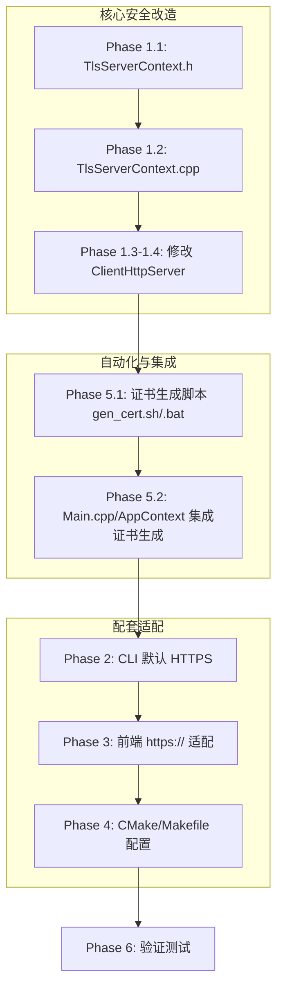

# 客户端全链路 HTTPS 安全迁移计划

## 背景

```
┌─────────────────────────────────────────────────────────────────┐
│                    Chrono-shift 客户端架构                        │
│                                                                  │
│  ┌──────────┐     IPC (WebView2)     ┌────────────────────┐     │
│  │ WebUI    │ ◄───────────────────── │  C++ 后端           │     │
│  │ (JS)     │     postMessage         │  (AppContext,       │     │
│  │          │     (已加密/隔离)        │   ClientHttpServer, │     │
│  │          │                        │   NetworkClient)    │     │
│  │          │     HTTP → HTTPS        │                     │     │
│  │          │ ◄───────────────────── │  port 9010          │     │
│  │          │     (DevTools API)      │  (本地 Web 服务)     │     │
│  └──────────┘                        └────────┬────────────┘     │
│                                               │                   │
│                                        ┌──────▼──────┐           │
│                                        │ DevTools CLI │           │
│                                        │ (C 命令行)    │           │
│                                        │ HTTP → HTTPS │           │
│                                        └─────────────┘           │
└─────────────────────────────────────────────────────────────────┘
```

## 当前安全审计结果

| 组件 | 当前协议 | 风险 | 目标 |
|------|---------|------|------|
| ClientHttpServer (port 9010) | HTTP 明文 | 本地进程可嗅探 API 请求/响应 | HTTPS |
| devtools.js → localhost:9010 | HTTP 明文 | 调试数据明文传输 | HTTPS |
| CLI 工具出站连接 | HTTP (默认) | 远程 API 调用被中间人攻击 | HTTPS |
| IPC (WebView2 postMessage) | 进程隔离 | ✅ 安全 (无需改动) | — |
| 前端 api.js → 远程 API | HTTPS ✅ | 已在 `api.js:11` 配置 | — |

## 架构决策

### 证书策略

```
┌──────────────────────────────────────────────┐
│          自签名证书 (开发/单机适用)               │
│                                                │
│  1. 首次启动时自动生成 (OpenSSL CLI)             │
│  2. 生成路径: client/certs/                    │
│  3. 文件:                                     │
│     - server.crt  (自签名证书)                  │
│     - server.key  (私钥, 权限 600)              │
│  4. 有效期: 3650 天 (10年)                     │
│  5. 仅在 127.0.0.1 使用                        │
└──────────────────────────────────────────────┘
```

**为什么选择自签名：**
- 服务仅在 `127.0.0.1` 监听，不对外暴露
- 自签名证书足够防止本地流量嗅探
- 无需 CA 签发，零成本
- 开发者工具场景下用户可手动信任

### 技术选型

```
服务端 TLS (ClientHttpServer)     客户端 TLS (CLI/NetworkClient)
┌─────────────────────┐          ┌─────────────────────┐
│ OpenSSL SSL_CTX     │          │ tls_client.c        │
│ (server mode)        │          │ (client mode)       │
│                      │          │                     │
│ SSL_accept()         │          │ SSL_connect()       │
│ SSL_read()/write()   │          │ SSL_read()/write()  │
└─────────────────────┘          └─────────────────────┘
         ▲                                ▲
         │                                │
         └────────── OpenSSL ─────────────┘
```

---

## Phase 1: ClientHttpServer TLS 支持

### 1.1 创建服务端 TLS 封装头文件

**文件**: `client/src/app/TlsServerContext.h`

```cpp
#ifndef CHRONO_CLIENT_TLS_SERVER_CONTEXT_H
#define CHRONO_CLIENT_TLS_SERVER_CONTEXT_H

#include <string>
#include <memory>

struct ssl_st;     // SSL*
struct ssl_ctx_st; // SSL_CTX*

namespace chrono {
namespace client {
namespace app {

/**
 * 服务端 TLS 上下文 RAII 封装
 *
 * 用于 ClientHttpServer 的 HTTPS 加密
 * 加载自签名证书，对每个客户端连接执行 SSL_accept
 */
class TlsServerContext {
public:
    /**
     * 初始化服务端 TLS 上下文
     * @param cert_file 证书文件路径 (PEM)
     * @param key_file  私钥文件路径 (PEM)
     */
    TlsServerContext(const std::string& cert_file,
                     const std::string& key_file);
    ~TlsServerContext();

    // 禁止拷贝
    TlsServerContext(const TlsServerContext&) = delete;
    TlsServerContext& operator=(const TlsServerContext&) = delete;

    // 允许移动
    TlsServerContext(TlsServerContext&& other) noexcept;
    TlsServerContext& operator=(TlsServerContext&& other) noexcept;

    /** 是否初始化成功 */
    bool is_valid() const { return ctx_ != nullptr; }

    /**
     * 在已接受的 socket 上执行 TLS 握手
     * @param fd 已 accept 的 socket
     * @return SSL 对象指针 (需通过 tls_close 释放)
     */
    struct ssl_st* accept(int fd);

    /**
     * 获取最后错误描述
     */
    const char* last_error() const;

private:
    struct ssl_ctx_st* ctx_;
    std::string last_error_;
};

} // namespace app
} // namespace client
} // namespace chrono

#endif
```

### 1.2 实现服务端 TLS

**文件**: `client/src/app/TlsServerContext.cpp`

```cpp
/**
 * 服务端 TLS 上下文实现
 *
 * 基于 OpenSSL，为 ClientHttpServer 提供 HTTPS 能力
 *
 * 依赖:
 *   client/certs/server.crt — 自签名证书
 *   client/certs/server.key — 私钥
 */

#include "TlsServerContext.h"

#include <openssl/ssl.h>
#include <openssl/err.h>
#include <openssl/crypto.h>

#include <cstring>

namespace chrono {
namespace client {
namespace app {

// === 静态初始化：OpenSSL 全局初始化 ===
namespace {
    bool g_openssl_inited = false;
    void ensure_openssl_init() {
        if (!g_openssl_inited) {
            SSL_load_error_strings();
            OpenSSL_add_ssl_algorithms();
            g_openssl_inited = true;
        }
    }
}

TlsServerContext::TlsServerContext(const std::string& cert_file,
                                   const std::string& key_file)
    : ctx_(nullptr)
{
    ensure_openssl_init();

    // 创建服务端 SSL_CTX (TLS 1.2+)
    ctx_ = SSL_CTX_new(TLS_server_method());
    if (!ctx_) {
        last_error_ = "SSL_CTX_new failed";
        return;
    }

    // 仅允许 TLS 1.2+
    SSL_CTX_set_min_proto_version(ctx_, TLS1_2_VERSION);

    // 加载证书
    if (SSL_CTX_use_certificate_file(ctx_, cert_file.c_str(),
                                     SSL_FILETYPE_PEM) <= 0) {
        last_error_ = "Failed to load certificate: " + cert_file;
        SSL_CTX_free(ctx_);
        ctx_ = nullptr;
        return;
    }

    // 加载私钥
    if (SSL_CTX_use_PrivateKey_file(ctx_, key_file.c_str(),
                                    SSL_FILETYPE_PEM) <= 0) {
        last_error_ = "Failed to load private key: " + key_file;
        SSL_CTX_free(ctx_);
        ctx_ = nullptr;
        return;
    }

    // 验证密钥匹配
    if (!SSL_CTX_check_private_key(ctx_)) {
        last_error_ = "Private key does not match certificate";
        SSL_CTX_free(ctx_);
        ctx_ = nullptr;
        return;
    }
}

TlsServerContext::~TlsServerContext()
{
    if (ctx_) {
        SSL_CTX_free(ctx_);
    }
}

TlsServerContext::TlsServerContext(TlsServerContext&& other) noexcept
    : ctx_(other.ctx_)
    , last_error_(std::move(other.last_error_))
{
    other.ctx_ = nullptr;
}

TlsServerContext& TlsServerContext::operator=(TlsServerContext&& other) noexcept
{
    if (this != &other) {
        if (ctx_) SSL_CTX_free(ctx_);
        ctx_ = other.ctx_;
        last_error_ = std::move(other.last_error_);
        other.ctx_ = nullptr;
    }
    return *this;
}

struct ssl_st* TlsServerContext::accept(int fd)
{
    SSL* ssl = SSL_new(ctx_);
    if (!ssl) {
        last_error_ = "SSL_new failed";
        return nullptr;
    }

    SSL_set_fd(ssl, fd);

    int ret = SSL_accept(ssl);
    if (ret <= 0) {
        unsigned long err = ERR_get_error();
        if (err) {
            char buf[256];
            ERR_error_string_n(err, buf, sizeof(buf));
            last_error_ = buf;
        } else {
            last_error_ = "SSL_accept failed";
        }
        SSL_free(ssl);
        return nullptr;
    }

    return ssl;
}

const char* TlsServerContext::last_error() const
{
    return last_error_.c_str();
}

} // namespace app
} // namespace client
} // namespace chrono
```

### 1.3 修改 ClientHttpServer 头文件

**文件**: `client/src/app/ClientHttpServer.h`

变更：
1. 添加 `#include <openssl/ssl.h>` 前向声明或 `TlsServerContext.h`
2. 添加 `TlsServerContext` 成员
3. 添加 `set_cert_paths()` 方法设置证书路径
4. 修改 `handle_client()` 签名适配 SSL

```cpp
// 新增前向声明
namespace chrono {
namespace client {
namespace app {
class TlsServerContext;
}

// ClientHttpServer 类新增:
class ClientHttpServer {
public:
    // ... 已有代码 ...

    // === 新增: TLS 配置 ===
    /** 设置证书路径 (启用 HTTPS) */
    void set_tls_cert_paths(const std::string& cert_file,
                            const std::string& key_file);

private:
    // ... 已有代码 ...

    // === 新增: TLS 成员 ===
    std::unique_ptr<TlsServerContext> tls_ctx_;
    bool use_https_ = false;
};
```

### 1.4 修改 ClientHttpServer 实现

**文件**: `client/src/app/ClientHttpServer.cpp`

核心变更：
1. `start()` 中初始化 `TlsServerContext`
2. `handle_client()` 中在 `recv/send` 之前执行 `SSL_accept`
3. 新增 `ssl_send()` / `ssl_recv()` 辅助方法
4. `send_response()` 区分明文/TLS 发送

```cpp
// === handle_client 修改 ===

void ClientHttpServer::handle_client(SOCKET fd)
{
    if (use_https_) {
        // HTTPS 模式
        SSL* ssl = tls_ctx_->accept(fd);
        if (!ssl) {
            LOG_ERROR("TLS 握手失败: %s", tls_ctx_->last_error());
            closesocket(fd);
            return;
        }
        handle_client_tls(fd, ssl);
    } else {
        // HTTP 明文模式 (兼容旧版)
        handle_client_plain(fd);
    }
}

void ClientHttpServer::handle_client_plain(SOCKET fd)
{
    // ... 原有 handle_client 逻辑 ...
}

void ClientHttpServer::handle_client_tls(SOCKET fd, SSL* ssl)
{
    char buf[kMaxBufSize] = {};
    int received = SSL_read(ssl, buf, sizeof(buf) - 1);
    if (received <= 0) {
        tls_close(ssl);
        closesocket(fd);
        return;
    }
    buf[received] = '\0';

    // 解析请求...
    char method[16] = {}, path[256] = {};
    if (sscanf(buf, "%15s %255s", method, path) < 2) {
        send_error_json_tls(ssl, 400, "Bad Request");
        tls_close(ssl);
        closesocket(fd);
        return;
    }

    // ... 路由分发 (使用 SSL 版本) ...
    if (dispatch_dynamic_route_tls(ssl, fd, path, method, request_body)) {
        tls_close(ssl);
        closesocket(fd);
        return;
    }

    // 静态路由
    if (std::strcmp(method, "GET") == 0) {
        if (std::strcmp(path, "/health") == 0) {
            send_json_response_tls(ssl, 200, "OK", R"({"status":"ok"})");
        } // ...
    }

    tls_close(ssl);
    closesocket(fd);
}
```

> **设计原则**: 为了避免重复代码，可以将 `send_response` 拆分为底层方法（接受回调用于发送），或者直接使用 `::send` 和 `SSL_write` 两套路径。推荐将路由处理逻辑提取为模板/回调，发送操作作为参数传入。

### 1.5 修改 DevToolsHttpApi 适配 TLS

`DevToolsHttpApi` 的路由处理器接收 `SOCKET fd` 作为参数，需要同时支持明文和 TLS 两种模式。

**方案**: 将处理器的签名改为 `std::function<void(void* ssl, SOCKET fd, ...)>` 并添加 `use_tls` 标志，或使用包装函数。

推荐使用**接口抽象**方式：

```cpp
// 新增: HTTP 响应发送接口
class HttpResponseWriter {
public:
    virtual ~HttpResponseWriter() = default;
    virtual void send(int status, const std::string& status_text,
                      const std::string& content_type,
                      const std::string& body) = 0;
    virtual void send_json(int status, const std::string& status_text,
                           const std::string& json) = 0;
};

// 明文版本
class PlainResponseWriter : public HttpResponseWriter { ... };
// TLS 版本
class TlsResponseWriter : public HttpResponseWriter { ... };
```

> 此改动影响较大，建议作为独立子任务。

---

## Phase 2: DevTools CLI 默认启用 HTTPS

### 2.1 修改 `client/devtools/cli/devtools_cli.h`

```c
// 在 DevToolsConfig 结构体中添加或修改默认值
typedef struct {
    // ... 已有字段 ...
    int  use_tls;        // 0=HTTP, 1=HTTPS (默认改为 1)
    int  port;           // 默认端口改为 443 (HTTPS)
    // ...
} DevToolsConfig;

// 或修改 main.c 中的默认初始化
```

### 2.2 修改 `client/devtools/cli/main.c`

```c
// 默认配置初始化处 (约 line 50-60)
g_config.use_tls = 1;    // ← 改为 HTTPS 默认
g_config.port = 443;     // ← 默认端口改为 443
```

### 2.3 修改 `client/devtools/cli/net_http.c`

当前 `http_request()` 函数已支持 TLS（通过 `g_config.use_tls` 判断），只需确保默认值为 1。

验证 `http_request()` 中的 TLS 分支：

```c
int http_request(const char* method, const char* path,
                 const char* body, const char* content_type,
                 char* response, size_t resp_size)
{
    // ...
    if (g_config.use_tls) {
        // TLS 连接 (已有实现)
    } else {
        // 明文连接 (保留向后兼容)
    }
    // ...
}
```

> 无需实际修改，只需确认 `g_config.use_tls` 默认值为 1。

---

## Phase 3: DevTools WebUI 前端 HTTPS 适配

### 3.1 修改 `client/devtools/ui/js/devtools.js`

```javascript
// 第 58 行: 将 http 改为 https
// 修改前:
var url = 'http://127.0.0.1:9010' + API_PREFIX + path;
// 修改后:
var url = 'https://127.0.0.1:9010' + API_PREFIX + path;
```

> 此变更要求 WebView2 信任自签名证书（通过 `--ignore-certificate-errors` 或在 WebView2 环境中添加证书例外）。

### 3.2 WebView2 证书信任

在 `WebViewManager` 中配置 WebView2 环境以信任自签名证书：

```cpp
// WebView2 创建时的配置 (在 WebViewManager 中)
// 方案 A: 开发模式放宽容错
webview2_env->put_AdditionalBrowserArguments(
    L"--ignore-certificate-errors");

// 方案 B: 将自签名证书添加到 WebView2 的证书存储
// 需要导入 client/certs/server.crt 到受信任根证书存储
```

> **安全警告**: `--ignore-certificate-errors` 仅在开发/调试模式下使用。生产环境应使用方案 B 将证书导入系统信任库。

---

## Phase 4: CMake/Makefile 构建配置更新

### 4.1 创建证书生成脚本

**文件**: `client/scripts/gen_cert.sh` (Linux/macOS)
**文件**: `client/scripts/gen_cert.bat` (Windows)

```bash
#!/bin/bash
# 生成自签名证书用于本地 HTTPS 服务
# 输出: client/certs/server.crt, client/certs/server.key

CERT_DIR="$(dirname "$0")/../certs"
mkdir -p "$CERT_DIR"

openssl req -x509 -nodes -days 3650 -newkey rsa:2048 \
    -keyout "$CERT_DIR/server.key" \
    -out "$CERT_DIR/server.crt" \
    -subj "/CN=127.0.0.1/O=Chrono-shift Dev/OU=Local Dev" \
    -addext "subjectAltName=DNS:localhost,IP:127.0.0.1"

chmod 600 "$CERT_DIR/server.key"
echo "自签名证书已生成: $CERT_DIR"
```

```batch
@echo off
REM 生成自签名证书用于本地 HTTPS 服务
SET CERT_DIR=%~dp0..\certs
IF NOT EXIST "%CERT_DIR%" mkdir "%CERT_DIR%"

openssl req -x509 -nodes -days 3650 -newkey rsa:2048 ^
    -keyout "%CERT_DIR%\server.key" ^
    -out "%CERT_DIR%\server.crt" ^
    -subj "/CN=127.0.0.1/O=Chrono-shift Dev/OU=Local Dev" ^
    -addext "subjectAltName=DNS:localhost,IP:127.0.0.1"

ECHO 自签名证书已生成: %CERT_DIR%
```

### 4.2 修改 `client/CMakeLists.txt`

```cmake
# 添加 OpenSSL 依赖 (如果尚未添加)
find_package(OpenSSL REQUIRED)
target_link_libraries(chrono-client PRIVATE OpenSSL::SSL OpenSSL::Crypto)

# 添加 TlsServerContext 源文件
# (如果已使用 GLOB_RECURSE, 会自动包含 src/app/*.cpp 中的新文件)

# 添加证书生成目标
add_custom_target(gen-certs
    COMMAND ${CMAKE_COMMAND} -E make_directory ${CMAKE_CURRENT_SOURCE_DIR}/certs
    COMMAND openssl req -x509 -nodes -days 3650 -newkey rsa:2048
            -keyout ${CMAKE_CURRENT_SOURCE_DIR}/certs/server.key
            -out ${CMAKE_CURRENT_SOURCE_DIR}/certs/server.crt
            -subj "/CN=127.0.0.1/O=Chrono-shift/OU=Dev"
            -addext "subjectAltName=DNS:localhost,IP:127.0.0.1"
    COMMENT "生成自签名 TLS 证书..."
)
```

### 4.3 修改 `client/devtools/cli/Makefile`

```makefile
# 当前已有 TLS 支持，需确保默认链接 OpenSSL
# 检查 LDFLAGS 是否包含 -lssl -lcrypto
# 确认 CFLAGS 包含 -DUSE_TLS

# 在 TLS 支持块中，默认启用 (NO_TLS=1 才禁用)
ifneq ($(NO_TLS), 1)
    # ... 已有代码 ...
    CFLAGS += -DUSE_TLS           # 确保定义了 USE_TLS 宏
endif
```

---

## Phase 5: 在 AppContext/Main.cpp 中集成证书生成与 HTTPS 启动

### 5.1 应用启动时自动生成证书

在 `Main.cpp` 或 `AppContext::init()` 中：

```cpp
#include <cstdlib>  // for system()

bool ensure_certificates(const std::string& cert_dir) {
    // 检查证书是否存在
    std::string cert_file = cert_dir + "/server.crt";
    std::string key_file  = cert_dir + "/server.key";

    std::ifstream cert(cert_file);
    std::ifstream key(key_file);

    if (cert.good() && key.good()) {
        return true; // 证书已存在
    }

    // 生成自签名证书
    std::string cmd = "openssl req -x509 -nodes -days 3650 -newkey rsa:2048 "
        "-keyout \"" + key_file + "\" "
        "-out \"" + cert_file + "\" "
        "-subj \"/CN=127.0.0.1/O=Chrono-shift/OU=Dev\" "
        "-addext \"subjectAltName=DNS:localhost,IP:127.0.0.1\"";

    int ret = std::system(cmd.c_str());
    if (ret != 0) {
        LOG_ERROR("证书生成失败");
        return false;
    }

    LOG_INFO("自签名证书已生成: %s", cert_dir.c_str());
    return true;
}
```

### 5.2 在 ClientHttpServer 启动时加载证书

```cpp
// AppContext::init() 或 Main.cpp 中:

// 1. 确保证书存在
std::string cert_dir = app_data_path + "/certs";
ensure_certificates(cert_dir);

// 2. 启动 HTTPS 服务
http_server_.set_tls_cert_paths(
    cert_dir + "/server.crt",
    cert_dir + "/server.key");
http_server_.start(9010);  // 内部自动启用 TLS
```

---

## Phase 6: 验证与测试

### 6.1 证书验证

```bash
# 验证证书有效性
openssl x509 -in client/certs/server.crt -text -noout

# 验证私钥
openssl rsa -in client/certs/server.key -check

# 验证证书和密钥匹配
openssl x509 -noout -modulus -in client/certs/server.crt | openssl md5
openssl rsa -noout -modulus -in client/certs/server.key | openssl md5
# 两个 MD5 应相同
```

### 6.2 HTTPS 功能验证

```bash
# curl 验证本地 HTTPS (信任自签名证书)
curl -k https://127.0.0.1:9010/health
# 预期: {"status":"ok","service":"chrono-client-local"}

# curl 验证 HTTP 应拒绝
curl http://127.0.0.1:9010/health
# 预期: 连接失败或重定向
```

### 6.3 DevTools CLI 验证

```bash
# 默认 HTTPS 连接
cd client/devtools/cli && make
./chrono-devtools connect --host 127.0.0.1 --port 9010
./chrono-devtools health
# 预期: 成功连接并返回健康状态

# 降级 HTTP 模式
./chrono-devtools --no-tls connect --host 127.0.0.1 --port 9010
# 预期: 连接失败 (服务端已改为 HTTPS-only)
```

### 6.4 WebUI 验证

1. 启动客户端应用程序
2. 打开开发者工具面板
3. 验证所有 API 调用正常返回 (Console → Network 面板)
4. 验证 WebView2 无证书错误提示

---

## 文件变更清单

| 文件 | 操作 | 说明 |
|------|------|------|
| `client/src/app/TlsServerContext.h` | **新建** | 服务端 TLS RAII 封装头文件 |
| `client/src/app/TlsServerContext.cpp` | **新建** | 服务端 TLS RAII 封装实现 |
| `client/src/app/ClientHttpServer.h` | 修改 | 添加 TLS 成员和方法 |
| `client/src/app/ClientHttpServer.cpp` | 修改 | 添加 TLS 处理分支 |
| `client/devtools/ui/js/devtools.js` | 修改 | `http://` → `https://` |
| `client/devtools/cli/devtools_cli.h` | 修改 | `use_tls` 默认值改为 1 |
| `client/devtools/cli/main.c` | 修改 | 默认端口和 TLS 配置 |
| `client/CMakeLists.txt` | 修改 | 添加 OpenSSL 链接和证书生成目标 |
| `client/devtools/cli/Makefile` | 修改 | 确认默认 TLS 编译标志 |
| `client/scripts/gen_cert.sh` | **新建** | Linux/macOS 证书生成脚本 |
| `client/scripts/gen_cert.bat` | **新建** | Windows 证书生成脚本 |
| `client/src/app/Main.cpp` | 修改 | 启动时自动生成证书 |
| `client/src/app/AppContext.cpp` | 修改 | 集成 HTTPS 初始化 |
| `client/src/app/WebViewManager.cpp` | 修改 | 配置 WebView2 证书信任 |

---

## 实现顺序建议



---

## 风险与注意事项

1. **OpenSSL 依赖**: 新增 `TlsServerContext` 需要 OpenSSL 库。当前客户端已有的 `TlsWrapper` 和 `tls_client.c` 已依赖 OpenSSL，因此不会引入新的外部依赖。

2. **性能影响**: TLS 握手对本地 127.0.0.1 连接的开销极小（微秒级），不影响开发体验。

3. **WebView2 证书警告**: 自签名证书可能导致 WebView2 显示安全警告。需要在 WebView2 初始化时配置 `--ignore-certificate-errors` 或导入证书到受信任存储。

4. **向后兼容**: `ClientHttpServer` 应保留 `use_https_` 标志位，允许通过配置降级为 HTTP（开发调试场景）。

5. **DevToolsHttpApi 路由处理器改造**: 现有的路由处理器签名使用 `SOCKET fd`，需改造为支持 TLS 的抽象接口。这是影响最大的变更，建议分步实施。

6. **双重代码路径**: `handle_client_plain()` 和 `handle_client_tls()` 之间存在代码重复。可以考虑使用模板或策略模式减少重复。
