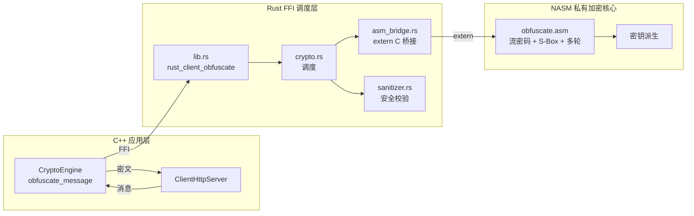

# Rust + ASM 私有加密 / 抗劫持分析 — 开发计划

> **目标**: 针对二次元/furry 用户社区，在 Chrono-shift 客户端内加入抗劫持分析与私有解码加密层。
> **核心手段**: Rust FFI 安全层 + NASM 汇编私有加密（仅此功能单独使用 ASM）。
> **算法方向**: 对称流密码 + 自定义 S-Box 置换表 + 多轮混淆，全部 ASM 手写实现。
> **环境**: NASM 3.01（Windows，PATH 内可用）。
> **Phase 10 兼容预留**: `Cargo.toml` 同时支持 `staticlib` + `cdylib`，`lib.rs` FFI 导出兼容 JNI。

---

## 1. 背景与动机

- 二次元/furry 用户在通讯软件中面临 **流量劫持**、**中间人分析**、**客户端篡改** 等风险。
- 已有的 HTTPS 迁移（Phase 1-6）解决了 **传输层加密**，但 **数据本身的私有编码/混淆层** 尚未覆盖。
- 需求：在 **消息持久化前/发送前**，经过一道 **私有 ASM 加密/解码**，使得即使传输层被旁路分析，原始数据也无法被直接识别。

---

## 2. 总体架构

```
[WebUI / IPC] → [C++ CryptoEngine] → [Rust FFI 调度层] → [ASM 私有加密核心]
                                    ↘                    ↗
                                     [Rust 安全校验 sanitizer]
```

| 层 | 语言 | 职责 |
|---|---|---|
| 应用层 | C++17 | [`CryptoEngine`](client/src/security/CryptoEngine.h) 统一加密接口，业务无感知 |
| 调度层 | Rust | [`crypto.rs`](client/security/src/crypto.rs) FFI 导出；集成 [`sanitizer`](client/security/src/sanitizer.rs) 安全校验 |
| 私有加密核心 | **NASM x64** | 纯 ASM 自研算法（对称流密码 + S-Box 置换 + 多轮混淆） |
| 构建集成 | CMake + Rust build.rs | NASM 编译 → Rust `extern` 链接 → 静态库 `.a` → C++ 可执行文件 |

**关键设计原则**: ASM 仅在此功能中使用，其他所有模块保持纯 C/C++/Rust。

---

## 3. ASM 算法框架（待你填充具体算法）

### 3.1 函数接口定义（ASM 导出符号）

```nasm
; ============================================================
; 你需要在 obfuscate.asm 中实现以下两个全局函数
; ============================================================

; --- 加密函数 ---
; RCX = data ptr       (输入明文)
; RDX = data length    (输入长度)
; R8  = key ptr        (输入密钥, 32 字节)
; R9  = out ptr        (输出密文缓冲区, 长度 >= data length)
; Returns: RAX = 0 成功, -1 失败
global asm_obfuscate

; --- 解密函数 ---
; RCX = data ptr       (输入密文)
; RDX = data length    (输入长度)
; R8  = key ptr        (输入密钥, 32 字节)
; R9  = out ptr        (输出明文缓冲区, 长度 >= data length)
; Returns: RAX = 0 成功, -1 失败
global asm_deobfuscate
```

### 3.2 框架模板（供你填充）

```nasm
; client/security/asm/obfuscate.asm
; NASM 3.01 — win64 COFF
; 私有加密核心 — 仅此功能使用 ASM
;
; ╔═══════════════════════════════════════════════════════╗
; ║  下方算法代码由你自行设计实现                          ║
; ║  建议结构:                                           ║
; ║    Phase 1: 密钥扩展 / S-Box 初始化                   ║
; ║    Phase 2: 多轮置换混淆                              ║
; ║    Phase 3: 流密码 XOR 输出                           ║
; ║    Phase 4: 垃圾指令插入（抗静态分析）                 ║
; ╚═══════════════════════════════════════════════════════╝

section .data
    ; 你自定义的 S-Box 表（256 字节）
    ; 示例占位，请替换为你的设计：
    sbox:   times 256 db 0

section .text

; ============================================================
; asm_obfuscate — 对称流密码加密
; ============================================================
asm_obfuscate:
    push    rbx
    push    rsi
    push    rdi
    push    r12
    push    r13
    push    r14
    push    r15
    
    ; ── 你在此处实现你的算法 ──
    ; 
    ; 建议子步骤：
    ;   1. KSA — 密钥调度初始化 (Key Scheduling)
    ;   2. S-Box 置换 — 替代原字节
    ;   3. 多轮混淆 — 重复置换 + 扩散
    ;   4. 输出加密结果
    ;
    ; 可用寄存器:
    ;   RSI = 源数据指针 (RCX 传入)
    ;   RDI = 输出指针   (R9 传入)
    ;   RCX = 数据长度   (RDX 传入)
    ;   R8  = 密钥指针
    ;   RAX, RBX, R10-R15 可自由使用
    ; ─────────────────────────────────────
    
    ; (示例: 简单的 XOR 占位，请替换)
    mov     rsi, rcx
    mov     rdi, r9
    mov     rcx, rdx
    xor     r10d, r10d
.loop:
    movzx   eax, byte [rsi]
    xor     al, byte [r8 + r10]    ; 轮询密钥
    mov     byte [rdi], al
    inc     rsi
    inc     rdi
    inc     r10
    and     r10, 31                ; 密钥长度 32
    loop    .loop
    
    pop     r15
    pop     r14
    pop     r13
    pop     r12
    pop     rdi
    pop     rsi
    pop     rbx
    xor     eax, eax               ; RAX = 0 (成功)
    ret

; ============================================================
; asm_deobfuscate — 对称流密码解密（流密码加解密对称）
; ============================================================
asm_deobfuscate:
    ; 对称流密码：解密 == 加密，直接跳转
    jmp     asm_obfuscate
```

### 3.3 建议的算法结构（供参考）

```
自研对称流密码建议结构:

1. 密钥扩展 (Key Schedule):
   输入: 32 字节密钥
   输出: 多轮子密钥 / S-Box 初始置换
   方式: 用户自定义布尔函数 + 轮常量

2. S-Box 置换层:
   输入: 1 字节
   输出: 1 字节 (查自定义 256 字节 S-Box)
   特性: 非线性、可逆（S-Box 为双射）

3. 多轮混淆 (N 轮):
   每轮包含:
     a. S-Box 字节替换 (SubBytes)
     b. 行移位/扩散 (ShiftRows-like)
     c. 轮密钥 XOR (AddRoundKey-like)
   轮数 N: 建议 >= 8 轮

4. 输出:
   与明文等长的密文流
```

> **重要**: 以上仅为你提供一个结构参考。你完全可以设计完全不同的算法结构。
> 核心要求是：**函数签名不变**（`asm_obfuscate` / `asm_deobfuscate`），其他任意发挥。

---

## 4. 文件组织结构

```
client/security/
├── asm/                          ← NEW: NASM 汇编目录（仅此功能）
│   ├── obfuscate.asm             ← 你自研的加密核心（流密码 + S-Box + 多轮）
│   └── obfuscate.inc             ← 可选：宏定义/常量/S-Box 数据
├── src/
│   ├── asm_bridge.rs             ← NEW: Rust -> ASM FFI 胶水层
│   ├── crypto.rs                 ← 修改: 集成 asm_bridge 调用
│   ├── sanitizer.rs              ← 已有: 安全校验
│   ├── lib.rs                    ← 修改: 导出新 FFI 函数
│   └── ...
├── build.rs                      ← NEW: NASM 构建脚本
├── Cargo.toml                    ← 修改: 添加 build = "build.rs" + crate-type 兼容 staticlib+cdylib
└── include/
    └── chrono_client_security.h  ← 修改: 添加 obfuscate/deobfuscate 声明
```

---

## 5. 构建系统设计

### 5.1 Rust `build.rs` — NASM 编译 (你不需要修改)

```rust
// client/security/build.rs
// 此脚本将你的 obfuscate.asm 编译为 .obj 并链接到 Rust 静态库
// 你唯一需要做的是: 保证 obfuscate.asm 语法正确

fn main() {
    let nasm = "nasm";
    
    let status = std::process::Command::new(nasm)
        .args(&[
            "-f", "win64",
            "-o",
            "asm\\obfuscate.obj",
            "asm\\obfuscate.asm",
        ])
        .status()
        .expect("NASM 未找到，请确保 nasm 在 PATH 中");
    assert!(status.success(), "NASM 编译 obfuscate.asm 失败");
    
    println!("cargo:rustc-link-search=native={}",
             std::env::current_dir().unwrap().display());
    println!("cargo:rustc-link-lib=static=obfuscate");
    
    // 当 asm 文件变更时重新编译
    println!("cargo:rerun-if-changed=asm/obfuscate.asm");
}
```

### 5.2 Rust FFI 桥接 (你不需要修改)

```rust
// client/security/src/asm_bridge.rs
// Rust -> ASM FFI 桥接层
// 调用你写的 asm_obfuscate / asm_deobfuscate

extern "C" {
    fn asm_obfuscate(
        data: *const u8, len: usize,
        key: *const u8, out: *mut u8
    ) -> i32;
    fn asm_deobfuscate(
        data: *const u8, len: usize,
        key: *const u8, out: *mut u8
    ) -> i32;
}

/// 调用 ASM 加密（失败时返回 Err）
pub fn obfuscate(data: &[u8], key: &[u8; 32]) -> Result<Vec<u8>, String> {
    let mut out = vec![0u8; data.len()];
    let ret = unsafe {
        asm_obfuscate(data.as_ptr(), data.len(), key.as_ptr(), out.as_mut_ptr())
    };
    if ret != 0 { Err("ASM 加密失败".into()) }
    else { Ok(out) }
}

/// 调用 ASM 解密
pub fn deobfuscate(data: &[u8], key: &[u8; 32]) -> Result<Vec<u8>, String> {
    let mut out = vec![0u8; data.len()];
    let ret = unsafe {
        asm_deobfuscate(data.as_ptr(), data.len(), key.as_ptr(), out.as_mut_ptr())
    };
    if ret != 0 { Err("ASM 解密失败".into()) }
    else { Ok(out) }
}
```

### 5.3 FFI 调用链路（你不需要自己实现）

```
C++ CryptoEngine::obfuscate_message(data, key)
  ↓ FFI extern "C"
rust_client_obfuscate(data_ptr, len, key_ptr, out_ptr)
  ↓ Rust asm_bridge::obfuscate()
    ↓ extern "C"
asm_obfuscate()  ← 这是你写的 NASM 代码
```

---

## 6. 抗劫持分析机制（框架建议）

以下机制为 **可选**，你可以根据需要选择是否在 ASM 中加入：

### 6.1 内存保护 (建议加入)
- ASM 加密操作在 **栈上完成**（不经过堆分配），减少内存 dump 风险
- 密钥使用后 **立即清零**（`REP STOSB` + `MFENCE`/`SFENCE`）

### 6.2 完整性校验 (可选)
- 每条消息加密后附加 ASM 计算的 HMAC-like 摘要（私有算法）
- 解码时校验摘要，防篡改

### 6.3 反调试 (可选)
- ASM 中检测 `PEB.BeingDebugged`（`mov eax, fs:[30h]` → `movzx eax, byte [eax+2]`）
- 检测到调试器时返回错误码或执行垃圾路径

### 6.4 代码段自校验 (可选)
- 启动时计算 `.text` 段 hash 与硬编码值比对

---

## 7. 分步实施计划

| Phase | 内容 | 文件 | 谁负责 |
|---|---|---|---|
| **P1** | 编写 `obfuscate.asm` — **你自研的流密码+S-Box+多轮混淆算法** | [`client/security/asm/obfuscate.asm`](client/security/asm/obfuscate.asm) | **你** |
| **P2** | 创建 `build.rs` — NASM 编译脚本（框架代码） | [`client/security/build.rs`](client/security/build.rs) | 我来 |
| **P3** | 创建 `asm_bridge.rs` — Rust → ASM FFI 桥接（框架代码） | [`client/security/src/asm_bridge.rs`](client/security/src/asm_bridge.rs) | 我来 |
| **P4** | 修改 `crypto.rs` — 集成 asm_bridge 调用 | [`client/security/src/crypto.rs`](client/security/src/crypto.rs) | 我来 |
| **P5** | 修改 `lib.rs` — 导出 `rust_client_obfuscate` FFI（兼容 staticlib + cdylib） | [`client/security/src/lib.rs`](client/security/src/lib.rs) | 我来 |
| **P6** | 修改 `Cargo.toml` — 添加 `build = "build.rs"` + `crate-type = ["staticlib", "cdylib"]` → Phase 10 兼容预留 | [`client/security/Cargo.toml`](client/security/Cargo.toml) | 我来 |
| **P7** | 扩展 `CryptoEngine` C++ 侧 — obfuscate/deobfuscate 接口 | [`client/src/security/CryptoEngine.h`](client/src/security/CryptoEngine.h) + [`.cpp`](client/src/security/CryptoEngine.cpp) | 我来 |
| **P8** | 添加 CLI 测试命令 `cmd_obfuscate.c`（调试用） | [`client/devtools/cli/commands/cmd_obfuscate.c`](client/devtools/cli/commands/cmd_obfuscate.c) | 我来 |
| **P9** | 更新 `CMakeLists.txt` — 确保 Rust 库链接（NASM 编译走 build.rs，CMake 无需改动） | [`client/CMakeLists.txt`](client/CMakeLists.txt) | 我来 |
| **P10** | 集成测试 — ASM 加密/解密正确性验证 | 测试脚本 | 我来 |

**你的核心工作**: P1 — 设计并在 `obfuscate.asm` 中实现你的私有算法。
**我的工作**: P2-P10 — 搭建完整的集成框架、FFI 桥接、构建系统、C++ 接口、测试工具。

---

## 8. 与现有系统的集成

### 8.1 消息流路径

```
[用户发送消息]
     ↓
WebUI (JS) → IPC → C++ ClientHttpServer
     ↓
CryptoEngine::obfuscate_message(msg, session_key)
     ↓
Rust FFI: rust_client_obfuscate()
     ↓
ASM: asm_obfuscate()  ← 你的算法
     ↓
密文 → 网络传输 / 本地存储
```

### 8.2 密钥管理

密钥派生策略（待讨论确定）:

| 方案 | 说明 |
|---|---|
| 会话 Token 派生 | 登录后从服务端会话 Token 派生加密密钥 |
| 用户密码衍生 | 用户密码 → PBKDF2/scrypt → 32 字节密钥 |
| 混合模式 | 用户密码 + 会话随机数 + 硬件指纹 |

> **请告知你倾向的密钥管理方案。**

---

## 9. 需要你确认/回答的问题

1. **你的算法设计**: 你准备何时开始编写 `obfuscate.asm`？需要我先搭建好框架你再填充算法，还是你先写算法代码我再搭建框架？
2. **密钥管理**: 密钥从哪来？（会话 Token 派生 / 用户密码 / 硬件绑定）
3. **S-Box**: 你的 S-Box 是固定常数还是在运行时由密钥动态生成？
4. **轮数**: 你的多轮混淆需要几轮？
5. **反调试**: 是否需要在 ASM 中加入反调试检测？
6. **应用范围**: 全部消息加密，还是仅特定内容？

---

## 10. 架构图



---

## 11. 下一步

1. **讨论阶段**: 请回答第 9 节的问题，确认设计方案。
2. 确认后我将 **立即创建 P2-P10 的所有框架代码**（你无需关心 Rust/C++/CMake 部分）。
3. 你专注于 **P1: 在 `obfuscate.asm` 中实现你的自研算法**。
4. 算法完成后一起集成测试。

---

## 12. Phase 10 兼容预留

[`plans/phase_10_lang_refactor_java_glue.md`](plans/phase_10_lang_refactor_java_glue.md) 计划在近期实施，会对以下文件做修改。本 ASM 混淆计划已提前预留兼容：

| 文件 | ASM 计划设置 | Phase 10 计划设置 | 兼容策略 |
|------|-------------|------------------|---------|
| [`Cargo.toml`](client/security/Cargo.toml) | `build = "build.rs"` | `crate-type = ["cdylib"]` | **合并**为 `crate-type = ["staticlib", "cdylib"]`，同时支持两种输出 |
| [`lib.rs`](client/security/src/lib.rs) | `pub mod asm_bridge;` + `rust_client_obfuscate()` | JNI `#[no_mangle]` 导出 | **共存**，不同模块互不干扰 |
| [`crypto.rs`](client/security/src/crypto.rs) | `obfuscate_message()` / `deobfuscate_message()` | 无修改 | 无冲突 |
| [`CryptoEngine.h/.cpp`](client/src/security/CryptoEngine.h) | `obfuscate_message()` 方法 | 无修改 | 无冲突 |

**注意**: Phase 10 实施时需确保 `Cargo.toml` 的 `crate-type` 保持不变（即保留 `"staticlib"` + `"cdylib"` 并存），否则会破坏 C++ 侧通过静态库链接 ASM obfuscate 功能。

---

*文档版本: v0.3 — 框架讨论版（含 Phase 10 兼容预留）*
